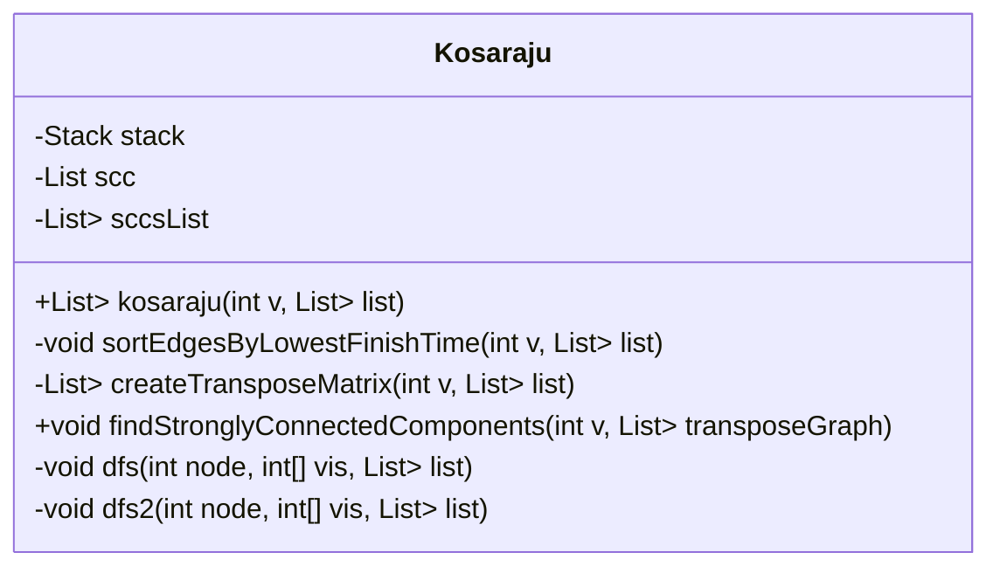
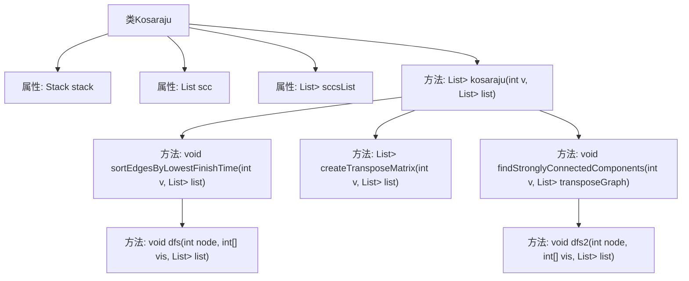

# 基础信息

|      |      |
|------|------|
| 名称 | Kosaraju |
| 编码语言 | .java |
| 代码路径 | Java/src/main/java/com/thealgorithms/datastructures/graphs/Kosaraju.java |
| 包名 | com.thealgorithms.datastructures.graphs |
| 依赖项 | ['java.util.ArrayList', 'java.util.List', 'java.util.Stack'] |
| 概述说明 | Kosaraju算法通过DFS排序、转置图和寻找强连通分量实现。 |

# 说明

Kosaraju算法是一种用于查找有向图中强连通分量的经典算法。该算法分为两个主要步骤：首先，通过深度优先搜索（DFS）对图中的所有节点进行排序，得到节点的完成时间顺序。接着，将原图进行转置，即反转所有边的方向，然后在转置图上按照之前得到的节点顺序再次进行DFS。每次DFS遍历所访问的节点集合即为一个强连通分量。通过这种方式，Kosaraju算法能够高效地识别出图中的所有强连通分量。

# 类列表 Class Summary

| 名称   | 类型  | 说明 |
|-------|------|-------------|
| Kosaraju | class | Kosaraju算法实现，通过DFS排序节点、转置图并找到强连通分量。 |

## 类 Kosaraju

|      |      |
|------|------|
| 访问范围 | public |
| 类型 | class |
| 名称 | Kosaraju |
| 说明 | Kosaraju算法实现，通过DFS排序节点、转置图并找到强连通分量。 |

### UML类图

**描述：**  
`Kosaraju` 类实现了 Kosaraju 算法，用于在有向图中找到强连通分量（SCC）。该类包含一个栈用于按最低完成时间排序边，一个列表用于存储当前强连通分量，以及一个列表用于存储所有强连通分量。主要方法 `kosaraju` 执行算法的四个步骤：按最低完成时间排序节点、创建图的转置、在转置图上执行 DFS 以找到强连通分量，并返回所有强连通分量的列表。私有方法 `sortEdgesByLowestFinishTime`、`createTransposeMatrix`、`dfs` 和 `dfs2` 分别用于排序边、创建转置图、执行 DFS 以排序节点和执行 DFS 以找到强连通分量。

### 内部方法调用关系图

这段代码实现了Kosaraju算法，用于在有向图中寻找强连通分量（SCC）。首先，通过深度优先搜索（DFS）对图的节点按完成时间排序，然后创建图的转置矩阵，最后在转置图上进行DFS以找到所有的强连通分量。代码通过维护一个栈和多个列表来存储节点和SCC信息，确保算法的正确执行。

### 字段列表 Field List

| 名称  | 类型  | 说明 |
|-------|-------|------|
| scc = new ArrayList<>() | List<Integer> | 定义了一个私有整数列表变量scc。 |
| sccsList = new ArrayList<>() | List<List<Integer>> | 私有列表变量sccsList存储整数列表的集合。 |
| stack = new Stack<>() | Stack<Integer> | 定义一个私有的整数类型栈对象。 |

### 方法列表 Method List

| 名称  | 类型  | 说明 |
|-------|-------|------|
| kosaraju | List<List<Integer>> | Kosaraju算法实现强连通分量检测。 |
| sortEdgesByLowestFinishTime | void | 按最低完成时间对边进行排序的深度优先搜索实现。 |
| dfs | void | 深度优先搜索遍历节点并压栈。 |
| findStronglyConnectedComponents | void | 通过DFS遍历转置图，找出强连通分量并存储。 |
| createTransposeMatrix | List<List<Integer>> | 创建转置矩阵，将原矩阵的行列互换并返回。 |
| dfs2 | void | 深度优先搜索遍历节点，标记已访问并递归处理未访问邻居，最后将节点加入强连通分量。 |

