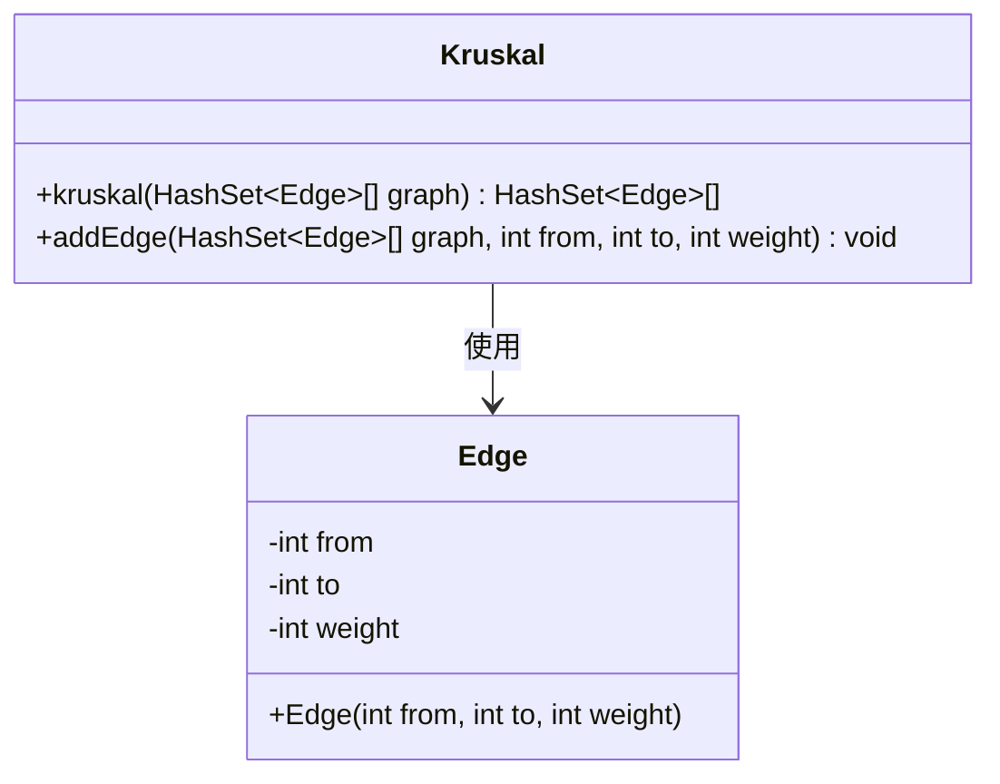

# 基础信息

|      |      |
|------|------|
| 名称 | Kruskal |
| 编码语言 | .java |
| 代码路径 | Java/src/main/java/com/thealgorithms/datastructures/graphs/Kruskal.java |
| 包名 | com.thealgorithms.datastructures.graphs |
| 依赖项 | ['java.util.Comparator', 'java.util.HashSet', 'java.util.PriorityQueue'] |
| 概述说明 | Kruskal算法利用优先队列排序边，合并连通组件避免环路生成最小生成树。 |

# 说明

Kruskal算法用于构建最小生成树，其核心步骤包括通过优先队列对图中所有边按权重进行排序，然后依次选择权重最小的边，确保不会形成环路。通过并查集数据结构合并连通组件，逐步将所有节点连接起来，最终形成一棵最小生成树。该算法有效避免了环路，保证了树的连通性和最小权重。

# 类列表 Class Summary

| 名称   | 类型  | 说明 |
|-------|------|-------------|
| Kruskal | class | Kruskal算法实现最小生成树，通过优先队列排序边，避免环路合并连通组件。 |

## 类 Kruskal

|      |      |
|------|------|
| 访问范围 | public |
| 类型 | class |
| 名称 | Kruskal |
| 说明 | Kruskal算法实现最小生成树，通过优先队列排序边，避免环路合并连通组件。 |

### UML类图

这段代码实现了Kruskal算法，用于寻找图的最小生成树（MST）。`Kruskal`类包含两个方法：`kruskal`和`addEdge`。`kruskal`方法通过优先队列按权重排序边，并使用并查集数据结构来避免形成环。`Edge`类表示图中的边，包含源节点、目标节点和权重。`Kruskal`类依赖于`Edge`类来表示图中的边。

### 内部方法调用关系图

```mermaid
graph TD
    A["类Kruskal"]
    B["内部类: Edge"]
    C["属性: int from"]
    D["属性: int to"]
    E["属性: int weight"]
    F["构造方法: Edge(int from, int to, int weight)"]
    G["方法: addEdge(HashSet<Edge>[] graph, int from, int to, int weight)"]
    H["方法: kruskal(HashSet<Edge>[] graph)"]
    I["初始化: int nodes = graph.length"]
    J["初始化: int[] captain = new int[nodes]"]
    K["初始化: HashSet<Integer>[] connectedGroups = new HashSet[nodes]"]
    L["初始化: HashSet<Edge>[] minGraph = new HashSet[nodes]"]
    M["初始化: PriorityQueue<Edge> edges = new PriorityQueue<>(Comparator.comparingInt(edge -> edge.weight))"]
    N["循环: for (int i = 0; i < nodes; i++)"]
    O["初始化: minGraph[i] = new HashSet<>()"]
    P["初始化: connectedGroups[i] = new HashSet<>()"]
    Q["初始化: connectedGroups[i].add(i)"]
    R["初始化: captain[i] = i"]
    S["初始化: edges.addAll(graph[i])"]
    T["循环: while (connectedElements != nodes && !edges.isEmpty())"]
    U["获取边: Edge edge = edges.poll()"]
    V["检查: if (!connectedGroups[captain[edge.from]].contains(edge.to) && !connectedGroups[captain[edge.to]].contains(edge.from))"]
    W["合并: connectedGroups[captain[edge.from]].addAll(connectedGroups[captain[edge.to]])"]
    X["更新: connectedGroups[captain[edge.from]].forEach(i -> captain[i] = captain[edge.from])"]
    Y["添加边: addEdge(minGraph, edge.from, edge.to, edge.weight)"]
    Z["更新: connectedElements = connectedGroups[captain[edge.from]].size()"]
    AA["返回: return minGraph"]

    A --> B
    B --> C
    B --> D
    B --> E
    B --> F
    A --> G
    A --> H
    H --> I
    H --> J
    H --> K
    H --> L
    H --> M
    H --> N
    N --> O
    N --> P
    N --> Q
    N --> R
    N --> S
    H --> T
    T --> U
    T --> V
    V --> W
    V --> X
    V --> Y
    V --> Z
    H --> AA
```

这段代码实现了Kruskal算法，用于寻找图的最小生成树（MST）。代码首先定义了一个内部类`Edge`来表示图中的边，然后通过`addEdge`方法向图中添加边。`kruskal`方法通过初始化数据结构、排序边、合并连通分量等步骤，逐步构建最小生成树，并最终返回结果。流程图展示了从初始化到最终返回MST的完整过程，涵盖了所有关键步骤和条件判断。

### 字段列表 Field List

| 名称  | 类型  | 说明 |
|-------|-------|------|

### 方法列表 Method List

| 名称  | 类型  | 说明 |
|-------|-------|------|
| kruskal | HashSet<Edge>[] | Kruskal算法实现最小生成树，通过合并节点集避免环路。 |
| addEdge | void | 在图中添加带权边，从节点from到节点to，权重为weight。 |

