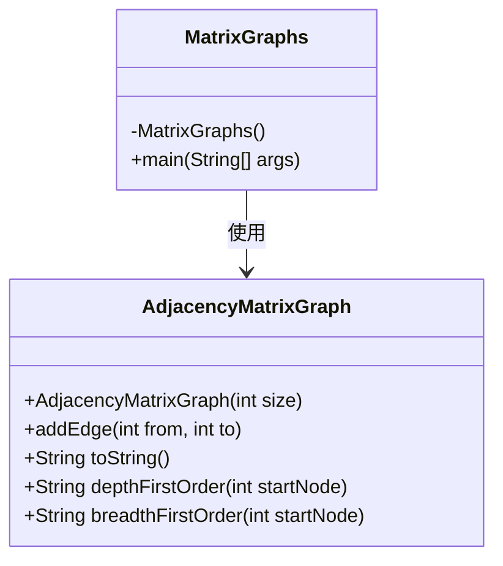
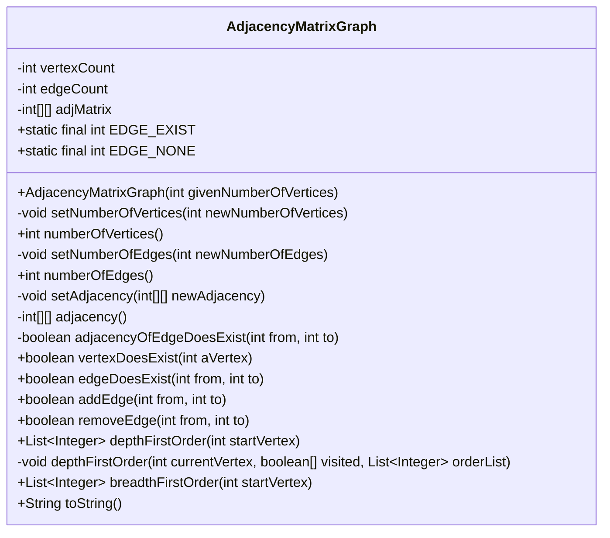

# 基础信息

|      |      |
|------|------|
| 名称 | MatrixGraphs |
| 编码语言 | .java |
| 代码路径 | Java/src/main/java/com/thealgorithms/datastructures/graphs/MatrixGraphs.java |
| 包名 | com.thealgorithms.datastructures.graphs |
| 依赖项 | ['java.util.ArrayList', 'java.util.LinkedList', 'java.util.List', 'java.util.Queue'] |
| 概述说明 | MatrixGraphs类创建10节点图，管理边并输出深度和广度优先遍历结果。AdjacencyMatrixGraph类实现邻接矩阵表示，支持顶点和边管理，提供两种遍历方法。 |

# 说明

MatrixGraphs类创建了一个包含10个节点的图，并通过添加边来构建图结构，随后输出深度优先遍历和广度优先遍历的结果。AdjacencyMatrixGraph类实现了图的邻接矩阵表示，提供了对顶点和边的管理功能，并支持深度优先遍历和广度优先遍历操作。这两个类共同实现了图的基本操作和遍历方法。

# 类列表 Class Summary

| 名称   | 类型  | 说明 |
|-------|------|-------------|
| MatrixGraphs | class | MatrixGraphs类创建10节点图，添加边并输出深度和广度优先遍历结果。 |
| AdjacencyMatrixGraph | class | AdjacencyMatrixGraph类实现图的邻接矩阵表示，支持顶点和边管理，提供深度优先和广度优先遍历。 |

## 类 MatrixGraphs

|      |      |
|------|------|
| 访问范围 | public final |
| 类型 | class |
| 名称 | MatrixGraphs |
| 说明 | MatrixGraphs类创建10节点图，添加边并输出深度和广度优先遍历结果。 |

### UML类图

该代码展示了一个使用邻接矩阵表示图的示例。`MatrixGraphs` 类是一个工具类，包含一个 `main` 方法用于测试 `AdjacencyMatrixGraph` 类的功能。`AdjacencyMatrixGraph` 类提供了图的构建、边的添加、深度优先遍历和广度优先遍历等功能。`MatrixGraphs` 类通过创建 `AdjacencyMatrixGraph` 对象并调用其方法来演示图的操作。

### 内部方法调用关系图

```mermaid
graph TD
    A["类MatrixGraphs"]
    B["构造方法: MatrixGraphs()"]
    C["main方法: main(String[] args)"]
    D["创建对象: AdjacencyMatrixGraph graph = new AdjacencyMatrixGraph(10)"]
    E["添加边: graph.addEdge(1, 2)"]
    F["添加边: graph.addEdge(1, 5)"]
    G["添加边: graph.addEdge(2, 5)"]
    H["添加边: graph.addEdge(1, 2)"]
    I["添加边: graph.addEdge(2, 3)"]
    J["添加边: graph.addEdge(3, 4)"]
    K["添加边: graph.addEdge(4, 1)"]
    L["添加边: graph.addEdge(2, 3)"]
    M["添加边: graph.addEdge(3, 9)"]
    N["添加边: graph.addEdge(9, 1)"]
    O["添加边: graph.addEdge(9, 8)"]
    P["添加边: graph.addEdge(1, 8)"]
    Q["添加边: graph.addEdge(5, 6)"]
    R["输出: 'The graph matrix:'"]
    S["输出: System.out.println(graph)"]
    T["输出: 'Depth first order beginning at node '1':'"]
    U["输出: System.out.println(graph.depthFirstOrder(1))"]
    V["输出: 'Breadth first order beginning at node '1':'"]
    W["输出: System.out.println(graph.breadthFirstOrder(1))"]

    A --> B
    A -.-> C
    C --> D
    D --> E
    D --> F
    D --> G
    D --> H
    D --> I
    D --> J
    D --> K
    D --> L
    D --> M
    D --> N
    D --> O
    D --> P
    D --> Q
    C --> R
    C --> S
    C --> T
    C --> U
    C --> V
    C --> W
```

这段代码定义了一个名为 `MatrixGraphs` 的类，其中包含一个私有的构造方法和一个 `main` 方法。`main` 方法创建了一个 `AdjacencyMatrixGraph` 对象，并多次调用 `addEdge` 方法添加图的边。随后，代码输出图的邻接矩阵、从节点1开始的深度优先遍历顺序和广度优先遍历顺序。流程图展示了 `main` 方法中的各个步骤及其调用关系。

### 字段列表 Field List

| 名称  | 类型  | 说明 |
|-------|-------|------|

### 方法列表 Method List

| 名称  | 类型  | 说明 |
|-------|-------|------|
| main | void | 创建10节点图，添加边，输出矩阵、深度和广度优先遍历。 |

## 类 AdjacencyMatrixGraph

|      |      |
|------|------|
| 访问范围 | None |
| 类型 | class |
| 名称 | AdjacencyMatrixGraph |
| 说明 | AdjacencyMatrixGraph类实现图的邻接矩阵表示，支持顶点和边管理，提供深度优先和广度优先遍历。 |

### UML类图

### 描述
`AdjacencyMatrixGraph` 类用于表示基于邻接矩阵的图数据结构。它包含顶点数量、边数量以及邻接矩阵等私有成员，并提供了构造函数、顶点和边的操作方法。类中还实现了深度优先遍历（DFS）和广度优先遍历（BFS）算法，用于遍历图中的顶点。此外，`toString` 方法用于生成图的字符串表示，显示顶点及其邻接关系。该类通过邻接矩阵来高效地存储和操作图中的边，并提供了丰富的功能来管理图的顶点和边。

### 内部方法调用关系图

```mermaid
graph TD
    A["类AdjacencyMatrixGraph"]
    B["属性: int vertexCount"]
    C["属性: int edgeCount"]
    D["属性: int[][] adjMatrix"]
    E["静态常量: EDGE_EXIST = 1"]
    F["静态常量: EDGE_NONE = 0"]
    G["构造方法: AdjacencyMatrixGraph(int givenNumberOfVertices)"]
    H["方法: private void setNumberOfVertices(int newNumberOfVertices)"]
    I["方法: public int numberOfVertices()"]
    J["方法: private void setNumberOfEdges(int newNumberOfEdges)"]
    K["方法: public int numberOfEdges()"]
    L["方法: private void setAdjacency(int[][] newAdjacency)"]
    M["方法: private int[][] adjacency()"]
    N["方法: private boolean adjacencyOfEdgeDoesExist(int from, int to)"]
    O["方法: public boolean vertexDoesExist(int aVertex)"]
    P["方法: public boolean edgeDoesExist(int from, int to)"]
    Q["方法: public boolean addEdge(int from, int to)"]
    R["方法: public boolean removeEdge(int from, int to)"]
    S["方法: public List<Integer> depthFirstOrder(int startVertex)"]
    T["方法: private void depthFirstOrder(int currentVertex, boolean[] visited, List<Integer> orderList)"]
    U["方法: public List<Integer> breadthFirstOrder(int startVertex)"]
    V["方法: public String toString()"]

    A --> B
    A --> C
    A --> D
    A --> E
    A --> F
    A --> G
    G --> H
    G --> J
    G --> L
    A --> I
    A --> K
    A --> M
    A --> N
    A --> O
    A --> P
    A --> Q
    Q --> O
    Q --> N
    Q --> J
    A --> R
    R --> O
    R --> N
    R --> J
    A --> S
    S --> T
    T --> N
    A --> U
    U --> O
    U --> N
    A --> V
```

这段代码定义了一个基于邻接矩阵的图类 `AdjacencyMatrixGraph`，包含了图的顶点和边的数量、邻接矩阵以及相关操作。类中提供了构造方法、顶点和边的增删查操作、深度优先遍历和广度优先遍历等功能。流程图展示了类的属性、方法及其调用关系，帮助理解代码的结构和功能。

### 字段列表 Field List

| 名称  | 类型  | 说明 |
|-------|-------|------|
| vertexCount | int | 私有整型变量vertexCount。 |
| edgeCount | int | 私有整型变量edgeCount。 |
| EDGE_NONE = 0 | int | 定义常量EDGE_NONE，值为0。 |
| adjMatrix | int[][] | 私有二维整型数组adjMatrix。 |
| EDGE_EXIST = 1 | int | 定义常量EDGE_EXIST，值为1。 |

### 方法列表 Method List

| 名称  | 类型  | 说明 |
|-------|-------|------|
| setAdjacency | void | 设置邻接矩阵为新传入的二维数组。 |
| vertexDoesExist | boolean | 检查顶点是否存在，确保顶点值在有效范围内。 |
| adjacency | int[][] | 返回私有二维整型数组adjMatrix。 |
| addEdge | boolean | 方法检查顶点存在后，若无边则添加双向边并更新边数，成功返回true，否则返回false。 |
| depthFirstOrder | void | 深度优先遍历图顶点，标记已访问并记录顺序。 |
| edgeDoesExist | boolean | 检查图中是否存在从顶点from到顶点to的边。 |
| removeEdge | boolean | 删除图中指定边的Java方法，成功返回true，否则false。 |
| numberOfVertices | int | 该方法返回顶点数量。 |
| setNumberOfVertices | void | 方法设置顶点数为指定值。 |
| adjacencyOfEdgeDoesExist | boolean | 检查图中两个节点间是否存在边。 |
| toString | String | 该方法生成图的邻接矩阵字符串表示。 |
| numberOfEdges | int | 该方法返回图中边的总数。 |
| setNumberOfEdges | void | 该方法用于设置边的数量，更新edgeCount变量。 |
| breadthFirstOrder | List<Integer> | 广度优先遍历算法，从指定顶点开始返回遍历顺序列表。 |
| depthFirstOrder | List<Integer> | 实现深度优先遍历，返回从指定顶点开始的访问顺序列表。 |

