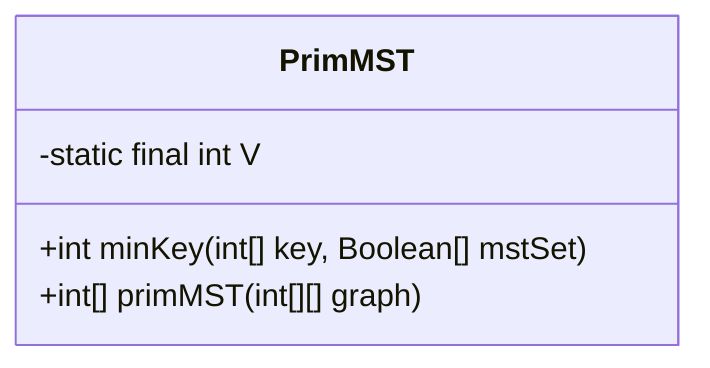
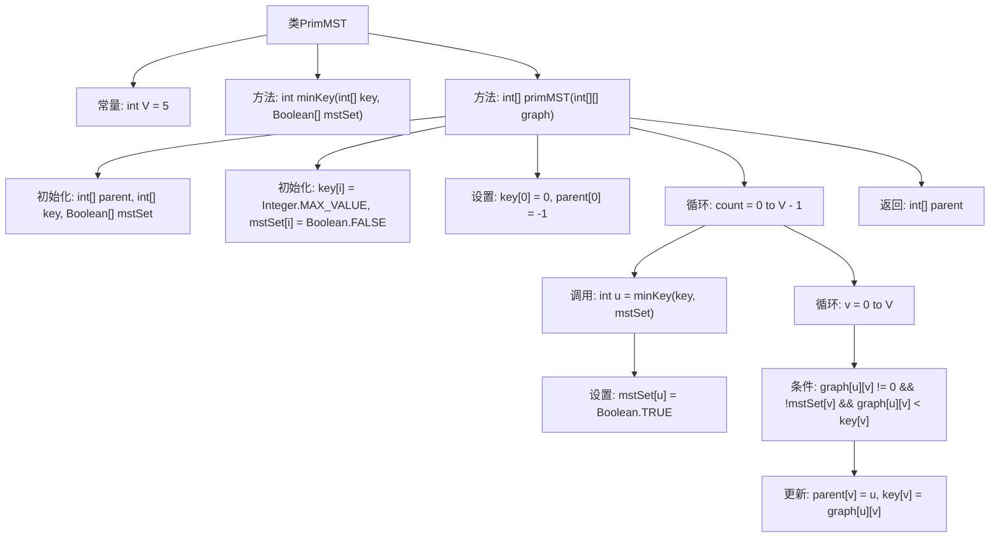

# 基础信息

|      |      |
|------|------|
| 名称 | PrimMST |
| 编码语言 | .java |
| 代码路径 | Java/src/main/java/com/thealgorithms/datastructures/graphs/PrimMST.java |
| 包名 | com.thealgorithms.datastructures.graphs |
| 依赖项 | [] |
| 概述说明 | Prim算法利用邻接矩阵实现最小生成树。 |

# 说明

Prim算法用于求解最小生成树问题，适用于无向连通图。该算法通过邻接矩阵表示图结构，邻接矩阵存储了图中各顶点之间的边及其权重。Prim算法的核心思想是从一个起始顶点开始，逐步选择与当前生成树相连且权重最小的边，并将对应顶点加入生成树中，直到所有顶点都被包含。该算法采用贪心策略，确保每次选择局部最优解，最终得到全局最优的最小生成树。

# 类列表 Class Summary

| 名称   | 类型  | 说明 |
|-------|------|-------------|
| PrimMST | class | Prim算法实现最小生成树，通过邻接矩阵表示图结构。 |

## 类 PrimMST

|      |      |
|------|------|
| 访问范围 | public |
| 类型 | class |
| 名称 | PrimMST |
| 说明 | Prim算法实现最小生成树，通过邻接矩阵表示图结构。 |

### UML类图

这段代码定义了一个名为 `PrimMST` 的类，用于实现 Prim 算法来构造最小生成树（MST）。类中包含两个主要方法：`minKey` 和 `primMST`。`minKey` 方法用于找到未被包含在 MST 中的顶点中具有最小键值的顶点，而 `primMST` 方法则通过使用邻接矩阵表示的图来构造 MST。`primMST` 方法返回一个表示 MST 的父节点数组。该类通过不断选择最小权重的边并更新相邻顶点的键值，逐步构建出最小生成树。

### 内部方法调用关系图

这段代码实现了Prim算法，用于在图中找到最小生成树（MST）。类`PrimMST`包含两个主要方法：`minKey`用于找到未包含在MST中的最小键值顶点，`primMST`用于构造MST。代码通过初始化键值和MST集合，逐步选择最小键值顶点并更新相邻顶点的键值和父节点，最终返回MST的父节点数组。

### 字段列表 Field List

| 名称  | 类型  | 说明 |
|-------|-------|------|
| V = 5 | int | 定义私有静态常量V，值为5。 |

### 方法列表 Method List

| 名称  | 类型  | 说明 |
|-------|-------|------|
| primMST | int[] | 实现Prim算法生成最小生成树，返回父节点数组。 |
| minKey | int | 函数minKey查找未在最小生成树中的最小键值顶点索引。 |

