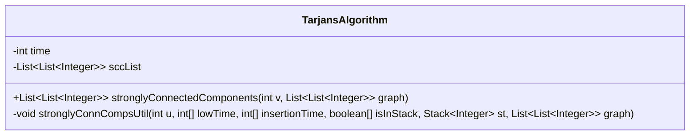
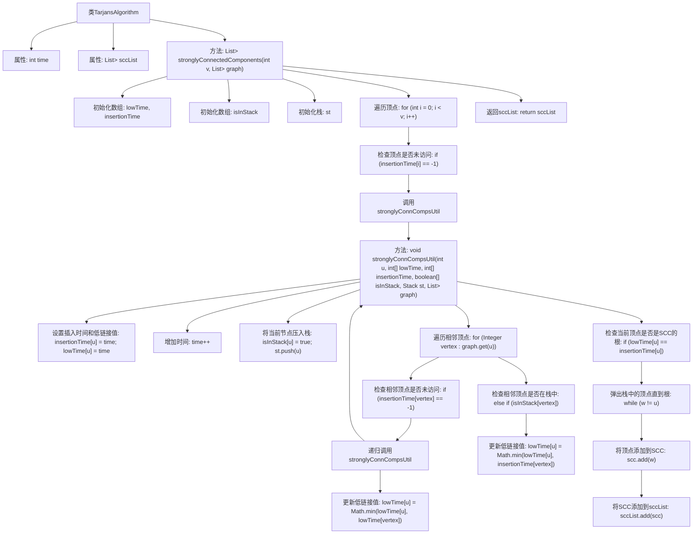

# 基础信息

|      |      |
|------|------|
| 名称 | TarjansAlgorithm |
| 编码语言 | .java |
| 代码路径 | Java/src/main/java/com/thealgorithms/datastructures/graphs/TarjansAlgorithm.java |
| 包名 | com.thealgorithms.datastructures.graphs |
| 依赖项 | ['java.util.ArrayList', 'java.util.List', 'java.util.Stack'] |
| 概述说明 | Tarjan算法用于查找有向图的强连通分量。 |

# 说明

Tarjan算法是一种用于查找有向图中强连通分量的有效方法。它通过深度优先搜索（DFS）遍历图中的节点，同时维护一个栈来记录访问顺序和低链接值，以识别和分离强连通分量。该算法具有线性时间复杂度，适用于大规模图结构分析。

# 类列表 Class Summary

| 名称   | 类型  | 说明 |
|-------|------|-------------|
| TarjansAlgorithm | class | Tarjan算法用于查找有向图的强连通分量。 |

## 类 TarjansAlgorithm

|      |      |
|------|------|
| 访问范围 | public |
| 类型 | class |
| 名称 | TarjansAlgorithm |
| 说明 | Tarjan算法用于查找有向图的强连通分量。 |

### UML类图

**类图描述：**  
`TarjansAlgorithm` 类用于实现 Tarjan 算法，以找到有向图中的强连通分量（SCC）。该类包含一个私有成员 `time` 用于跟踪节点的时间戳，以及一个私有成员 `sccList` 用于存储所有强连通分量。公有方法 `stronglyConnectedComponents` 接收图的顶点数和邻接表作为参数，返回强连通分量列表。私有方法 `stronglyConnCompsUtil` 是一个递归工具函数，用于深度优先搜索（DFS）并计算每个节点的低链接值，从而确定强连通分量。

### 内部方法调用关系图

**描述：**  
这段代码实现了Tarjan算法，用于查找有向图中的强连通分量（SCC）。代码的核心是通过深度优先搜索（DFS）遍历图中的每个顶点，并在遍历过程中记录每个顶点的插入时间和低链接值。通过比较低链接值和插入时间，算法能够识别出强连通分量，并将其存储在`sccList`中返回。流程图展示了从初始化数据结构到遍历顶点、递归调用DFS、更新低链接值以及最终识别和存储强连通分量的完整过程。

### 字段列表 Field List

| 名称  | 类型  | 说明 |
|-------|-------|------|
| time | int | 定义私有整型变量time。 |
| sccList = new ArrayList<>() | List<List<Integer>> | 定义私有列表变量sccList，存储整数列表。 |

### 方法列表 Method List

| 名称  | 类型  | 说明 |
|-------|-------|------|
| stronglyConnectedComponents | List<List<Integer>> | 使用DFS和Tarjan算法查找有向图的强连通分量。 |
| stronglyConnCompsUtil | void | 该方法用于查找图的强连通分量，通过深度优先搜索和栈实现。 |

