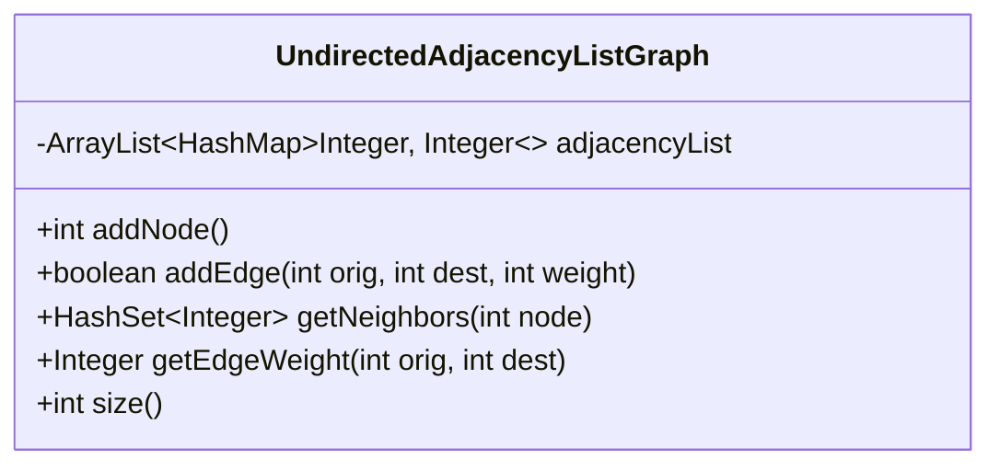
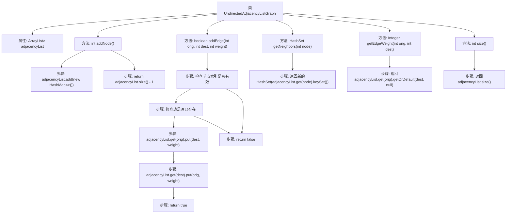

# 基础信息

|      |      |
|------|------|
| 名称 | UndirectedAdjacencyListGraph |
| 编码语言 | .java |
| 代码路径 | Java/src/main/java/com/thealgorithms/datastructures/graphs/UndirectedAdjacencyListGraph.java |
| 包名 | com.thealgorithms.datastructures.graphs |
| 依赖项 | ['java.util.ArrayList', 'java.util.HashMap', 'java.util.HashSet'] |
| 概述说明 | 无向图类支持节点、边操作，可获取邻居、边权重及节点数量。 |

# 说明

无向图类提供了一系列功能，用于管理和操作无向图数据结构。该类支持添加节点和边，允许用户获取指定节点的邻居节点以及边的权重信息。此外，用户还可以查询图中当前包含的节点数量。这些功能共同构成了一个完整的无向图管理工具，适用于需要处理无向图的各种应用场景。

# 类列表 Class Summary

| 名称   | 类型  | 说明 |
|-------|------|-------------|
| UndirectedAdjacencyListGraph | class | 无向图类，支持添加节点、边、获取邻居和边权重，以及查询节点数量。 |

## 类 UndirectedAdjacencyListGraph

|      |      |
|------|------|
| 访问范围 | public |
| 类型 | class |
| 名称 | UndirectedAdjacencyListGraph |
| 说明 | 无向图类，支持添加节点、边、获取邻居和边权重，以及查询节点数量。 |

### UML类图

该代码定义了一个 `UndirectedAdjacencyListGraph` 类，用于表示无向图的邻接表。类中包含一个 `adjacencyList` 属性，它是一个 `ArrayList`，其中每个元素是一个 `HashMap`，用于存储节点及其相邻节点的权重。类提供了添加节点、添加边、获取邻居节点、获取边权重以及获取图大小的方法。通过这些方法，可以方便地操作无向图的结构和数据。

### 内部方法调用关系图

这段代码定义了一个无向邻接表图类 `UndirectedAdjacencyListGraph`，用于表示无向图并提供了添加节点、添加边、获取邻居节点、获取边权重和获取图大小等功能。流程图展示了类中的主要方法及其内部步骤，清晰地描述了方法的执行流程和逻辑判断。

### 字段列表 Field List

| 名称  | 类型  | 说明 |
|-------|-------|------|
| adjacencyList = new ArrayList<>() | ArrayList<HashMap<Integer, Integer>> | 声明一个包含哈希映射的数组列表，用于表示邻接表。 |

### 方法列表 Method List

| 名称  | 类型  | 说明 |
|-------|-------|------|
| getNeighbors | HashSet<Integer> | 获取指定节点的所有邻居节点集合。 |
| getEdgeWeight | Integer | 获取图中指定节点间边的权重。 |
| addEdge | boolean | 添加边，检查节点有效性，避免重复，成功返回真。 |
| addNode | int | 方法`addNode`在邻接表中添加新节点并返回其索引。 |
| size | int | 该方法返回邻接表的大小。 |

