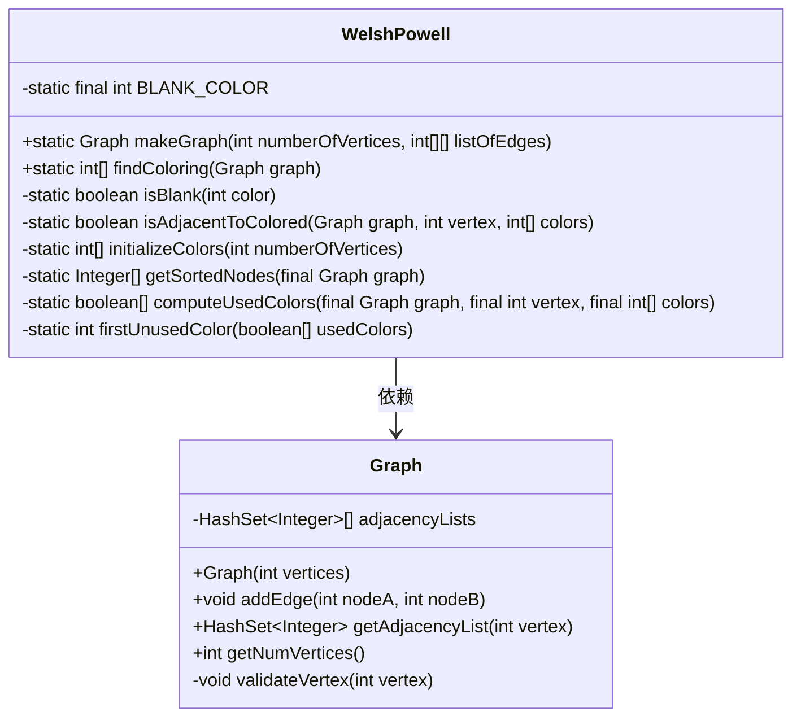
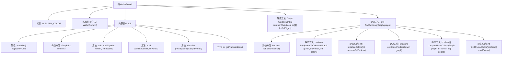

# 基础信息

|      |      |
|------|------|
| 名称 | WelshPowell |
| 编码语言 | .java |
| 代码路径 | Java/src/main/java/com/thealgorithms/datastructures/graphs/WelshPowell.java |
| 包名 | com.thealgorithms.datastructures.graphs |
| 依赖项 | ['java.util.Arrays', 'java.util.Comparator', 'java.util.HashSet', 'java.util.stream.IntStream'] |
| 概述说明 | WelshPowell算法实现图着色，邻接表表示图，按度排序并分配颜色。 |

# 说明

WelshPowell类实现了图着色算法，该算法使用邻接表来表示图结构。首先，算法根据节点的度进行排序，然后按照排序顺序为每个节点分配颜色，确保相邻节点颜色不同。这一过程有效减少了所需颜色数量，实现了图的合理着色。

# 类列表 Class Summary

| 名称   | 类型  | 说明 |
|-------|------|-------------|
| WelshPowell | class | WelshPowell类实现图着色算法，使用邻接表表示图，按节点度排序并分配颜色。 |

## 类 WelshPowell

|      |      |
|------|------|
| 访问范围 | public final |
| 类型 | class |
| 名称 | WelshPowell |
| 说明 | WelshPowell类实现图着色算法，使用邻接表表示图，按节点度排序并分配颜色。 |

### UML类图

类图描述：
`WelshPowell` 类是一个工具类，提供了创建图和为图着色的功能。它包含多个静态方法，如 `makeGraph` 用于创建图，`findColoring` 用于使用 Welsh-Powell 算法为图着色。`Graph` 类表示一个图，使用邻接表存储图的结构，提供了添加边、获取邻接表和验证顶点等方法。`WelshPowell` 类依赖于 `Graph` 类来实现其功能。

### 内部方法调用关系图

这段代码实现了Welsh-Powell图着色算法。`WelshPowell`类包含一个内部类`Graph`，用于表示图的邻接表结构。`makeGraph`方法用于创建图，`findColoring`方法用于为图着色。着色过程中，首先初始化颜色数组，然后按顶点度数排序，接着为每个顶点分配颜色，并确保相邻顶点颜色不同。辅助方法用于检查颜色是否未分配、计算已用颜色等。

### 字段列表 Field List

| 名称  | 类型  | 说明 |
|-------|-------|------|
| BLANK_COLOR = -1 | int | 定义私有静态常量BLANK_COLOR，值为-1。 |

### 方法列表 Method List

| 名称  | 类型  | 说明 |
|-------|-------|------|
| isBlank | boolean | 判断颜色是否为空白颜色。 |
| firstUnusedColor | int | 方法返回未使用的第一个颜色索引。 |
| computeUsedColors | boolean[] | 计算图中指定顶点已用颜色数组。 |
| initializeColors | int[] | 初始化顶点颜色数组，默认填充为空白颜色。 |
| getSortedNodes | Integer[] | 获取图中节点并按邻接表大小降序排序。 |
| makeGraph | Graph | 静态方法创建图，根据顶点数和边列表添加边，返回图对象。 |
| isAdjacentToColored | boolean | 判断图中某顶点是否与已着色顶点相邻。 |
| findColoring | int[] | 该代码为图的顶点着色算法，通过初始化颜色、排序顶点、计算使用颜色并分配新颜色实现。 |

