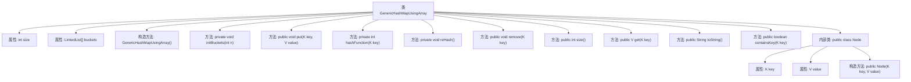

# 基础信息

|      |      |
|------|------|
| 名称 | GenericHashMapUsingArray |
| 编码语言 | .java |
| 代码路径 | Java/src/main/java/com/thealgorithms/datastructures/hashmap/hashing/GenericHashMapUsingArray.java |
| 包名 | com.thealgorithms.datastructures.hashmap.hashing |
| 依赖项 | ['java.util.LinkedList'] |
| 概述说明 | 实现泛型哈希映射，支持增删查改及动态扩容，基于数组和链表。 |

# 说明

该描述涉及实现一个基于数组和链表的泛型哈希映射，具备增删查改功能，并支持动态扩容。哈希映射通过数组存储链表头节点，链表用于处理哈希冲突。插入时计算键的哈希值确定数组索引，若索引位置已有元素，则将其添加到链表末尾。查找、删除和修改操作同样基于哈希值和链表遍历。动态扩容在元素数量超过阈值时触发，通过创建更大的数组并重新哈希所有元素，确保性能稳定。

# 类列表 Class Summary

| 名称   | 类型  | 说明 |
|-------|------|-------------|
| GenericHashMapUsingArray | class | 实现基于数组和链表的泛型哈希映射，支持增删查改及动态扩容。 |


## 类 GenericHashMapUsingArray

|      |      |
|------|------|
| 访问范围 | public |
| 类型 | class |
| 名称 | GenericHashMapUsingArray |
| 说明 | 实现基于数组和链表的泛型哈希映射，支持增删查改及动态扩容。 |


### UML类图

```mermaid
classDiagram
    class GenericHashMapUsingArray~K, V~ {
        -int size
        -LinkedList~Node~[] buckets
        +GenericHashMapUsingArray()
        -initBuckets(int n)
        +put(K key, V value)
        -hashFunction(K key) int
        -reHash()
        +remove(K key)
        +size() int
        +get(K key) V
        +toString() String
        +containsKey(K key) boolean
        +class Node {
            -K key
            -V value
            +Node(K key, V value)
        }
    }
```

这段代码实现了一个基于数组和链表的泛型哈希映射（`GenericHashMapUsingArray`）。它通过哈希函数将键映射到数组的索引，并使用链表处理哈希冲突。类中包含初始化桶、插入、删除、获取值、重新哈希等方法。`Node`类用于存储键值对。哈希映射在负载因子超过阈值时会自动扩容，以保持性能。


### 内部方法调用关系图



这段代码实现了一个基于数组和链表的泛型哈希映射（HashMap）。它通过哈希函数将键映射到数组的特定位置，并使用链表处理哈希冲突。主要功能包括插入键值对、删除键值对、获取值、检查键是否存在以及重新哈希（当负载因子超过阈值时）。内部类`Node`用于存储键值对。代码通过维护`size`和`buckets`来管理哈希表的容量和存储结构。

### 字段列表 Field List

| 名称  | 类型  | 说明 |
|-------|-------|------|
| buckets | LinkedList<Node>[] | 私有链表数组用于存储节点。 |
| size | int | 声明一个私有整型变量size。 |

### 方法列表 Method List

| 名称  | 类型  | 说明 |
|-------|-------|------|
| size | int | 该方法返回当前对象的尺寸值。 |
| containsKey | boolean | 检查键是否存在，返回布尔值。 |
| reHash | void | 哈希表扩容并重新散列所有节点。 |
| remove | void | 通过哈希函数定位链表，遍历查找并移除指定键值节点，更新大小。 |
| initBuckets | void | 初始化n个空链表的桶数组。 |
| hashFunction | int | 哈希函数通过键的哈希码计算桶索引。 |
| put | void | 哈希表插入键值对，更新存在键值，检查负载因子并重新哈希。 |
| get | V | 通过哈希函数定位桶，遍历链表查找匹配键的值，未找到返回null。 |
| toString | String | 重写toString方法，遍历链表并拼接键值对，最后移除多余逗号和空格。 |


