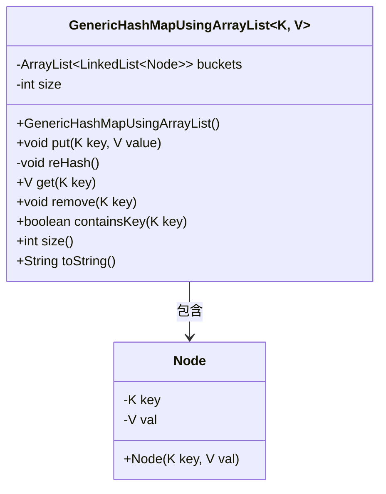
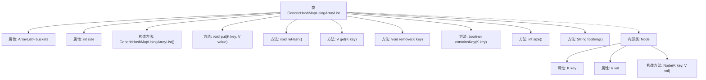
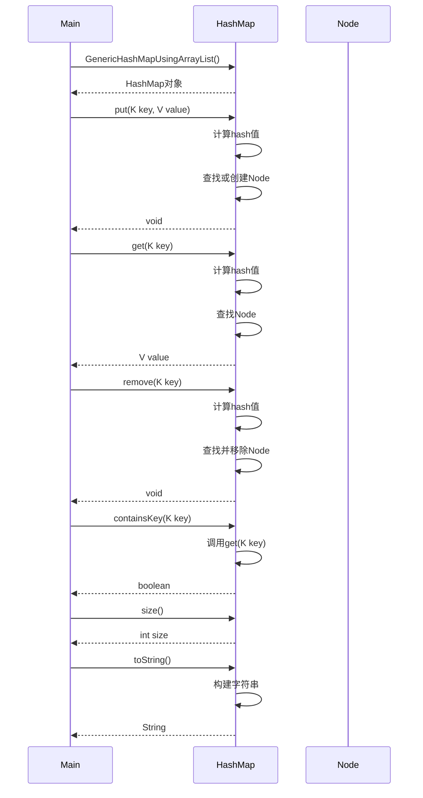

# 基础信息

|      |      |
|------|------|
| 名称 | GenericHashMapUsingArrayList |
| 编码语言 | .java |
| 代码路径 | Java/src/main/java/com/thealgorithms/datastructures/hashmap/hashing/GenericHashMapUsingArrayList.java |
| 包名 | com.thealgorithms.datastructures.hashmap.hashing |
| 依赖项 | ['java.util.ArrayList', 'java.util.LinkedList'] |
| 概述说明 | ArrayList实现泛型哈希映射，支持增删查改和动态扩容。 |

# 说明

使用ArrayList实现的泛型哈希映射，具备增删查改功能，并支持动态扩容。该数据结构通过ArrayList存储键值对，能够高效地处理数据操作。动态扩容机制确保在数据量增加时，哈希映射能够自动调整容量，以维持性能。该实现适用于需要灵活管理键值对且支持动态扩展的场景。

# 类列表 Class Summary

| 名称   | 类型  | 说明 |
|-------|------|-------------|
| GenericHashMapUsingArrayList | class | 使用ArrayList实现的泛型哈希映射，支持增删查改及动态扩容。 |

## 类 GenericHashMapUsingArrayList

|      |      |
|------|------|
| 访问范围 | public |
| 类型 | class |
| 名称 | GenericHashMapUsingArrayList |
| 说明 | 使用ArrayList实现的泛型哈希映射，支持增删查改及动态扩容。 |

### UML类图

类图描述：
`GenericHashMapUsingArrayList` 是一个泛型哈希映射类，使用 `ArrayList` 和 `LinkedList` 实现。它包含一个内部类 `Node`，用于存储键值对。类的主要方法包括 `put`、`get`、`remove`、`containsKey` 和 `size`，分别用于插入、获取、删除键值对、检查键是否存在以及获取映射的大小。类还实现了 `toString` 方法，用于返回映射的字符串表示。`reHash` 方法用于在负载因子超过阈值时重新哈希映射。

### 内部方法调用关系图

这段代码实现了一个基于ArrayList的泛型哈希映射，支持键值对的插入、获取、删除和检查等操作。哈希映射使用链表处理哈希冲突，并通过负载因子阈值触发动态扩容。内部类Node用于存储键值对，reHash方法用于在负载因子超过阈值时扩容哈希表。

### 字段列表 Field List

| 名称  | 类型  | 说明 |
|-------|-------|------|
| buckets | ArrayList<LinkedList<Node>> | 私有变量buckets，类型为ArrayList，元素为LinkedList<Node>。 |
| size | int | 定义了一个私有的整型变量size。 |

### 方法列表 Method List

| 名称  | 类型  | 说明 |
|-------|-------|------|
| remove | void | 通过哈希值定位并删除链表中的指定键值节点。 |
| containsKey | boolean | 检查键是否存在，返回布尔值。 |
| size | int | 该方法返回当前对象的size属性值。 |
| get | V | 通过哈希计算获取键值，遍历链表查找匹配键并返回值。 |
| toString | String | 重写toString方法，遍历节点并生成键值对字符串，去除末尾逗号和空格。 |
| put | void | 哈希表插入操作，处理冲突并检查负载因子，必要时重新哈希。 |
| reHash | void | reHash方法扩展哈希表容量并重新插入所有节点。 |

