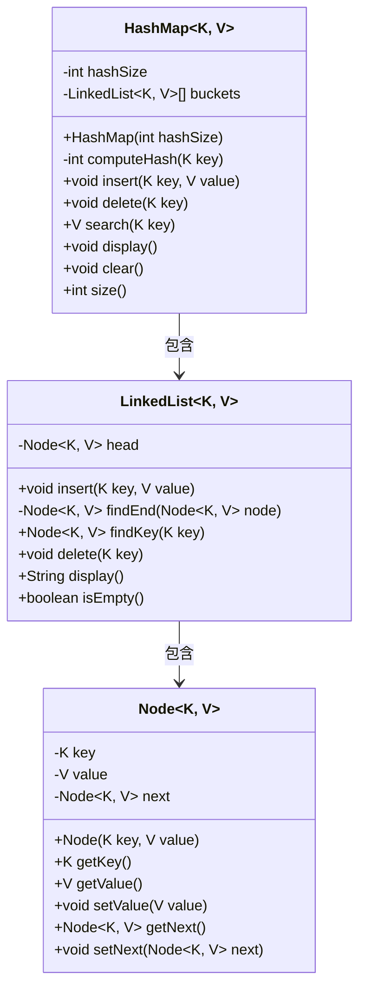

# 基础信息

|      |      |
|------|------|
| 名称 | HashMap |
| 编码语言 | .java |
| 代码路径 | Java/src/main/java/com/thealgorithms/datastructures/hashmap/hashing/HashMap.java |
| 包名 | com.thealgorithms.datastructures.hashmap.hashing |
| 依赖项 | [] |
| 概述说明 | HashMap实现插入、删除、查找、显示、清空和大小功能，链表解决哈希冲突。 |

# 说明

该实现为HashMap数据结构，具备插入、删除、查找、显示、清空和获取大小等核心功能。为了处理哈希冲突，采用链表法将冲突的键值对存储在同一个桶中。插入操作将键值对添加到对应哈希桶的链表中；删除操作从链表中移除指定键的节点；查找操作遍历链表以获取对应键的值；显示功能输出所有键值对；清空操作移除所有元素；大小功能返回当前存储的键值对数量。该实现通过链表有效解决了哈希冲突问题。

# 类列表 Class Summary

| 名称   | 类型  | 说明 |
|-------|------|-------------|
| HashMap | class | HashMap实现，包含插入、删除、查找、显示、清空和大小功能，使用链表解决哈希冲突。 |

## 类 HashMap

|      |      |
|------|------|
| 访问范围 | public |
| 类型 | class |
| 名称 | HashMap |
| 说明 | HashMap实现，包含插入、删除、查找、显示、清空和大小功能，使用链表解决哈希冲突。 |

### UML类图

该代码实现了一个基于链表的哈希表（HashMap），其中包含一个嵌套的链表类（LinkedList）和节点类（Node）。HashMap类通过哈希函数将键值对分配到不同的桶中，每个桶是一个链表，用于处理哈希冲突。链表类负责管理节点的插入、删除和查找操作，节点类则存储键值对及其指向下一个节点的指针。这种结构有效地处理了哈希冲突，并提供了高效的键值对操作。

### 内部方法调用关系图

```mermaid
graph TD
    A["类HashMap<K, V>"]
    B["属性: int hashSize"]
    C["属性: LinkedList<K, V>[] buckets"]
    D["构造方法: HashMap(int hashSize)"]
    E["方法: int computeHash(K key)"]
    F["方法: void insert(K key, V value)"]
    G["方法: void delete(K key)"]
    H["方法: V search(K key)"]
    I["方法: void display()"]
    J["方法: void clear()"]
    K["方法: int size()"]
    L["嵌套类: LinkedList<K, V>"]
    M["属性: Node<K, V> head"]
    N["方法: void insert(K key, V value)"]
    O["方法: Node<K, V> findEnd(Node<K, V> node)"]
    P["方法: Node<K, V> findKey(K key)"]
    Q["方法: void delete(K key)"]
    R["方法: String display()"]
    S["方法: String display(Node<K, V> node)"]
    T["方法: boolean isEmpty()"]
    U["嵌套类: Node<K, V>"]
    V["属性: K key"]
    W["属性: V value"]
    X["属性: Node<K, V> next"]
    Y["构造方法: Node(K key, V value)"]
    Z["方法: K getKey()"]
    AA["方法: V getValue()"]
    AB["方法: void setValue(V value)"]
    AC["方法: Node<K, V> getNext()"]
    AD["方法: void setNext(Node<K, V> next)"]

    A --> B
    A --> C
    A --> D
    A --> E
    A --> F
    A --> G
    A --> H
    A --> I
    A --> J
    A --> K
    A --> L
    L --> M
    L --> N
    L --> O
    L --> P
    L --> Q
    L --> R
    L --> S
    L --> T
    A --> U
    U --> V
    U --> W
    U --> X
    U --> Y
    U --> Z
    U --> AA
    U --> AB
    U --> AC
    U --> AD
```

这段代码实现了一个简单的哈希表（HashMap），使用链表（LinkedList）来处理哈希冲突。HashMap类包含插入、删除、查找、显示、清空和计算大小等操作。内部嵌套了LinkedList类和Node类，分别用于管理链表和存储键值对。流程图展示了类之间的关系及其方法调用，帮助理解哈希表的实现机制。

### 字段列表 Field List

| 名称  | 类型  | 说明 |
|-------|-------|------|
| hashSize | int | 私有整型变量hashSize用于存储哈希表大小。 |
| buckets | LinkedList<K, V>[] | 私有链表数组存储键值对。 |

### 方法列表 Method List

| 名称  | 类型  | 说明 |
|-------|-------|------|
| size | int | 计算哈希表中非空桶的数量并返回。 |
| computeHash | int | 计算键的哈希值，空键返回0，非空键取模后确保为正。 |
| delete | void | 删除指定键值对的方法，通过哈希计算定位并删除。 |
| insert | void | 插入键值对到哈希表的指定桶中。 |
| display | void | 方法display遍历哈希表，输出每个桶的内容。 |
| search | V | 根据键值计算哈希，查找对应节点并返回值，找不到返回空。 |
| clear | void | 该方法清空哈希表中所有桶，重置为初始状态。 |

