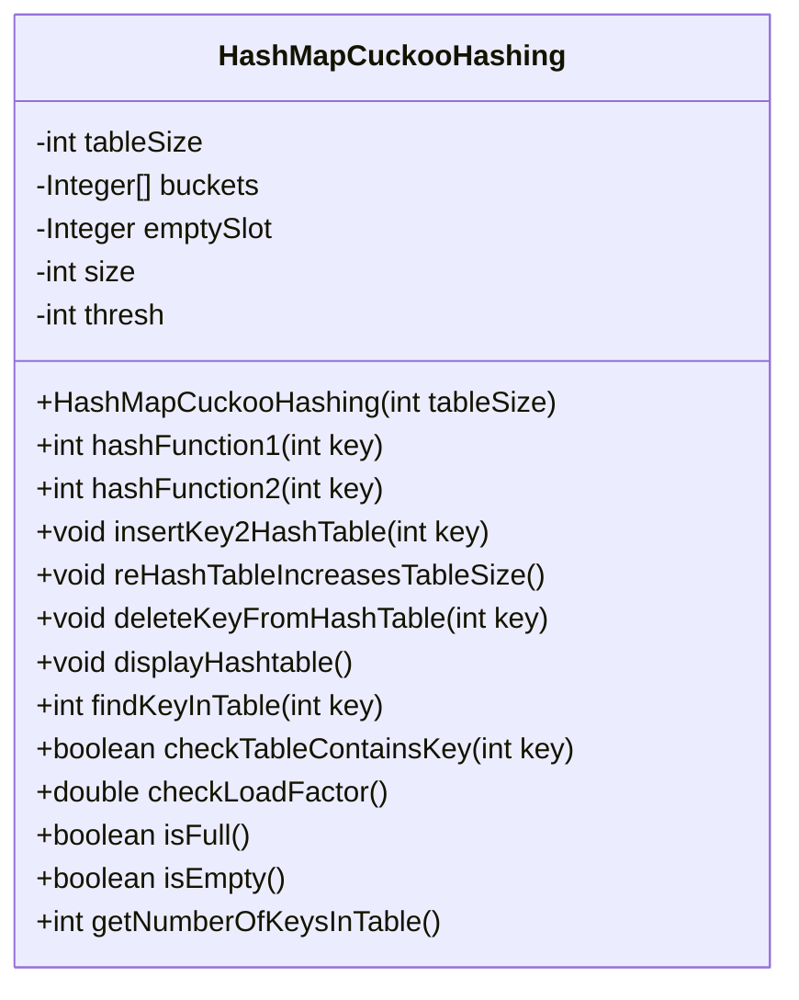

# 基础信息

|      |      |
|------|------|
| 名称 | HashMapCuckooHashing |
| 编码语言 | .java |
| 代码路径 | Java/src/main/java/com/thealgorithms/datastructures/hashmap/hashing/HashMapCuckooHashing.java |
| 包名 | com.thealgorithms.datastructures.hashmap.hashing |
| 依赖项 | ['java.util.Objects'] |
| 概述说明 | 布谷鸟哈希表支持插入、删除、查找及动态扩容功能。 |

# 说明

实现基于布谷鸟散列的哈希表，支持插入、删除、查找和动态扩容功能。该哈希表利用布谷鸟散列算法，通过多哈希函数和备用位置策略解决冲突，确保数据分布均匀。插入操作在发生冲突时，将现有元素移动到备用位置，直到找到空闲槽或达到最大重试次数。删除操作直接移除指定元素，查找操作通过多哈希函数快速定位元素。动态扩容机制在负载因子超过阈值时自动扩展哈希表容量，重新散列所有元素，以维持高效性能。

# 类列表 Class Summary

| 名称   | 类型  | 说明 |
|-------|------|-------------|
| HashMapCuckooHashing | class | 实现基于布谷鸟散列的哈希表，支持插入、删除、查找和动态扩容。 |

## 类 HashMapCuckooHashing

|      |      |
|------|------|
| 访问范围 | public |
| 类型 | class |
| 名称 | HashMapCuckooHashing |
| 说明 | 实现基于布谷鸟散列的哈希表，支持插入、删除、查找和动态扩容。 |

### UML类图

这段代码实现了一个基于Cuckoo Hashing的哈希表类 `HashMapCuckooHashing`。该类包含两个哈希函数 `hashFunction1` 和 `hashFunction2`，用于计算键的哈希值。`insertKey2HashTable` 方法用于插入键，当发生冲突时，会通过重新哈希和重新插入来解决冲突。`reHashTableIncreasesTableSize` 方法用于扩展哈希表的大小并重新插入所有键。`deleteKeyFromHashTable` 方法用于删除键，`findKeyInTable` 方法用于查找键的位置。`checkLoadFactor` 方法用于检查负载因子并在必要时扩展哈希表。`isFull` 和 `isEmpty` 方法分别用于检查哈希表是否已满或为空。`getNumberOfKeysInTable` 方法返回当前哈希表中的键的数量。

### 内部方法调用关系图

```mermaid
graph TD
    A["类HashMapCuckooHashing"]
    B["属性: int tableSize"]
    C["属性: Integer[] buckets"]
    D["属性: final Integer emptySlot"]
    E["属性: int size"]
    F["属性: int thresh"]
    G["构造方法: HashMapCuckooHashing(int tableSize)"]
    H["方法: int hashFunction1(int key)"]
    I["方法: int hashFunction2(int key)"]
    J["方法: void insertKey2HashTable(int key)"]
    K["方法: void reHashTableIncreasesTableSize()"]
    L["方法: void deleteKeyFromHashTable(int key)"]
    M["方法: void displayHashtable()"]
    N["方法: int findKeyInTable(int key)"]
    O["方法: boolean checkTableContainsKey(int key)"]
    P["方法: double checkLoadFactor()"]
    Q["方法: boolean isFull()"]
    R["方法: boolean isEmpty()"]
    S["方法: int getNumberOfKeysInTable()"]

    A --> B
    A --> C
    A --> D
    A --> E
    A --> F
    A --> G
    A --> H
    A --> I
    A --> J
    A --> K
    A --> L
    A --> M
    A --> N
    A --> O
    A --> P
    A --> Q
    A --> R
    A --> S
```

这段代码实现了一个基于Cuckoo Hashing的哈希表类。哈希表使用两个哈希函数来确定键的存储位置，并在插入时处理冲突。如果插入过程中检测到无限循环，哈希表会自动扩容并重新哈希所有键。类中还提供了删除、查找、显示哈希表内容以及检查哈希表状态（如是否为空、是否已满）等功能。通过检查负载因子，哈希表在必要时会自动扩容以保持性能。

### 字段列表 Field List

| 名称  | 类型  | 说明 |
|-------|-------|------|
| tableSize | int | 定义了一个私有整型变量tableSize。 |
| thresh | int | 定义私有整型变量thresh。 |
| emptySlot | Integer | 私有整型变量emptySlot用于表示空槽位。 |
| buckets | Integer[] | 声明了一个私有的整数数组变量buckets。 |
| size | int | 私有整型变量size。 |

### 方法列表 Method List

| 名称  | 类型  | 说明 |
|-------|-------|------|
| checkTableContainsKey | boolean | 检查哈希表中是否存在指定键。 |
| hashFunction1 | int | 哈希函数通过取模运算计算键的哈希值，确保结果非负。 |
| displayHashtable | void | 遍历哈希表并打印每个桶的状态，空桶标记为"Empty"。 |
| hashFunction2 | int | 哈希函数通过除法取模处理键值，确保结果为正且小于表大小。 |
| getNumberOfKeysInTable | int | 获取表中键的数量，返回值为size。 |
| insertKey2HashTable | void | 哈希表插入键值，检查重复，满时扩容，避免死循环。 |
| reHashTableIncreasesTableSize | void | 方法reHashTableIncreasesTableSize扩展哈希表大小为两倍，并迁移非空数据。 |
| isEmpty | boolean | 检查哈希表是否为空，遍历所有桶，若任一桶非空则返回false，否则返回true。 |
| checkLoadFactor | double | 检查哈希表负载因子，若大于0.7则重新哈希并扩容。 |
| isFull | boolean | 该方法检查哈希表是否已满，遍历所有桶，若发现空位则返回false，否则返回true。 |
| deleteKeyFromHashTable | void | 删除哈希表中指定键值，若表空或键不存在则抛出异常。 |
| findKeyInTable | int | 在哈希表中查找键，若表空或未找到则抛出异常，找到则返回哈希值。 |

