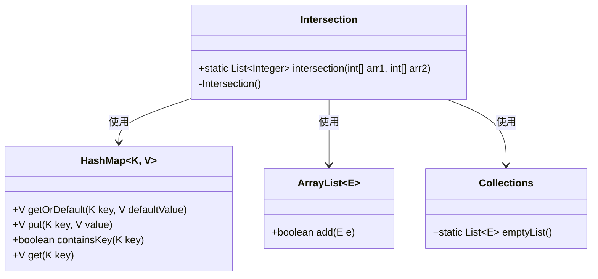
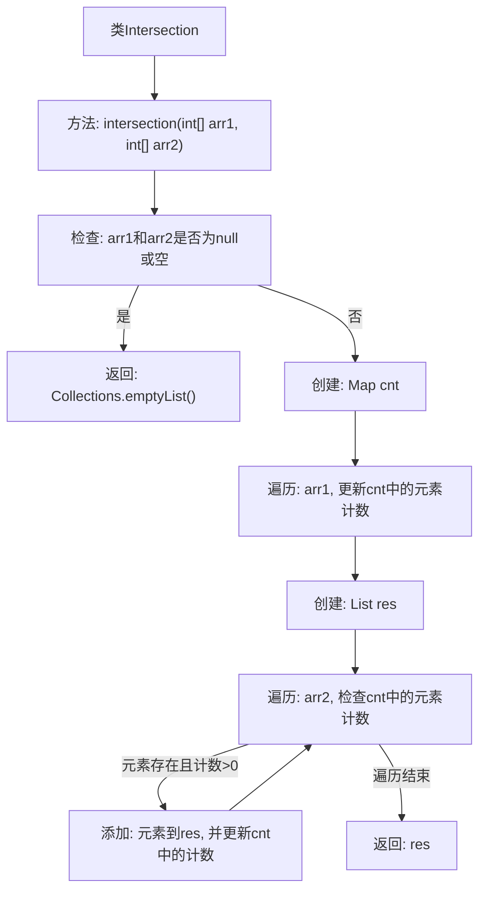

# 基础信息

|      |      |
|------|------|
| 名称 | Intersection |
| 编码语言 | .java |
| 代码路径 | Java/src/main/java/com/thealgorithms/datastructures/hashmap/hashing/Intersection.java |
| 包名 | com.thealgorithms.datastructures.hashmap.hashing |
| 依赖项 | ['java.util.ArrayList', 'java.util.Collections', 'java.util.HashMap', 'java.util.List', 'java.util.Map'] |
| 概述说明 | 使用哈希表统计两整数数组元素，返回交集列表。 |

# 说明

该任务要求计算两个整数数组的交集，采用哈希表来统计数组中的元素。具体步骤包括：首先遍历第一个数组，使用哈希表记录每个元素的出现次数；然后遍历第二个数组，检查每个元素是否存在于哈希表中，若存在则将其添加到结果列表中，并减少哈希表中的计数。最终返回的结果列表即为两个数组的交集。该方法通过哈希表实现高效的元素查找和统计，确保时间复杂度较低。

# 类列表 Class Summary

| 名称   | 类型  | 说明 |
|-------|------|-------------|
| Intersection | class | 计算两个整数数组的交集，使用哈希表统计元素并返回结果列表。 |

## 类 Intersection

|      |      |
|------|------|
| 访问范围 | public final |
| 类型 | class |
| 名称 | Intersection |
| 说明 | 计算两个整数数组的交集，使用哈希表统计元素并返回结果列表。 |

### UML类图

这段代码定义了一个 `Intersection` 类，其中包含一个静态方法 `intersection`，用于计算两个整数数组的交集。该方法首先检查输入数组是否为空或无效，如果无效则返回空列表。接着，使用 `HashMap` 统计第一个数组中每个元素的出现次数，然后遍历第二个数组，检查元素是否在 `HashMap` 中存在且计数大于零，如果满足条件则将该元素添加到结果列表中，并减少 `HashMap` 中的计数。最后返回结果列表。`Intersection` 类的构造函数被声明为私有，以防止实例化。

### 内部方法调用关系图

**描述：**  
这段代码实现了一个计算两个整数数组交集的方法。首先，它检查输入数组是否为空或为null，如果是则返回空列表。接着，它使用一个HashMap来记录第一个数组中每个元素的出现次数。然后，遍历第二个数组，检查元素是否在HashMap中存在且计数大于0，如果是则将其添加到结果列表中，并减少HashMap中的计数。最后，返回包含交集元素的结果列表。

### 字段列表 Field List

| 名称  | 类型  | 说明 |
|-------|-------|------|

### 方法列表 Method List

| 名称  | 类型  | 说明 |
|-------|-------|------|
| intersection | List<Integer> | 求两个数组的交集，返回结果列表。 |

