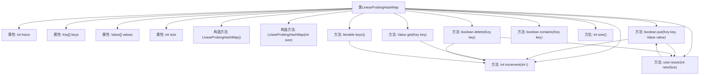

# 基础信息

|      |      |
|------|------|
| 名称 | LinearProbingHashMap |
| 编码语言 | .java |
| 代码路径 | Java/src/main/java/com/thealgorithms/datastructures/hashmap/hashing/LinearProbingHashMap.java |
| 包名 | com.thealgorithms.datastructures.hashmap.hashing |
| 依赖项 | ['java.util.ArrayList'] |
| 概述说明 | 线性探测哈希表支持插入、查找、删除及动态扩容。 |

# 说明

线性探测哈希表是一种用于存储键值对的数据结构，支持插入、查找和删除操作。它通过线性探测法解决哈希冲突，即当发生冲突时，顺序查找下一个空闲位置。该实现还具备动态调整大小的功能，当哈希表的负载因子超过或低于特定阈值时，自动扩展或收缩表的大小，以保持操作效率。这种设计确保了哈希表在各种操作下的性能稳定性和空间利用率。

# 类列表 Class Summary

| 名称   | 类型  | 说明 |
|-------|------|-------------|
| LinearProbingHashMap | class | 线性探测哈希表实现，支持插入、查找、删除及动态调整大小。 |


## 类 LinearProbingHashMap

|      |      |
|------|------|
| 访问范围 | public |
| 类型 | class |
| 名称 | LinearProbingHashMap |
| 说明 | 线性探测哈希表实现，支持插入、查找、删除及动态调整大小。 |


### UML类图

```mermaid
classDiagram
    class Map~Key, Value~ {
        <<Interface>>
        +boolean put(Key key, Value value)
        +Value get(Key key)
        +boolean delete(Key key)
        +boolean contains(Key key)
        +int size()
        +Iterable~Key~ keys()
    }

    class LinearProbingHashMap~Key extends Comparable~Key~, Value~ {
        -int hsize
        -Key[] keys
        -Value[] values
        -int size
        +LinearProbingHashMap()
        +LinearProbingHashMap(int size)
        +boolean put(Key key, Value value)
        +Value get(Key key)
        +boolean delete(Key key)
        +boolean contains(Key key)
        +int size()
        +Iterable~Key~ keys()
        -int increment(int i)
        -void resize(int newSize)
    }

    LinearProbingHashMap --> Map : 实现
```

这段代码定义了一个 `LinearProbingHashMap` 类，它实现了 `Map` 接口。`LinearProbingHashMap` 使用线性探测法来解决哈希冲突，并提供了基本的哈希表操作，如插入、查找、删除和获取所有键。类中包含私有方法 `increment` 和 `resize`，分别用于计算下一个探测位置和调整哈希表大小。代码通过泛型支持不同类型的键和值，并确保键是可比较的。


### 内部方法调用关系图



这段代码实现了一个基于线性探测的哈希映射表。类 `LinearProbingHashMap` 包含了哈希表的基本操作，如插入 (`put`)、查找 (`get`)、删除 (`delete`) 和检查键是否存在 (`contains`)。哈希表的大小 (`hsize`) 和存储的键值对 (`keys` 和 `values`) 是类的核心属性。当哈希表达到一定负载因子时，会自动调整大小 (`resize`)。线性探测通过 `increment` 方法实现，用于处理哈希冲突。代码还提供了获取所有键的排序列表 (`keys`) 和获取哈希表大小 (`size`) 的方法。

### 字段列表 Field List

| 名称  | 类型  | 说明 |
|-------|-------|------|
| hsize | int | 定义私有整型变量hsize。 |
| size | int | 声明一个私有的整型变量size。 |
| values | Value[] | 私有成员变量values，类型为Value数组。 |
| keys | Key[] | 声明一个私有数组变量keys，类型为Key。 |

### 方法列表 Method List

| 名称  | 类型  | 说明 |
|-------|-------|------|
| contains | boolean | 检查键是否存在，返回键对应的值是否为空。 |
| keys | Iterable<Key> | 重写keys方法，返回排序后的非空键列表。 |
| size | int | 重写size方法，返回变量size的值。 |
| increment | int | 私有方法`increment`将输入值加1后取模`hsize`。 |
| get | Value | 重写get方法，通过哈希查找键值对，若键为null则返回null。 |
| delete | boolean | 删除指定键值对，若成功则调整哈希表大小。 |
| resize | void | 线性探测哈希表调整大小，复制键值到新表。 |
| put | boolean | 重写put方法，处理键为null，自动扩容，哈希冲突时更新或插入键值对。 |


