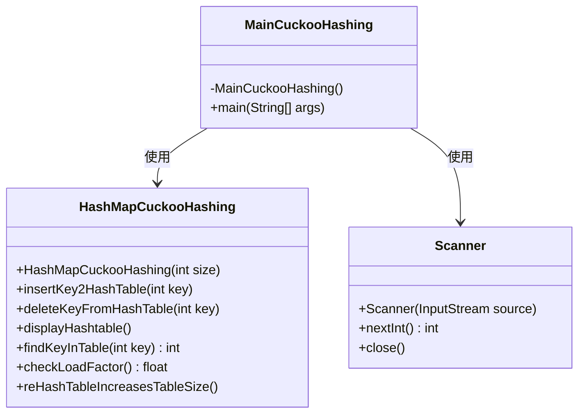
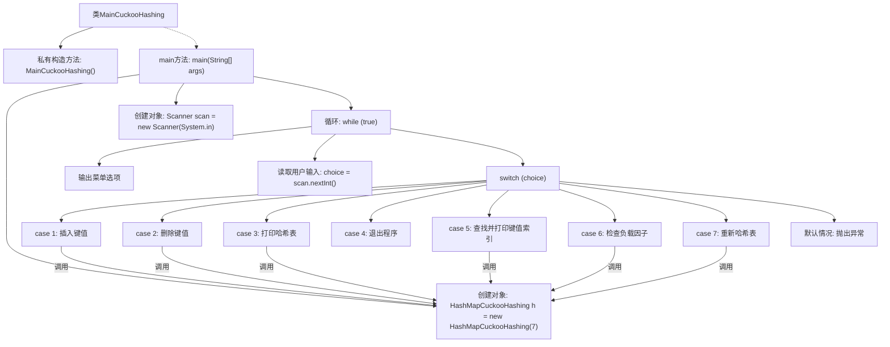

# 基础信息

|      |      |
|------|------|
| 名称 | MainCuckooHashing |
| 编码语言 | .java |
| 代码路径 | Java/src/main/java/com/thealgorithms/datastructures/hashmap/hashing/MainCuckooHashing.java |
| 包名 | com.thealgorithms.datastructures.hashmap.hashing |
| 依赖项 | ['java.util.Scanner'] |
| 概述说明 | 主类实现布谷鸟哈希表，支持增删查打印及重哈希功能。 |

# 说明

主类实现了布谷鸟哈希表的操作，涵盖插入、删除、查找、打印以及重哈希等核心功能。插入操作确保数据正确存入哈希表，删除操作移除指定元素，查找操作快速定位目标数据，打印功能展示当前哈希表状态，重哈希则在必要时调整哈希表大小以优化性能。这些功能共同确保布谷鸟哈希表的高效运行和数据管理。

# 类列表 Class Summary

| 名称   | 类型  | 说明 |
|-------|------|-------------|
| MainCuckooHashing | class | 主类实现布谷鸟哈希表操作，包括增删查打印及重哈希等功能。 |

## 类 MainCuckooHashing

|      |      |
|------|------|
| 访问范围 | public final |
| 类型 | class |
| 名称 | MainCuckooHashing |
| 说明 | 主类实现布谷鸟哈希表操作，包括增删查打印及重哈希等功能。 |

### UML类图

**描述：**
该代码展示了一个使用Cuckoo Hashing算法实现的哈希表操作程序。`MainCuckooHashing`类包含主方法，通过用户输入选择不同的操作，如插入、删除、打印哈希表、查找键、检查负载因子和重新哈希等。`HashMapCuckooHashing`类负责实现具体的哈希表操作，而`Scanner`类用于处理用户输入。代码通过循环和条件判断实现了交互式的哈希表管理功能。

### 内部方法调用关系图

这段代码实现了一个基于Cuckoo Hashing的哈希表操作程序。程序通过一个无限循环展示菜单，用户可以选择插入、删除、打印哈希表、查找键值索引、检查负载因子、重新哈希表或退出程序。每个操作都通过调用`HashMapCuckooHashing`类的相应方法来完成。程序通过`Scanner`读取用户输入，并根据输入执行相应操作。如果用户输入无效选项，程序会抛出异常。

### 字段列表 Field List

| 名称  | 类型  | 说明 |
|-------|-------|------|

### 方法列表 Method List

| 名称  | 类型  | 说明 |
|-------|-------|------|
| main | void | Java程序实现哈希表操作，支持增删查印及重哈希。 |

