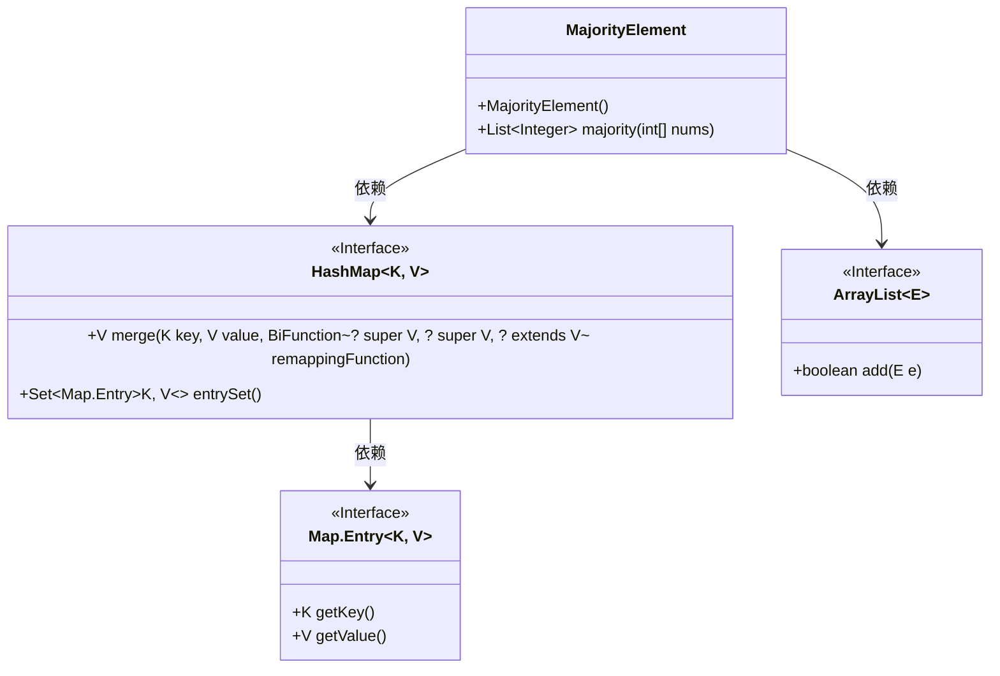
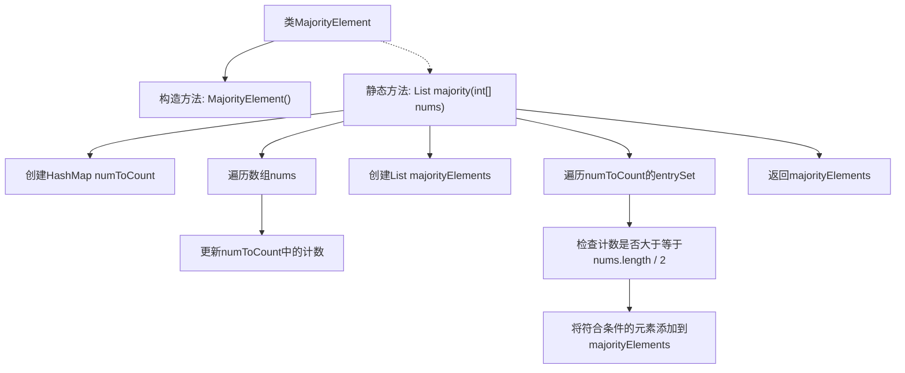

# 基础信息

|      |      |
|------|------|
| 名称 | MajorityElement |
| 编码语言 | .java |
| 代码路径 | Java/src/main/java/com/thealgorithms/datastructures/hashmap/hashing/MajorityElement.java |
| 包名 | com.thealgorithms.datastructures.hashmap.hashing |
| 依赖项 | ['java.util.ArrayList', 'java.util.HashMap', 'java.util.List'] |
| 概述说明 | 代码从整数数组中找出出现次数过半的元素并返回列表。 |

# 说明

该代码实现了一个方法，用于从整数数组中找出出现次数超过一半的元素，并返回这些元素的列表。该方法通过遍历数组，统计每个元素的出现次数，然后筛选出出现次数超过数组长度一半的元素，最终将这些元素以列表形式返回。

# 类列表 Class Summary

| 名称   | 类型  | 说明 |
|-------|------|-------------|
| MajorityElement | class | 该代码实现了一个方法，用于从整数数组中找出出现次数超过一半的元素，并返回这些元素的列表。 |

## 类 MajorityElement

|      |      |
|------|------|
| 访问范围 | public final |
| 类型 | class |
| 名称 | MajorityElement |
| 说明 | 该代码实现了一个方法，用于从整数数组中找出出现次数超过一半的元素，并返回这些元素的列表。 |

### UML类图

这段代码定义了一个 `MajorityElement` 类，其中包含一个静态方法 `majority`，用于从整数数组中找出出现次数超过数组长度一半的元素。该方法使用 `HashMap` 来统计每个元素的出现次数，然后遍历 `HashMap` 的条目，将符合条件的元素添加到 `ArrayList` 中并返回。类图展示了 `MajorityElement` 类与 `HashMap` 和 `ArrayList` 之间的依赖关系，以及 `HashMap` 与 `Map.Entry` 之间的依赖关系。

### 内部方法调用关系图

这段代码定义了一个`MajorityElement`类，其中包含一个静态方法`majority`，用于找出给定整数数组中的多数元素。方法首先通过遍历数组并使用`HashMap`记录每个元素的出现次数，然后遍历`HashMap`，将出现次数超过数组长度一半的元素添加到结果列表中，最后返回该列表。流程图清晰地展示了方法的执行步骤和逻辑流程。

### 字段列表 Field List

| 名称  | 类型  | 说明 |
|-------|-------|------|

### 方法列表 Method List

| 名称  | 类型  | 说明 |
|-------|-------|------|
| majority | List<Integer> | 统计数组中出现次数过半的元素并返回列表。 |

