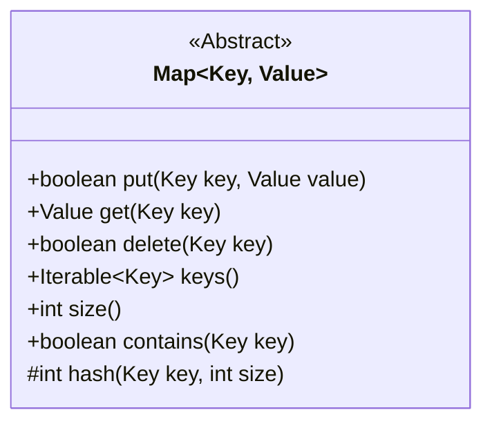
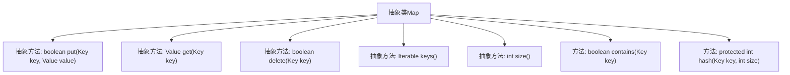

# 基础信息

|      |      |
|------|------|
| 名称 | Map |
| 编码语言 | .java |
| 代码路径 | Java/src/main/java/com/thealgorithms/datastructures/hashmap/hashing/Map.java |
| 包名 | com.thealgorithms.datastructures.hashmap.hashing |
| 依赖项 | [] |
| 概述说明 | 抽象类Map定义键值对操作，含插入、获取、删除、遍历、大小查询、哈希计算和键存在检查。 |

# 说明

抽象类Map定义了键值对的基本操作，包括插入、获取、删除、遍历和查询大小等功能。此外，它还提供了哈希计算和键存在检查的功能，确保数据的高效管理和检索。这些操作共同构成了Map类的核心功能，适用于各种需要键值对存储和管理的场景。

# 类列表 Class Summary

| 名称   | 类型  | 说明 |
|-------|------|-------------|
| Map | class | 抽象类Map定义键值对操作，包括插入、获取、删除、遍历和大小查询，并提供哈希计算和键存在检查功能。 |

## 类 Map

|      |      |
|------|------|
| 访问范围 | public abstract |
| 类型 | class |
| 名称 | Map |
| 说明 | 抽象类Map定义键值对操作，包括插入、获取、删除、遍历和大小查询，并提供哈希计算和键存在检查功能。 |

### UML类图

这段代码定义了一个抽象类 `Map<Key, Value>`，用于表示一个键值对映射的通用结构。该类提供了基本的操作，如插入、获取、删除键值对，以及获取所有键和映射大小的方法。此外，还包含一个受保护的哈希方法 `hash`，用于计算键的哈希值，并提供了一个公共方法 `contains` 来检查某个键是否存在于映射中。该类的设计为其他具体映射实现提供了基础框架。

### 内部方法调用关系图

这段代码定义了一个抽象类 `Map<Key, Value>`，包含了多个抽象方法和两个具体方法。抽象方法包括 `put`、`get`、`delete`、`keys` 和 `size`，这些方法需要在子类中实现。具体方法 `contains` 用于检查键是否存在，`hash` 方法用于计算键的哈希值。

### 字段列表 Field List

| 名称  | 类型  | 说明 |
|-------|-------|------|

### 方法列表 Method List

| 名称  | 类型  | 说明 |
|-------|-------|------|
| hash | int | 该方法通过哈希码计算键在指定大小范围内的索引。 |
| contains | boolean | 检查键是否存在，若存在返回true，否则返回false。 |
| get | Value | 通过键获取对应值的方法。 |
| size | int | 返回集合的大小。 |
| keys | Iterable<Key> | 返回所有键的迭代集合。 |
| put | boolean | 插入键值对到数据结构中。 |
| delete | boolean | 删除指定键值的布尔型抽象方法。 |

