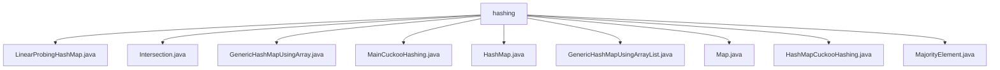

# 基础信息

|      |      |
|------|------|
| 名称 | hashing |
| 编码语言 | .java |
| 代码路径 | Java/src/main/java/com/thealgorithms/datastructures/hashmap/hashing |
| 包名 | Java.src.main.java.com.thealgorithms.datastructures.hashmap.hashing |
| 概述说明 | 线性探测哈希表解决冲突，动态调整大小。哈希表统计数组交集。泛型哈希映射支持增删查改，动态扩容。布谷鸟哈希表高效管理数据。链表法处理哈希冲突。ArrayList实现泛型哈希映射，支持动态扩容。Map类定义键值对操作。布谷鸟散列哈希表支持插入删除查找，动态扩容。统计数组中出现次数超半元素。 |

# 说明

## 概述
该代码模块主要围绕哈希表及其相关操作展开，涵盖了多种哈希表实现及其应用场景。模块中包括了线性探测哈希表、布谷鸟哈希表、基于数组和链表的泛型哈希映射、基于ArrayList的泛型哈希映射等不同实现方式。此外，模块还提供了一些基于哈希表的实用算法，如计算数组交集、查找多数元素等。这些实现和算法共同构成了一个完整的哈希表工具集，适用于各种需要高效键值对存储和管理的场景。

## 主要业务场景
1. **哈希表的基本操作**：模块中的多个类实现了哈希表的插入、删除、查找、动态扩容等基本操作。这些操作通过不同的冲突解决策略（如线性探测、链表法、布谷鸟散列等）来确保哈希表的高效性和稳定性。
   - **线性探测哈希表**：通过线性探测法解决冲突，支持动态调整大小。
   - **布谷鸟哈希表**：利用多哈希函数和备用位置策略解决冲突，支持动态扩容。
   - **基于数组和链表的泛型哈希映射**：通过数组存储链表头节点，链表用于处理哈希冲突，支持动态扩容。
   - **基于ArrayList的泛型哈希映射**：使用ArrayList存储键值对，支持动态扩容。

2. **哈希表的应用**：模块中的一些类实现了基于哈希表的实用算法，展示了哈希表在实际问题中的应用。
   - **计算数组交集**：通过哈希表统计数组元素，高效计算两个整数数组的交集。
   - **查找多数元素**：通过哈希表统计元素出现次数，找出出现次数超过数组长度一半的元素。

3. **抽象类与接口**：模块中提供了一个抽象类`Map`，定义了键值对的基本操作，如插入、获取、删除、遍历和查询大小等。这些操作构成了哈希表的核心功能，适用于各种需要键值对存储和管理的场景。

4. **动态扩容机制**：多个实现中包含了动态扩容机制，确保在数据量增加时，哈希表能够自动调整容量，以维持性能。这种机制在处理大规模数据时尤为重要，能够有效避免哈希表性能下降。

通过这些实现和应用，该模块为开发者提供了丰富的工具和算法，能够高效地处理各种键值对存储和管理的需求。

### 包内部结构视图

该流程图展示了 `hashing` 文件夹下的所有文件及其层级关系。`hashing` 作为根节点，包含了多个与哈希算法相关的 Java 文件，如 `LinearProbingHashMap.java`、`GenericHashMapUsingArray.java` 等。这些文件均直接隶属于 `hashing` 文件夹，没有进一步的子文件夹层级，反映了该目录下文件的扁平结构。

# 文件列表 File List

| 名称   | 类型  | 说明 |
|-------|------|-------------|
| [Map.java](Map.md) | file | 抽象类Map定义键值对操作，含插入、获取、删除、遍历、大小查询、哈希计算和键存在检查。 |
| [Intersection.java](Intersection.md) | file | 使用哈希表统计两整数数组元素，返回交集列表。 |
| [MajorityElement.java](MajorityElement.md) | file | 代码从整数数组中找出出现次数过半的元素并返回列表。 |
| [HashMapCuckooHashing.java](HashMapCuckooHashing.md) | file | 布谷鸟哈希表支持插入、删除、查找及动态扩容功能。 |
| [GenericHashMapUsingArrayList.java](GenericHashMapUsingArrayList.md) | file | ArrayList实现泛型哈希映射，支持增删查改和动态扩容。 |
| [HashMap.java](HashMap.md) | file | HashMap实现插入、删除、查找、显示、清空和大小功能，链表解决哈希冲突。 |
| [MainCuckooHashing.java](MainCuckooHashing.md) | file | 主类实现布谷鸟哈希表，支持增删查打印及重哈希功能。 |
| [GenericHashMapUsingArray.java](GenericHashMapUsingArray.md) | file | 实现泛型哈希映射，支持增删查改及动态扩容，基于数组和链表。 |
| [LinearProbingHashMap.java](LinearProbingHashMap.md) | file | 线性探测哈希表支持插入、查找、删除及动态扩容。 |

