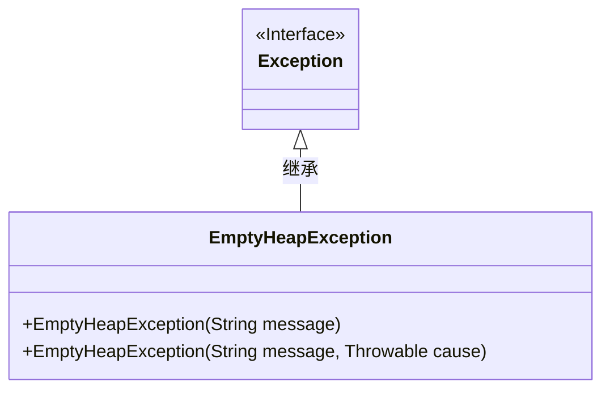
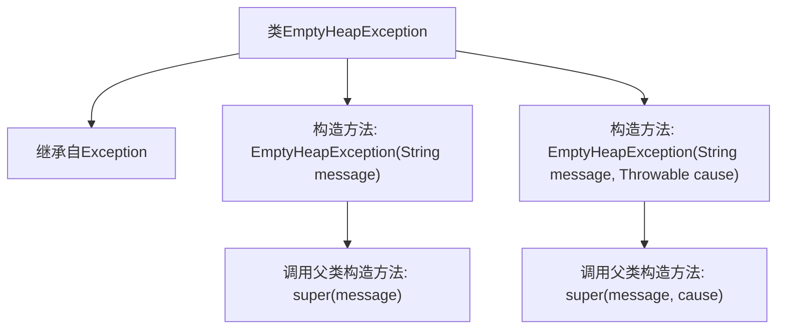

# 基础信息

|      |      |
|------|------|
| 名称 | EmptyHeapException |
| 编码语言 | .java |
| 代码路径 | Java/src/main/java/com/thealgorithms/datastructures/heaps/EmptyHeapException.java |
| 包名 | com.thealgorithms.datastructures.heaps |
| 依赖项 | [] |
| 概述说明 | EmptyHeapException继承Exception，支持带消息和原因的构造方法。 |

# 说明

EmptyHeapException类是一个继承自Exception的自定义异常类。它提供了两个构造方法，一个接受消息参数，另一个同时接受消息和原因参数。这些构造方法允许在抛出异常时传递详细的错误信息和引发异常的根本原因，从而帮助开发者更好地理解和处理异常情况。

# 类列表 Class Summary

| 名称   | 类型  | 说明 |
|-------|------|-------------|
| EmptyHeapException | class | EmptyHeapException类继承Exception，提供带消息和原因参数的构造方法。 |

## 类 EmptyHeapException

|      |      |
|------|------|
| 访问范围 | @SuppressWarnings("serial");public |
| 类型 | class |
| 名称 | EmptyHeapException |
| 说明 | EmptyHeapException类继承Exception，提供带消息和原因参数的构造方法。 |

### UML类图

这段代码定义了一个名为 `EmptyHeapException` 的自定义异常类，它继承自 `Exception` 类。`EmptyHeapException` 提供了两个构造函数，一个接受一个字符串参数 `message`，另一个接受字符串参数 `message` 和一个 `Throwable` 参数 `cause`。这些构造函数分别用于创建带有特定错误信息和原因的自定义异常对象。该异常类可以用于在堆（Heap）为空时抛出异常，帮助开发者更好地处理堆操作中的错误情况。

### 内部方法调用关系图

这段代码定义了一个名为`EmptyHeapException`的异常类，它继承自`Exception`类。该类提供了两个构造方法：一个接受单个`String`参数用于传递异常信息，另一个接受`String`和`Throwable`参数，分别用于传递异常信息和导致异常的原因。两个构造方法都通过`super`关键字调用了父类`Exception`的相应构造方法。这段代码主要用于在堆为空时抛出异常，并提供详细的异常信息。

### 字段列表 Field List

| 名称  | 类型  | 说明 |
|-------|-------|------|

### 方法列表 Method List

| 名称  | 类型  | 说明 |
|-------|-------|------|

