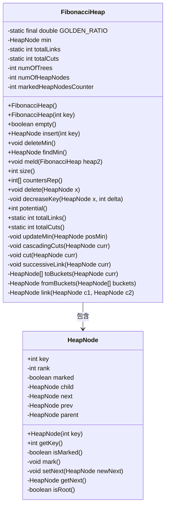

# 基础信息

|      |      |
|------|------|
| 名称 | FibonacciHeap |
| 编码语言 | .java |
| 代码路径 | Java/src/main/java/com/thealgorithms/datastructures/heaps/FibonacciHeap.java |
| 包名 | com.thealgorithms.datastructures.heaps |
| 依赖项 | [] |
| 概述说明 | 斐波那契堆支持插入、删除最小节点、合并及维护节点标记和树结构。 |

# 说明

斐波那契堆是一种高效的数据结构，支持多种操作，包括插入新节点、删除最小节点以及合并两个堆。该实现特别注重维护节点的标记状态和树形结构，以确保操作的性能优化。通过精确管理节点的标记，堆能够有效地处理插入和删除操作，同时保持树结构的完整性，从而在各种应用场景中提供高效的数据处理能力。

# 类列表 Class Summary

| 名称   | 类型  | 说明 |
|-------|------|-------------|
| FibonacciHeap | class | 斐波那契堆实现，支持插入、删除最小节点、合并堆等操作，并维护节点标记和树结构。 |

## 类 FibonacciHeap

|      |      |
|------|------|
| 访问范围 | public |
| 类型 | class |
| 名称 | FibonacciHeap |
| 说明 | 斐波那契堆实现，支持插入、删除最小节点、合并堆等操作，并维护节点标记和树结构。 |

### UML类图

**描述：**
`FibonacciHeap` 类实现了一个斐波那契堆数据结构，用于高效地管理优先队列操作。它包含多个私有成员变量，如 `min` 节点、树的数目、节点数目等，并提供了插入、删除最小值、合并堆等操作。`HeapNode` 类是 `FibonacciHeap` 的内部类，表示堆中的节点，包含节点的键值、子节点、兄弟节点等信息。通过 `FibonacciHeap` 的方法，可以对这些节点进行操作，如插入、删除、合并等。

### 内部方法调用关系图

```mermaid
graph TD
    A["类FibonacciHeap"]
    B["属性: double GOLDEN_RATIO"]
    C["属性: HeapNode min"]
    D["属性: int totalLinks"]
    E["属性: int totalCuts"]
    F["属性: int numOfTrees"]
    G["属性: int numOfHeapNodes"]
    H["属性: int markedHeapNodesCounter"]
    I["构造方法: FibonacciHeap()"]
    J["构造方法: FibonacciHeap(int key)"]
    K["方法: boolean empty()"]
    L["方法: HeapNode insert(int key)"]
    M["方法: void deleteMin()"]
    N["方法: HeapNode findMin()"]
    O["方法: void meld(FibonacciHeap heap2)"]
    P["方法: int size()"]
    Q["方法: int[] countersRep()"]
    R["方法: void delete(HeapNode x)"]
    S["方法: void decreaseKey(HeapNode x, int delta)"]
    T["方法: int potential()"]
    U["方法: static int totalLinks()"]
    V["方法: static int totalCuts()"]
    W["方法: void updateMin(HeapNode posMin)"]
    X["方法: void cascadingCuts(HeapNode curr)"]
    Y["方法: void cut(HeapNode curr)"]
    Z["方法: void successiveLink(HeapNode curr)"]
    AA["方法: HeapNode[] toBuckets(HeapNode curr)"]
    AB["方法: HeapNode fromBuckets(HeapNode[] buckets)"]
    AC["方法: HeapNode link(HeapNode c1, HeapNode c2)"]
    AD["内部类: HeapNode"]
    AE["属性: int key"]
    AF["属性: int rank"]
    AG["属性: boolean marked"]
    AH["属性: HeapNode child"]
    AI["属性: HeapNode next"]
    AJ["属性: HeapNode prev"]
    AK["属性: HeapNode parent"]
    AL["构造方法: HeapNode(int key)"]
    AM["方法: int getKey()"]
    AN["方法: boolean isMarked()"]
    AO["方法: void mark()"]
    AP["方法: void setNext(HeapNode newNext)"]
    AQ["方法: HeapNode getNext()"]
    AR["方法: boolean isRoot()"]

    A --> B
    A --> C
    A --> D
    A --> E
    A --> F
    A --> G
    A --> H
    A --> I
    A --> J
    A --> K
    A --> L
    A --> M
    A --> N
    A --> O
    A --> P
    A --> Q
    A --> R
    A --> S
    A --> T
    A --> U
    A --> V
    A --> W
    A --> X
    A --> Y
    A --> Z
    A --> AA
    A --> AB
    A --> AC
    A --> AD
    AD --> AE
    AD --> AF
    AD --> AG
    AD --> AH
    AD --> AI
    AD --> AJ
    AD --> AK
    AD --> AL
    AD --> AM
    AD --> AN
    AD --> AO
    AD --> AP
    AD --> AQ
    AD --> AR
```

**描述：**
该流程图展示了`FibonacciHeap`类的结构及其内部类`HeapNode`的属性和方法。`FibonacciHeap`类实现了斐波那契堆数据结构，包含多个属性和方法，如插入、删除最小值、合并堆等操作。`HeapNode`类表示堆中的节点，包含节点的键值、子节点、兄弟节点等属性，以及相关操作方法。流程图清晰地展示了类与内部类之间的关系及其方法调用路径。

### 字段列表 Field List

| 名称  | 类型  | 说明 |
|-------|-------|------|
| min | HeapNode | 私有变量min指向堆节点。 |
| totalCuts = 0 | int | 私有静态整型变量totalCuts初始化为0。 |
| numOfTrees = 0 | int | 定义私有整型变量numOfTrees并初始化为0。 |
| numOfHeapNodes = 0 | int | 私有整型变量numOfHeapNodes初始化为0。 |
| totalLinks = 0 | int | 静态私有整型变量totalLinks初始化为0。 |
| markedHeapNodesCounter = 0 | int | 私有整型变量标记堆节点计数器初始化为0。 |
| GOLDEN_RATIO = (1 + Math.sqrt(5)) / 2 | double | 定义黄金比例常量为1.618。 |

### 方法列表 Method List

| 名称  | 类型  | 说明 |
|-------|-------|------|
| empty | boolean | 该方法检查最小值是否为空。 |
| totalCuts | int | 静态方法返回总切割次数。 |
| findMin | HeapNode | 查找并返回堆中的最小节点。 |
| size | int | 该方法返回堆节点的数量。 |
| successiveLink | void | 将节点分桶处理并更新最小值。 |
| fromBuckets | HeapNode | 从桶数组中构建最小堆节点并返回最小节点。 |
| delete | void | 删除堆节点：减小节点键值并删除最小节点。 |
| cascadingCuts | void | 递归剪枝操作，标记节点并更新计数器。 |
| insert | HeapNode | 插入新节点，更新最小节点，增加节点和树的数量。 |
| potential | int | 方法potential返回树数量加两倍标记堆节点数的总和。 |
| totalLinks | int | 静态方法返回总链接数。 |
| toBuckets | HeapNode[] | 将堆节点分配到桶中，按秩合并并返回桶数组。 |
| link | HeapNode | 链接两个堆节点，调整父子关系并增加秩。 |
| meld | void | 合并两个斐波那契堆，更新最小节点和节点数量。 |
| countersRep | int[] | 方法返回斐波那契堆中各秩节点的计数数组。 |
| deleteMin | void | 删除最小堆节点，处理子节点和兄弟节点，更新堆结构。 |
| updateMin | void | 更新最小节点：若新节点值小于当前最小值，则更新最小节点。 |
| cut | void | cut方法断开curr节点与其父节点的连接，更新父节点属性，重置curr节点关系，并更新最小节点和树数量。 |
| decreaseKey | void | 减少堆节点键值，若需则切割并级联切割父节点。 |

