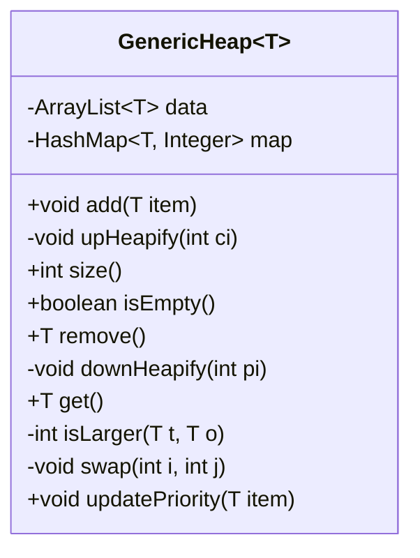
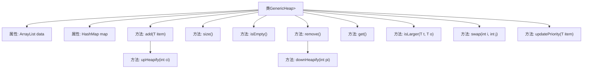

# 基础信息

|      |      |
|------|------|
| 名称 | GenericHeap |
| 编码语言 | .java |
| 代码路径 | Java/src/main/java/com/thealgorithms/datastructures/heaps/GenericHeap.java |
| 包名 | com.thealgorithms.datastructures.heaps |
| 依赖项 | ['java.util.ArrayList', 'java.util.HashMap'] |
| 概述说明 | 泛型堆支持增删、取最大值及更新优先级，维护堆属性。 |

# 说明

该泛型堆实现支持添加元素、删除元素、获取最大值以及更新元素优先级等操作，同时确保堆属性得到维护。通过高效的数据结构设计，能够在O(log n)时间复杂度内完成这些操作，保持堆的平衡和有序性。该实现适用于需要动态管理优先级队列的场景，如任务调度、图算法等。

# 类列表 Class Summary

| 名称   | 类型  | 说明 |
|-------|------|-------------|
| GenericHeap | class | 泛型堆实现，支持添加、删除、获取最大值及更新优先级操作，维护堆属性。 |

## 类 GenericHeap

|      |      |
|------|------|
| 访问范围 | public |
| 类型 | class |
| 名称 | GenericHeap |
| 说明 | 泛型堆实现，支持添加、删除、获取最大值及更新优先级操作，维护堆属性。 |

### UML类图

这段代码定义了一个泛型堆数据结构 `GenericHeap<T>`，其中 `T` 必须实现 `Comparable<T>` 接口。堆通过 `ArrayList` 存储数据，并使用 `HashMap` 来记录每个元素的索引，以便快速查找和更新。主要功能包括添加元素、移除最大元素、获取最大元素、更新元素优先级等。堆通过 `upHeapify` 和 `downHeapify` 方法来维护堆的性质，确保每次操作后堆仍然保持最大堆的结构。

### 内部方法调用关系图

**描述：**
该代码实现了一个泛型堆数据结构，支持添加、删除、获取最大元素、更新元素优先级等操作。堆通过`ArrayList`存储数据，并使用`HashMap`维护元素索引。`upHeapify`和`downHeapify`方法分别用于在添加和删除元素时维护堆的性质。`swap`方法用于交换元素并更新索引，`isLarger`方法用于比较元素大小。整个结构通过`updatePriority`方法支持动态更新元素优先级。

### 字段列表 Field List

| 名称  | 类型  | 说明 |
|-------|-------|------|
| data = new ArrayList<>() | ArrayList<T> | 私有成员变量data为ArrayList类型，存储泛型T对象。 |
| map = new HashMap<>() | HashMap<T, Integer> | 定义私有HashMap变量map，键为泛型T，值为Integer。 |

### 方法列表 Method List

| 名称  | 类型  | 说明 |
|-------|-------|------|
| size | int | 返回数据集合的大小。 |
| swap | void | 交换列表中两个元素的位置并更新映射。 |
| get | T | 获取堆顶元素，若堆为空则抛出异常。 |
| updatePriority | void | 更新堆中指定项的优先级，若项不存在则抛出异常。 |
| upHeapify | void | 堆排序中向上调整元素位置的递归方法。 |
| isEmpty | boolean | 判断集合是否为空，依据大小是否为零。 |
| isLarger | int | 比较两个对象大小，返回比较结果。 |
| add | void | 方法add用于向堆中插入元素，检查非空并更新映射和堆结构。 |
| remove | T | 堆移除元素方法：交换首尾元素，移除尾元素，更新映射，下滤调整堆结构。 |
| downHeapify | void | 堆排序中的下滤操作，比较并交换节点值，递归调整子树。 |

