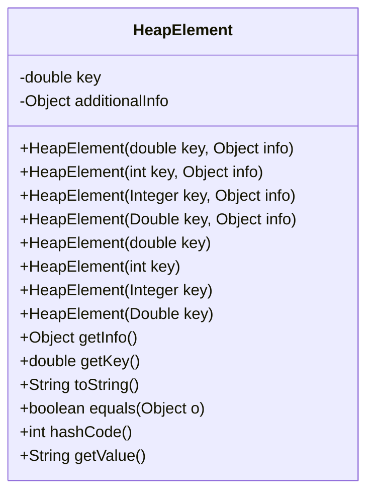

# 基础信息

|      |      |
|------|------|
| 名称 | HeapElement |
| 编码语言 | .java |
| 代码路径 | Java/src/main/java/com/thealgorithms/datastructures/heaps/HeapElement.java |
| 包名 | com.thealgorithms.datastructures.heaps |
| 依赖项 | [] |
| 概述说明 | HeapElement类支持多种键值，提供构造、获取、字符串表示、相等性判断和哈希码功能。 |

# 说明

HeapElement类是一个多功能的数据结构，用于存储键和附加信息。它支持多种类型的键值，提供了构造函数、获取键和附加信息的方法、字符串表示功能、相等性判断以及哈希码生成功能。该类设计灵活，适用于需要键值对操作的场景。

# 类列表 Class Summary

| 名称   | 类型  | 说明 |
|-------|------|-------------|
| HeapElement | class | HeapElement类包含键和附加信息，支持多种类型键值，提供构造、获取、字符串表示、相等性判断和哈希码功能。 |

## 类 HeapElement

|      |      |
|------|------|
| 访问范围 | public |
| 类型 | class |
| 名称 | HeapElement |
| 说明 | HeapElement类包含键和附加信息，支持多种类型键值，提供构造、获取、字符串表示、相等性判断和哈希码功能。 |

### UML类图

**描述：**  
`HeapElement` 类用于表示堆中的元素，包含一个 `double` 类型的 `key` 和一个 `Object` 类型的 `additionalInfo`。类提供了多个构造函数，允许通过不同的数据类型（如 `double`、`int`、`Integer`、`Double`）来初始化 `key`，并且可以可选地传递 `additionalInfo`。类还提供了获取 `key` 和 `additionalInfo` 的方法，以及重写了 `toString`、`equals` 和 `hashCode` 方法，确保对象在比较和哈希时行为正确。此外，`getValue` 方法返回 `additionalInfo` 的字符串表示。

### 内部方法调用关系图

```mermaid
graph TD
    A["类HeapElement"]
    B["属性: double key"]
    C["属性: Object additionalInfo"]
    D["构造方法: HeapElement(double key, Object info)"]
    E["构造方法: HeapElement(int key, Object info)"]
    F["构造方法: HeapElement(Integer key, Object info)"]
    G["构造方法: HeapElement(Double key, Object info)"]
    H["构造方法: HeapElement(double key)"]
    I["构造方法: HeapElement(int key)"]
    J["构造方法: HeapElement(Integer key)"]
    K["构造方法: HeapElement(Double key)"]
    L["方法: Object getInfo()"]
    M["方法: double getKey()"]
    N["重写方法: String toString()"]
    O["重写方法: boolean equals(Object o)"]
    P["重写方法: int hashCode()"]
    Q["方法: String getValue()"]

    A --> B
    A --> C
    A --> D
    A --> E
    A --> F
    A --> G
    A --> H
    A --> I
    A --> J
    A --> K
    A --> L
    A --> M
    A --> N
    A --> O
    A --> P
    A --> Q
```

该流程图展示了`HeapElement`类的结构和功能。`HeapElement`类包含两个属性：`key`和`additionalInfo`，并提供了多个构造方法以支持不同类型的`key`输入。此外，类中还定义了获取信息的方法`getInfo()`和`getKey()`，以及重写了`toString()`、`equals()`和`hashCode()`方法。最后，类中还包含一个`getValue()`方法，用于返回`additionalInfo`的字符串表示。该流程图清晰地展示了类的内部结构和方法之间的调用关系。

### 字段列表 Field List

| 名称  | 类型  | 说明 |
|-------|-------|------|
| additionalInfo | Object | 私有且不可变的对象附加信息。 |
| key | double | 声明一个私有的不可变双精度浮点类型变量key。 |

### 方法列表 Method List

| 名称  | 类型  | 说明 |
|-------|-------|------|
| getInfo | Object | 该方法返回`additionalInfo`对象。 |
| getValue | String | 该方法返回additionalInfo对象的字符串表示。 |
| toString | String | 重写toString方法，返回键值及附加信息。 |
| hashCode | int | 重写hashCode方法，计算key和additionalInfo的哈希值。 |
| equals | boolean | 重写equals方法，比较HeapElement对象的key和additionalInfo属性。 |
| getKey | double | 获取键值的双精度浮点数方法。 |

