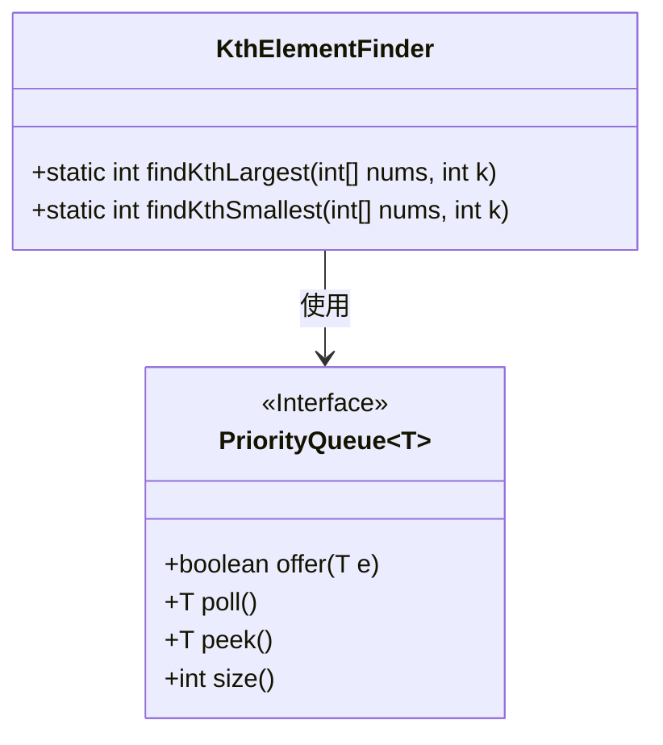
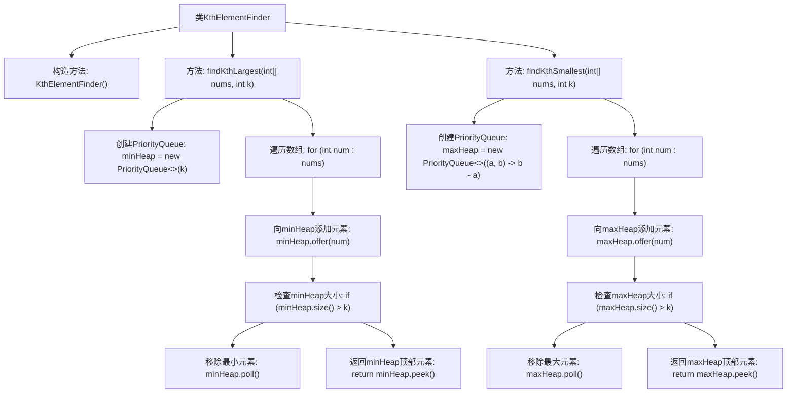

# 基础信息

|      |      |
|------|------|
| 名称 | KthElementFinder |
| 编码语言 | .java |
| 代码路径 | Java/src/main/java/com/thealgorithms/datastructures/heaps/KthElementFinder.java |
| 包名 | com.thealgorithms.datastructures.heaps |
| 依赖项 | ['java.util.PriorityQueue'] |
| 概述说明 | KthElementFinder类提供静态方法，用堆查找数组第K大/小元素，时间复杂度O(n*log(k))，空间复杂度O(k)。 |

# 说明

KthElementFinder类包含两个静态方法，分别用于查找数组中第K大和第K小的元素。这两个方法分别使用最小堆和最大堆实现，时间复杂度为O(n*log(k))，空间复杂度为O(k)。通过堆结构，能够高效地定位数组中的第K大或第K小元素。

# 类列表 Class Summary

| 名称   | 类型  | 说明 |
|-------|------|-------------|
| KthElementFinder | class | KthElementFinder类提供两个静态方法，分别使用最小堆和最大堆查找数组中第K大和第K小的元素，时间复杂度为O(n*log(k))，空间复杂度为O(k)。 |

## 类 KthElementFinder

|      |      |
|------|------|
| 访问范围 | public final |
| 类型 | class |
| 名称 | KthElementFinder |
| 说明 | KthElementFinder类提供两个静态方法，分别使用最小堆和最大堆查找数组中第K大和第K小的元素，时间复杂度为O(n*log(k))，空间复杂度为O(k)。 |

### UML类图

这段代码定义了一个名为 `KthElementFinder` 的类，其中包含两个静态方法：`findKthLargest` 和 `findKthSmallest`。这两个方法分别用于查找数组中第K大和第K小的元素。`findKthLargest` 使用最小堆（`PriorityQueue`）来维护最大的K个元素，而 `findKthSmallest` 使用最大堆来维护最小的K个元素。通过堆的插入和删除操作，最终返回堆顶元素即为目标元素。`PriorityQueue` 是一个泛型接口，提供了插入、删除和查看堆顶元素的操作。

### 内部方法调用关系图

这段代码定义了一个`KthElementFinder`类，其中包含两个静态方法`findKthLargest`和`findKthSmallest`，分别用于查找数组中第K大的元素和第K小的元素。`findKthLargest`方法使用最小堆来维护数组中的前K大元素，而`findKthSmallest`方法使用最大堆来维护数组中的前K小元素。通过遍历数组并动态调整堆的大小，最终返回堆顶元素作为结果。

### 字段列表 Field List

| 名称  | 类型  | 说明 |
|-------|-------|------|

### 方法列表 Method List

| 名称  | 类型  | 说明 |
|-------|-------|------|
| findKthLargest | int | 使用最小堆找到数组中第k大的元素。 |
| findKthSmallest | int | 使用最大堆查找数组中第k小的元素。 |

