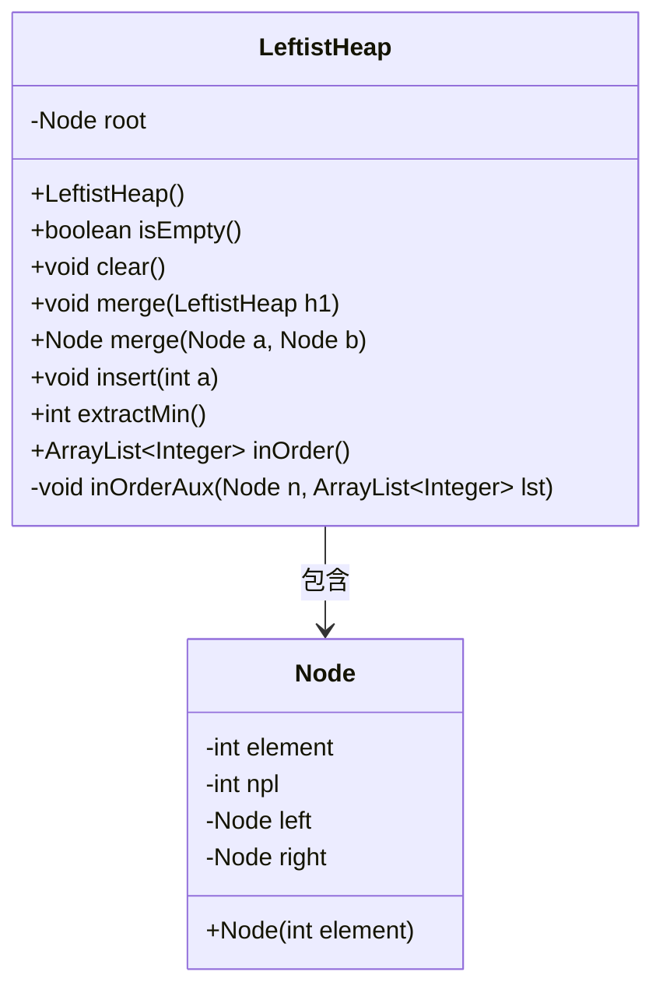
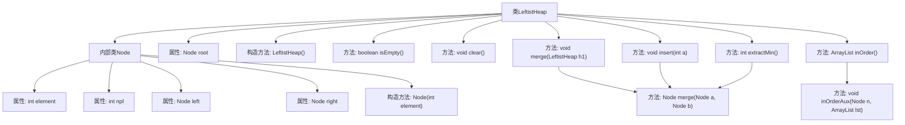
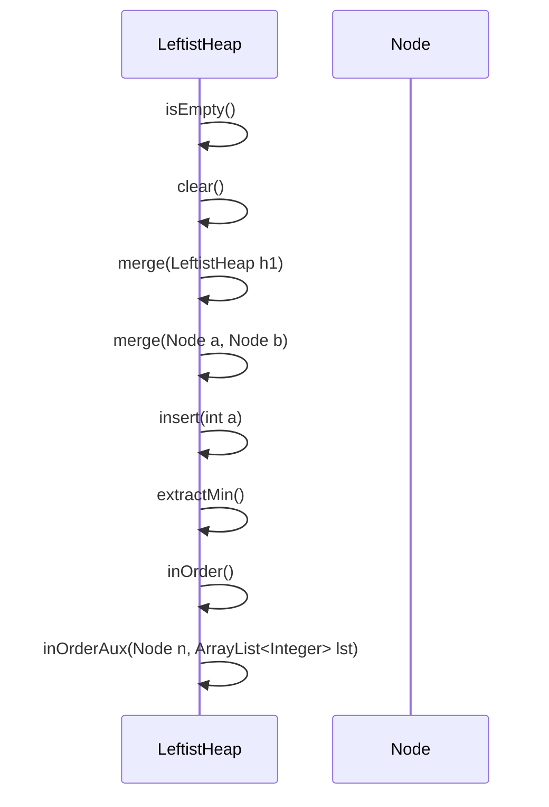

# 基础信息

|      |      |
|------|------|
| 名称 | LeftistHeap |
| 编码语言 | .java |
| 代码路径 | Java/src/main/java/com/thealgorithms/datastructures/heaps/LeftistHeap.java |
| 包名 | com.thealgorithms.datastructures.heaps |
| 依赖项 | ['java.util.ArrayList'] |
| 概述说明 | 左倾堆实现插入、合并、提取最小值及中序遍历功能。 |

# 说明

左倾堆是一种优先队列数据结构，具有高效的插入、合并和提取最小值操作。其实现包含四个主要功能：插入新元素、合并两个堆、提取最小元素以及中序遍历。插入操作通过递归方式将新元素与现有堆合并，确保堆的左倾性质。合并操作将两个堆合并为一个，优先选择较小根节点作为新堆的根，并递归合并子树。提取最小值操作移除并返回堆的根节点，然后合并其左右子树以维持堆结构。中序遍历按照左子树、根节点、右子树的顺序访问堆中所有元素，便于观察堆的内容。这些功能共同确保了左倾堆的高效性和实用性。

# 类列表 Class Summary

| 名称   | 类型  | 说明 |
|-------|------|-------------|
| LeftistHeap | class | 左倾堆实现，包含插入、合并、提取最小值和中序遍历功能。 |

## 类 LeftistHeap

|      |      |
|------|------|
| 访问范围 | public |
| 类型 | class |
| 名称 | LeftistHeap |
| 说明 | 左倾堆实现，包含插入、合并、提取最小值和中序遍历功能。 |

### UML类图

类图描述：  
`LeftistHeap` 类实现了一个左偏堆（Leftist Heap），其核心操作包括插入、合并、提取最小值和中序遍历。`Node` 类用于表示堆中的每个节点，包含元素值、左子节点、右子节点以及节点的零路径长度（npl）。`LeftistHeap` 类通过 `merge` 方法维护左偏堆的性质，`insert` 方法用于插入新元素，`extractMin` 方法用于提取并删除最小元素，`inOrder` 方法返回堆的中序遍历结果。

### 内部方法调用关系图

这段代码定义了一个左偏堆（Leftist Heap）数据结构，包含内部节点类`Node`和主要操作如插入、合并、提取最小值等。`Node`类用于表示堆中的每个元素，包含元素值、左右子节点和`npl`（null path length）属性。`LeftistHeap`类提供了堆的初始化、检查是否为空、清空堆、合并堆、插入元素、提取最小值和中序遍历等功能。代码通过递归和条件判断确保左偏堆的性质得以维护。

### 字段列表 Field List

| 名称  | 类型  | 说明 |
|-------|-------|------|
| root | Node | 定义私有节点变量root。 |

### 方法列表 Method List

| 名称  | 类型  | 说明 |
|-------|-------|------|
| isEmpty | boolean | 判断根节点是否为空。 |
| clear | void | 该方法通过将根节点设为null来清空堆。 |
| inOrder | ArrayList<Integer> | 该方法返回二叉树的中序遍历结果，存储在ArrayList中。 |
| merge | void | 合并当前堆与给定堆，并置空给定堆的根节点。 |
| merge | Node | 合并两个节点，确保左倾性质，调整左右子节点并返回结果。 |
| inOrderAux | void | 中序遍历二叉树，将节点值存入列表。 |
| extractMin | int | 提取最小值，若空返回-1，否则返回根元素并合并左右子树。 |
| insert | void | 在二叉堆中插入元素a，通过合并新节点与根节点实现。 |

