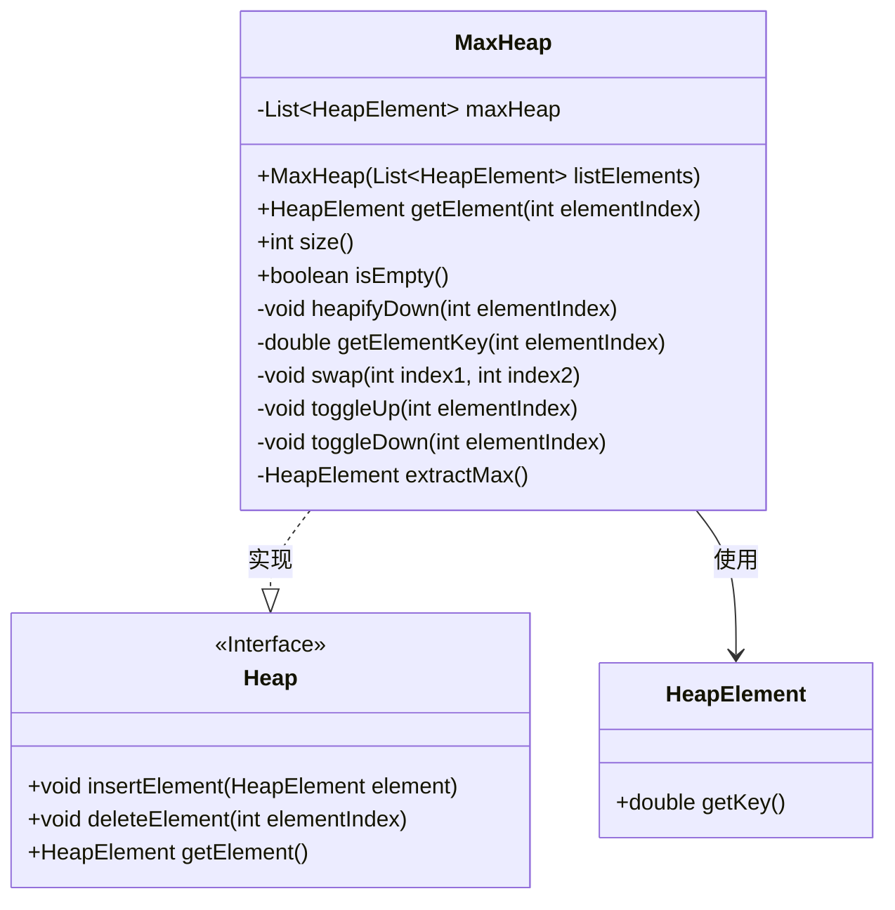
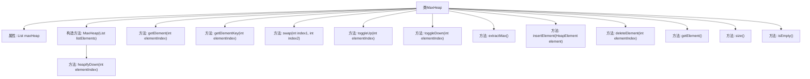

# 基础信息

|      |      |
|------|------|
| 名称 | MaxHeap |
| 编码语言 | .java |
| 代码路径 | Java/src/main/java/com/thealgorithms/datastructures/heaps/MaxHeap.java |
| 包名 | com.thealgorithms.datastructures.heaps |
| 依赖项 | ['java.util.ArrayList', 'java.util.List'] |
| 概述说明 | MaxHeap类实现最大堆，支持插入、删除和获取最大元素，维护堆属性。 |

# 说明

MaxHeap类用于实现最大堆数据结构，支持插入新元素、删除元素以及获取当前最大元素等核心操作。该类在每次操作后都会自动维护堆的属性，确保父节点始终大于或等于其子节点，从而保持最大堆的正确性和有效性。

# 类列表 Class Summary

| 名称   | 类型  | 说明 |
|-------|------|-------------|
| MaxHeap | class | MaxHeap类实现最大堆，支持插入、删除、获取最大元素等操作，维护堆属性。 |

## 类 MaxHeap

|      |      |
|------|------|
| 访问范围 | public |
| 类型 | class |
| 名称 | MaxHeap |
| 说明 | MaxHeap类实现最大堆，支持插入、删除、获取最大元素等操作，维护堆属性。 |

### UML类图

类图描述：
`MaxHeap` 类实现了 `Heap` 接口，提供了最大堆的基本操作，如插入、删除和获取元素。`MaxHeap` 内部使用 `List<HeapElement>` 存储堆元素，并通过 `heapifyDown`、`toggleUp` 和 `toggleDown` 方法维护堆的性质。`HeapElement` 类提供了获取元素键值的方法。`MaxHeap` 类通过 `HeapElement` 类操作堆中的元素，确保堆的性质不被破坏。

### 内部方法调用关系图

这段代码实现了一个最大堆（MaxHeap）数据结构，提供了堆的初始化、插入、删除、获取最大元素等操作。构造方法通过传入的元素列表初始化堆，并在初始化过程中调用`heapifyDown`方法维护堆的性质。`insertElement`和`deleteElement`方法分别用于插入和删除元素，并通过`toggleUp`和`toggleDown`方法调整堆结构。`extractMax`方法用于提取并返回堆中的最大元素。代码还提供了获取堆大小和判断堆是否为空的方法。

### 字段列表 Field List

| 名称  | 类型  | 说明 |
|-------|-------|------|
| maxHeap | List<HeapElement> | 私有且不可变的堆元素最大堆列表。 |

### 方法列表 Method List

| 名称  | 类型  | 说明 |
|-------|-------|------|
| isEmpty | boolean | 检查maxHeap是否为空。 |
| size | int | 该方法返回最大堆的大小。 |
| getElement | HeapElement | 获取堆中指定索引元素，若索引越界则抛出异常。 |
| toggleUp | void | 调整最大堆中指定元素位置，使其符合堆性质。 |
| heapifyDown | void | 堆化下移操作，比较并交换最大堆元素，递归调整。 |
| extractMax | HeapElement | 提取最大堆元素，若堆为空则抛出异常。 |
| getElementKey | double | 获取堆中指定元素的键，索引越界时抛出异常。 |
| swap | void | 交换最大堆中两个指定索引位置的元素。 |
| insertElement | void | 插入非空元素到最大堆并调整堆结构。 |
| getElement | HeapElement | 重写getElement方法，调用extractMax并返回结果，可能抛出EmptyHeapException。 |
| toggleDown | void | 调整堆中元素位置，确保父节点大于子节点。 |
| deleteElement | void | 删除堆中指定索引元素，处理空堆和越界异常，替换并调整堆结构。 |

