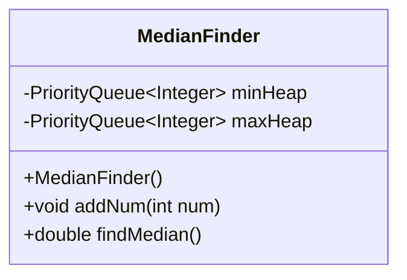
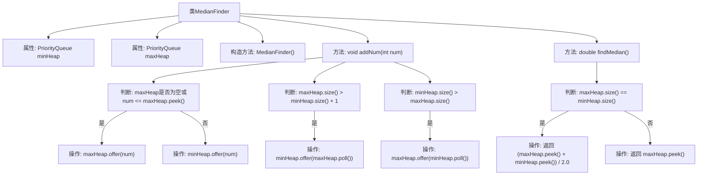

# 基础信息

|      |      |
|------|------|
| 名称 | MedianFinder |
| 编码语言 | .java |
| 代码路径 | Java/src/main/java/com/thealgorithms/datastructures/heaps/MedianFinder.java |
| 包名 | com.thealgorithms.datastructures.heaps |
| 依赖项 | ['java.util.PriorityQueue'] |
| 概述说明 | MedianFinder类通过双堆维护数据流中位数，addNum平衡堆，findMedian返回中位数。 |

# 说明

MedianFinder类通过使用两个堆来维护数据流的中位数。具体来说，该类在添加新数据时，通过addNum方法确保两个堆保持平衡。当需要获取中位数时，findMedian方法会根据当前堆的状态返回准确的中位数值。这种设计使得类能够高效地处理动态数据流，并快速提供中位数结果。

# 类列表 Class Summary

| 名称   | 类型  | 说明 |
|-------|------|-------------|
| MedianFinder | class | MedianFinder类使用两个堆维护数据流中位数，addNum平衡堆，findMedian返回中位数。 |

## 类 MedianFinder

|      |      |
|------|------|
| 访问范围 | public final |
| 类型 | class |
| 名称 | MedianFinder |
| 说明 | MedianFinder类使用两个堆维护数据流中位数，addNum平衡堆，findMedian返回中位数。 |

### UML类图

类图描述：
`MedianFinder` 类用于实时计算数据流的中位数。它内部维护了两个优先队列：`minHeap` 和 `maxHeap`，分别用于存储较大的一半和较小的一半数据。`addNum` 方法将新数据插入到适当的堆中，并保持两个堆的大小平衡。`findMedian` 方法根据堆的大小返回当前数据流的中位数，如果数据个数为偶数，则返回两个堆顶元素的平均值，否则返回 `maxHeap` 的堆顶元素。

### 内部方法调用关系图

这段代码定义了一个`MedianFinder`类，用于实时计算数据流的中位数。它通过维护两个优先队列（`minHeap`和`maxHeap`）来平衡数据流中的元素。`addNum`方法将新元素插入到适当的堆中，并确保两个堆的大小差不超过1。`findMedian`方法根据堆的大小关系返回中位数：如果两个堆大小相等，则返回两个堆顶元素的平均值；否则返回`maxHeap`的堆顶元素。这种方法确保了中位数的计算在O(log n)时间内完成。

### 字段列表 Field List

| 名称  | 类型  | 说明 |
|-------|-------|------|
| maxHeap = new PriorityQueue<>((a, b) -> b - a) | PriorityQueue<Integer> | 定义了一个最大堆优先队列，使用自定义比较器实现降序排列。 |
| minHeap = new PriorityQueue<>() | PriorityQueue<Integer> | 私有优先队列minHeap初始化为最小堆。 |

### 方法列表 Method List

| 名称  | 类型  | 说明 |
|-------|-------|------|
| addNum | void | 将数字插入两个堆，保持堆大小平衡。 |
| findMedian | double | 双堆法求中位数，大小相等取均值，否则取大堆顶。 |

