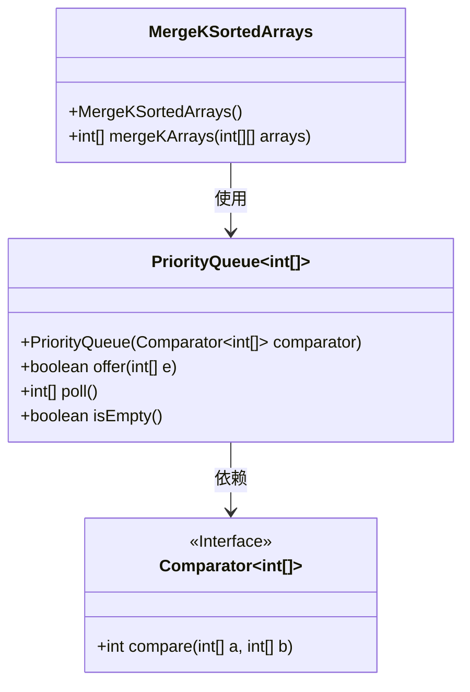
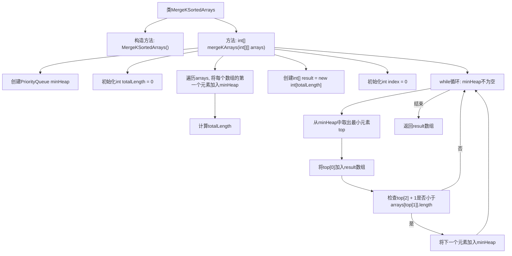

# 基础信息

|      |      |
|------|------|
| 名称 | MergeKSortedArrays |
| 编码语言 | .java |
| 代码路径 | Java/src/main/java/com/thealgorithms/datastructures/heaps/MergeKSortedArrays.java |
| 包名 | com.thealgorithms.datastructures.heaps |
| 依赖项 | ['java.util.Comparator', 'java.util.PriorityQueue'] |
| 概述说明 | 利用最小堆合并多个有序数组为单一有序数组。 |

# 说明

使用最小堆合并多个有序数组为单一有序数组的方法，首先将每个数组的第一个元素及其所属数组的索引存入最小堆。然后，从堆中取出最小元素，将其加入结果数组，并将该元素所属数组的下一个元素（如果存在）推入堆中。重复此过程，直到堆为空，最终得到合并后的单一有序数组。

# 类列表 Class Summary

| 名称   | 类型  | 说明 |
|-------|------|-------------|
| MergeKSortedArrays | class | 使用最小堆合并多个有序数组为单一有序数组。 |

## 类 MergeKSortedArrays

|      |      |
|------|------|
| 访问范围 | public final |
| 类型 | class |
| 名称 | MergeKSortedArrays |
| 说明 | 使用最小堆合并多个有序数组为单一有序数组。 |

### UML类图

### 描述
`MergeKSortedArrays` 类是一个工具类，用于合并多个已排序的数组。它使用 `PriorityQueue`（最小堆）来高效地合并这些数组。`PriorityQueue` 依赖于 `Comparator` 接口来比较数组中的元素。`mergeKArrays` 方法首先将每个数组的第一个元素添加到堆中，然后从堆中取出最小元素并添加到结果数组中，同时将下一个元素（如果存在）推入堆中，直到所有元素都被处理完毕。最终返回一个包含所有元素的排序数组。

### 内部方法调用关系图

这段代码实现了一个合并多个已排序数组的功能。通过使用最小堆（PriorityQueue），代码首先将每个数组的第一个元素加入堆中，然后不断从堆中取出最小元素并加入结果数组，同时将该元素所在数组的下一个元素加入堆中，直到堆为空。最终返回的数组包含所有输入数组的元素，并按升序排列。

### 字段列表 Field List

| 名称  | 类型  | 说明 |
|-------|-------|------|

### 方法列表 Method List

| 名称  | 类型  | 说明 |
|-------|-------|------|
| mergeKArrays | int[] | 使用最小堆合并多个有序数组，返回合并后的有序数组。 |

