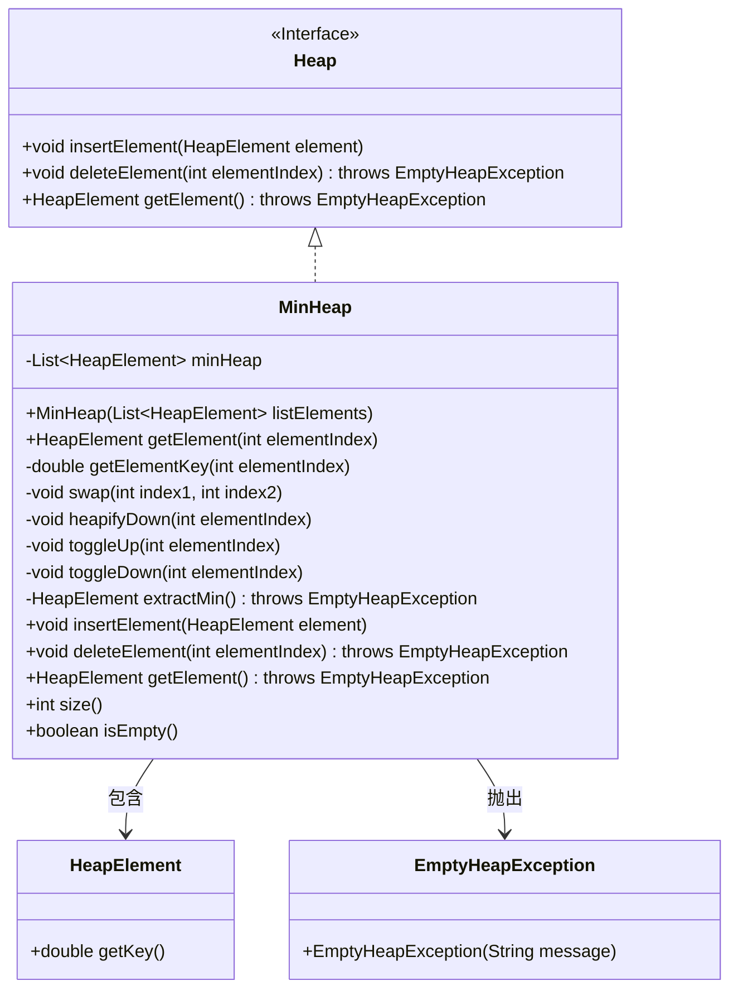

# 基础信息

|      |      |
|------|------|
| 名称 | MinHeap |
| 编码语言 | .java |
| 代码路径 | Java/src/main/java/com/thealgorithms/datastructures/heaps/MinHeap.java |
| 包名 | com.thealgorithms.datastructures.heaps |
| 依赖项 | ['java.util.ArrayList', 'java.util.List'] |
| 概述说明 | MinHeap类实现最小堆，支持插入、删除和获取最小元素，维护堆属性。 |

# 说明

MinHeap类实现了最小堆数据结构，支持插入新元素、删除指定元素以及获取当前最小元素等核心操作。该类通过维护堆属性，确保父节点的值始终小于或等于其子节点的值，从而保证堆结构的正确性和高效性。这些操作使得MinHeap类在处理需要频繁查找和删除最小元素的场景中表现出色。

# 类列表 Class Summary

| 名称   | 类型  | 说明 |
|-------|------|-------------|
| MinHeap | class | MinHeap类实现最小堆，支持插入、删除、获取最小元素等操作，维护堆属性。 |

## 类 MinHeap

|      |      |
|------|------|
| 访问范围 | public |
| 类型 | class |
| 名称 | MinHeap |
| 说明 | MinHeap类实现最小堆，支持插入、删除、获取最小元素等操作，维护堆属性。 |

### UML类图

这段代码实现了一个最小堆（MinHeap），它继承自 `Heap` 接口。`MinHeap` 类通过 `List<HeapElement>` 来存储堆元素，并提供了插入、删除、获取最小元素等操作。代码中包含了堆的初始化、堆化操作（`heapifyDown`、`toggleUp`、`toggleDown`）以及元素的交换和键值获取等辅助方法。`MinHeap` 类还处理了空堆和无效索引的异常情况，确保堆操作的正确性和鲁棒性。

### 内部方法调用关系图

```mermaid
graph TD
    A["类MinHeap"]
    B["属性: List<HeapElement> minHeap"]
    C["构造方法: MinHeap(List<HeapElement> listElements)"]
    D["方法: HeapElement getElement(int elementIndex)"]
    E["方法: double getElementKey(int elementIndex)"]
    F["方法: void swap(int index1, int index2)"]
    G["方法: void heapifyDown(int elementIndex)"]
    H["方法: void toggleUp(int elementIndex)"]
    I["方法: void toggleDown(int elementIndex)"]
    J["方法: HeapElement extractMin()"]
    K["方法: void insertElement(HeapElement element)"]
    L["方法: void deleteElement(int elementIndex)"]
    M["方法: HeapElement getElement()"]
    N["方法: int size()"]
    O["方法: boolean isEmpty()"]

    A --> B
    A --> C
    A --> D
    A --> E
    A --> F
    A --> G
    A --> H
    A --> I
    A --> J
    A --> K
    A --> L
    A --> M
    A --> N
    A --> O

    C -->|"检查输入列表是否为null"| C1["抛出IllegalArgumentException"]
    C -->|"初始化minHeap"| C2["遍历listElements"]
    C2 -->|"元素不为null"| C3["添加到minHeap"]
    C2 -->|"元素为null"| C4["输出警告信息"]
    C -->|"堆化数组"| C5["调用heapifyDown"]
    C -->|"检查堆是否为空"| C6["输出提示信息"]

    D -->|"检查索引是否有效"| D1["抛出IndexOutOfBoundsException"]
    D -->|"返回元素"| D2["返回minHeap.get(elementIndex - 1)"]

    E -->|"检查索引是否有效"| E1["抛出IndexOutOfBoundsException"]
    E -->|"返回元素键值"| E2["返回minHeap.get(elementIndex - 1).getKey()"]

    F -->|"交换元素"| F1["交换minHeap中的元素"]

    G -->|"找到最小元素"| G1["比较左右子节点"]
    G1 -->|"交换元素"| G2["递归调用heapifyDown"]

    H -->|"比较父节点"| H1["交换元素"]
    H1 -->|"递归调用toggleUp"| H2["直到堆属性满足"]

    I -->|"比较子节点"| I1["交换元素"]
    I1 -->|"递归调用toggleDown"| I2["直到堆属性满足"]

    J -->|"检查堆是否为空"| J1["抛出EmptyHeapException"]
    J -->|"删除最小元素"| J2["调用deleteElement(1)"]
    J -->|"返回最小元素"| J3["返回最小元素"]

    K -->|"检查元素是否为null"| K1["抛出IllegalArgumentException"]
    K -->|"添加元素"| K2["调用toggleUp"]

    L -->|"检查堆是否为空"| L1["抛出EmptyHeapException"]
    L -->|"检查索引是否有效"| L2["抛出IndexOutOfBoundsException"]
    L -->|"删除元素"| L3["调用toggleUp或toggleDown"]

    M -->|"调用extractMin"| M1["返回最小元素"]

    N -->|"返回堆大小"| N1["返回minHeap.size()"]

    O -->|"检查堆是否为空"| O1["返回minHeap.isEmpty()"]
```

这段代码实现了一个最小堆（MinHeap）数据结构，提供了堆的初始化、元素插入、删除、获取最小元素等操作。通过`heapifyDown`和`toggleUp`等方法维护堆的性质，确保堆中的最小元素始终位于堆顶。代码还处理了各种异常情况，如空堆操作、无效索引等，确保了程序的健壮性。

### 字段列表 Field List

| 名称  | 类型  | 说明 |
|-------|-------|------|
| minHeap | List<HeapElement> | 私有最小堆元素列表。 |

### 方法列表 Method List

| 名称  | 类型  | 说明 |
|-------|-------|------|
| insertElement | void | 插入非空元素至最小堆并调整堆结构。 |
| size | int | 该方法返回最小堆的大小。 |
| swap | void | 交换最小堆中两个指定位置的元素。 |
| isEmpty | boolean | isEmpty方法检查minHeap是否为空。 |
| extractMin | HeapElement | 提取最小堆元素，若堆为空则抛出异常。 |
| getElement | HeapElement | 重写getElement方法，调用extractMin返回堆的最小元素。 |
| toggleDown | void | 最小堆下沉操作，调整指定元素位置直至满足堆性质。 |
| getElementKey | double | 方法getElementKey通过索引获取最小堆元素键值，索引越界抛出异常。 |
| getElement | HeapElement | 获取堆中指定索引元素，索引越界时抛出异常。 |
| heapifyDown | void | 堆化向下操作，调整最小堆，确保父节点小于子节点。 |
| deleteElement | void | 删除堆中指定索引元素，处理空堆和索引越界，替换并调整堆结构。 |
| toggleUp | void | 最小堆元素上移操作，通过交换调整元素位置直至满足堆条件。 |

