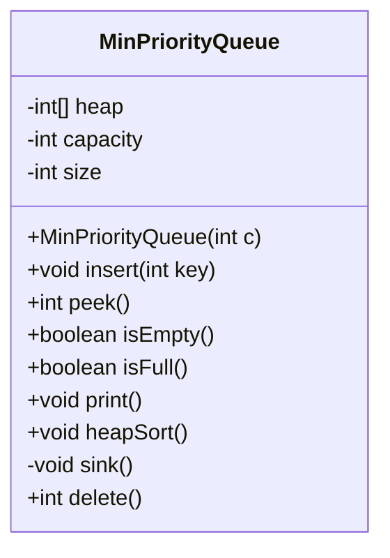
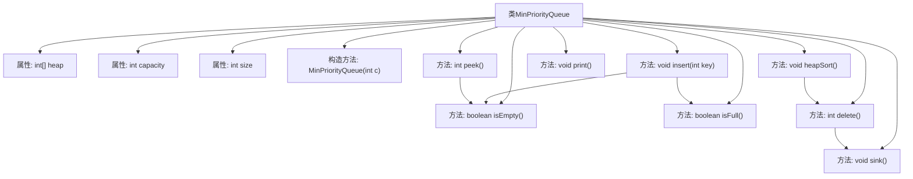

# 基础信息

|      |      |
|------|------|
| 名称 | MinPriorityQueue |
| 编码语言 | .java |
| 代码路径 | Java/src/main/java/com/thealgorithms/datastructures/heaps/MinPriorityQueue.java |
| 包名 | com.thealgorithms.datastructures.heaps |
| 依赖项 | [] |
| 概述说明 | 最小优先队列类支持插入、删除、查看最小值和堆排序操作。 |

# 说明

最小优先队列类是一种数据结构，支持插入、删除、查看最小值及堆排序操作。插入操作将新元素添加到队列中，删除操作移除队列中的最小元素，查看最小值操作返回当前队列中的最小元素而不移除它，堆排序操作则利用堆结构对队列中的元素进行排序。这些操作确保了队列始终按照最小优先的原则进行管理，适用于需要频繁访问和操作最小元素的场景。

# 类列表 Class Summary

| 名称   | 类型  | 说明 |
|-------|------|-------------|
| MinPriorityQueue | class | 最小优先队列类，支持插入、删除、查看最小值及堆排序操作。 |

## 类 MinPriorityQueue

|      |      |
|------|------|
| 访问范围 | public |
| 类型 | class |
| 名称 | MinPriorityQueue |
| 说明 | 最小优先队列类，支持插入、删除、查看最小值及堆排序操作。 |

### UML类图

**描述：**  
`MinPriorityQueue` 类实现了一个最小优先队列，使用堆数据结构来维护元素的优先级。队列的核心功能包括插入元素、删除最小元素、查看最小元素、检查队列是否为空或已满，以及打印队列中的元素。此外，该类还提供了堆排序功能。堆的维护通过 `sink` 方法实现，确保在删除元素后堆的性质得以保持。该类适用于需要高效处理最小元素的场景。

### 内部方法调用关系图

这段代码实现了一个最小优先队列（MinPriorityQueue），使用堆数据结构来维护元素的优先级。队列支持插入、删除、查看最小元素、检查队列是否为空或满、打印队列元素以及堆排序等操作。流程图展示了类的主要属性和方法之间的调用关系，特别是插入、删除和堆排序等核心操作。

### 字段列表 Field List

| 名称  | 类型  | 说明 |
|-------|-------|------|
| heap | int[] | 私有整型数组heap声明。 |
| capacity | int | 私有整型变量capacity，用于存储容量值。 |
| size | int | 定义了一个私有整型变量size。 |

### 方法列表 Method List

| 名称  | 类型  | 说明 |
|-------|-------|------|
| heapSort | void | 堆排序算法通过循环删除元素实现排序。 |
| isFull | boolean | 方法isFull检查当前大小是否等于容量。 |
| peek | int | 检查最小优先队列是否为空，若为空抛出异常，否则返回堆顶元素。 |
| delete | int | 删除最小堆根节点，若堆为空则抛出异常。 |
| insert | void | 插入元素到最小优先队列，若满则报错，否则调整堆结构。 |
| isEmpty | boolean | isEmpty方法检查size是否为0，返回布尔值。 |
| print | void | 打印堆中所有元素，每元素后加空格，最后换行。 |
| sink | void | 堆下沉操作，比较左右子节点，交换最小节点，保持堆性质。 |

