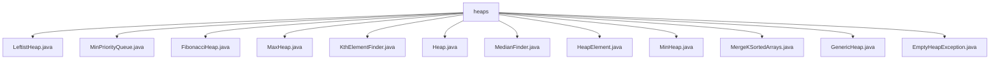

# 基础信息

|      |      |
|------|------|
| 名称 | heaps |
| 编码语言 | .java |
| 代码路径 | Java/src/main/java/com/thealgorithms/datastructures/heaps |
| 包名 | Java.src.main.java.com.thealgorithms.datastructures.heaps |
| 概述说明 | 左倾堆、最小优先队列、斐波那契堆、最大堆、最小堆、Kth元素查找、中位数查找、堆元素、合并有序数组、泛型堆、空堆异常。 |

# 说明

## 概述

该代码模块主要实现了多种堆数据结构及其相关操作，涵盖了最小堆、最大堆、左倾堆、斐波那契堆等经典堆的实现。此外，模块还提供了一些基于堆的实用功能，如查找第K大/小元素、合并多个有序数组、动态维护数据流的中位数等。这些数据结构和功能广泛应用于优先队列、排序、动态数据流处理等场景，能够高效地处理插入、删除、查找等操作，确保数据的有序性和操作的性能优化。

## 主要业务场景

1. **优先队列管理**：通过最小堆（`MinHeap`、`MinPriorityQueue`）和最大堆（`MaxHeap`），模块支持高效的插入、删除、查找最小/最大元素等操作，适用于任务调度、事件处理等需要优先级的场景。
   
2. **堆排序与选择**：`KthElementFinder`类利用堆结构查找数组中的第K大或第K小元素，适用于需要快速定位特定顺序元素的场景。

3. **动态数据流处理**：`MedianFinder`类通过两个堆动态维护数据流的中位数，适用于实时数据流处理场景，如金融数据监控、实时统计等。

4. **多路归并排序**：`MergeKSortedArrays`类使用最小堆合并多个有序数组，适用于大数据处理中的多路归并排序场景。

5. **高效合并与插入**：左倾堆（`LeftistHeap`）和斐波那契堆（`FibonacciHeap`）提供了高效的合并操作，适用于需要频繁合并堆的场景，如图算法中的最小生成树、最短路径等。

6. **泛型堆应用**：`GenericHeap`类支持泛型元素的堆操作，适用于需要动态管理优先级队列的场景，如任务调度、图算法等。

7. **异常处理**：`EmptyHeapException`类提供了自定义异常处理，确保在堆为空时能够抛出明确的异常信息，提升代码的健壮性。

8. **键值对存储**：`HeapElement`类支持存储键和附加信息，适用于需要键值对操作的场景，如堆中的元素存储与比较。

这些业务场景展示了该模块在数据结构与算法领域的广泛应用，能够为开发者提供高效、灵活的工具来处理各种复杂的数据操作需求。

### 包内部结构视图

该流程图展示了`heaps`文件夹下的所有文件及其层级关系。`heaps`作为根节点，直接连接到多个堆相关的Java文件，包括`LeftistHeap.java`、`MinPriorityQueue.java`、`FibonacciHeap.java`等。每个文件都直接依赖于`heaps`文件夹，没有进一步的子文件夹层级。这种结构清晰地反映了堆数据结构相关类的组织方式。

# 文件列表 File List

| 名称   | 类型  | 说明 |
|-------|------|-------------|
| [GenericHeap.java](GenericHeap.md) | file | 泛型堆支持增删、取最大值及更新优先级，维护堆属性。 |
| [MedianFinder.java](MedianFinder.md) | file | MedianFinder类通过双堆维护数据流中位数，addNum平衡堆，findMedian返回中位数。 |
| [MaxHeap.java](MaxHeap.md) | file | MaxHeap类实现最大堆，支持插入、删除和获取最大元素，维护堆属性。 |
| [MergeKSortedArrays.java](MergeKSortedArrays.md) | file | 利用最小堆合并多个有序数组为单一有序数组。 |
| [EmptyHeapException.java](EmptyHeapException.md) | file | EmptyHeapException继承Exception，支持带消息和原因的构造方法。 |
| [MinHeap.java](MinHeap.md) | file | MinHeap类实现最小堆，支持插入、删除和获取最小元素，维护堆属性。 |
| [HeapElement.java](HeapElement.md) | file | HeapElement类支持多种键值，提供构造、获取、字符串表示、相等性判断和哈希码功能。 |
| [Heap.java](Heap.md) | file | 输入内容为空，无法生成概要描述。 |
| [KthElementFinder.java](KthElementFinder.md) | file | KthElementFinder类提供静态方法，用堆查找数组第K大/小元素，时间复杂度O(n*log(k))，空间复杂度O(k)。 |
| [FibonacciHeap.java](FibonacciHeap.md) | file | 斐波那契堆支持插入、删除最小节点、合并及维护节点标记和树结构。 |
| [MinPriorityQueue.java](MinPriorityQueue.md) | file | 最小优先队列类支持插入、删除、查看最小值和堆排序操作。 |
| [LeftistHeap.java](LeftistHeap.md) | file | 左倾堆实现插入、合并、提取最小值及中序遍历功能。 |

