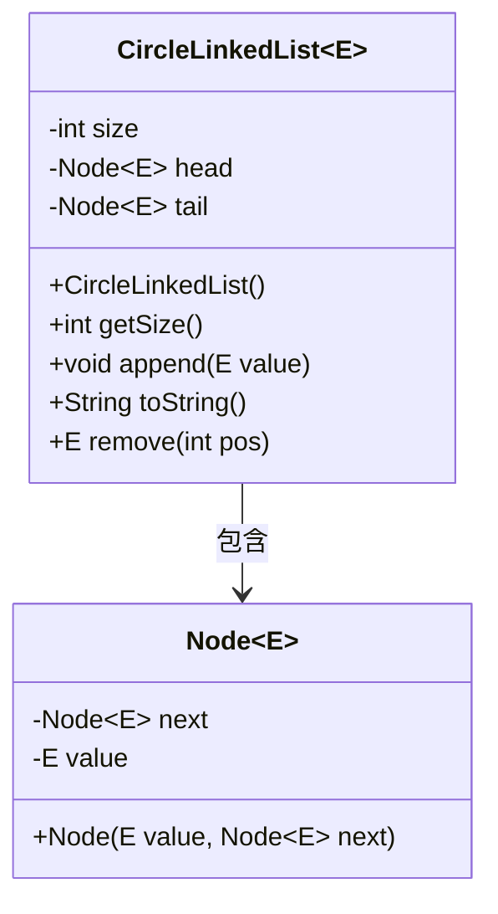
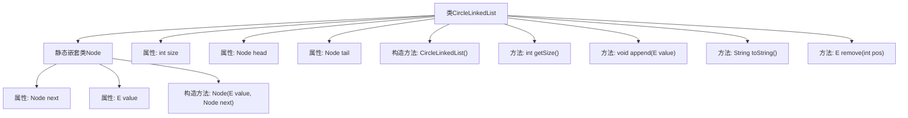

# 基础信息

|      |      |
|------|------|
| 名称 | CircleLinkedList |
| 编码语言 | .java |
| 代码路径 | Java/src/main/java/com/thealgorithms/datastructures/lists/CircleLinkedList.java |
| 包名 | com.thealgorithms.datastructures.lists |
| 依赖项 | [] |
| 概述说明 | 循环链表支持增删元素、获取大小和字符串表示。 |

# 说明

该任务要求实现一个循环链表数据结构，具备添加和删除元素的功能，同时支持获取链表大小以及生成链表的字符串表示。循环链表的特点是尾节点指向头节点，形成一个闭环。实现过程中需要确保添加和删除操作能正确维护链表的循环特性，获取大小功能需准确返回链表中元素的数量，而字符串表示则应清晰展示链表的内容和结构。整体实现需注重逻辑的严谨性和性能的优化。

# 类列表 Class Summary

| 名称   | 类型  | 说明 |
|-------|------|-------------|
| CircleLinkedList | class | 实现循环链表，支持添加、删除元素及获取大小和字符串表示。 |

## 类 CircleLinkedList

|      |      |
|------|------|
| 访问范围 | public |
| 类型 | class |
| 名称 | CircleLinkedList |
| 说明 | 实现循环链表，支持添加、删除元素及获取大小和字符串表示。 |

### UML类图

这段代码定义了一个循环链表类 `CircleLinkedList`，其中包含一个静态嵌套类 `Node`，用于表示链表中的节点。`CircleLinkedList` 类提供了初始化链表、获取链表大小、添加元素、删除元素以及生成链表字符串表示的方法。`Node` 类用于存储链表中的元素，并指向下一个节点。循环链表的特点是尾节点的 `next` 指针指向头节点，形成一个闭环。该实现确保了链表在添加和删除元素时的正确性，并处理了空链表和无效位置的异常情况。

### 内部方法调用关系图

该流程图展示了 `CircleLinkedList<E>` 类的结构及其内部静态嵌套类 `Node<E>` 的关系。`CircleLinkedList<E>` 类包含多个属性和方法，如 `size`、`head`、`tail` 等属性，以及 `append`、`toString`、`remove` 等方法。静态嵌套类 `Node<E>` 用于表示链表中的节点，包含 `next` 和 `value` 属性以及一个构造方法。整个流程图清晰地展示了类与嵌套类之间的关系以及类内部方法的调用结构。

### 字段列表 Field List

| 名称  | 类型  | 说明 |
|-------|-------|------|
| size | int | 定义了一个私有的整型变量size。 |
| tail | Node<E> | 链表尾部节点引用。 |
| head = null | Node<E> | 初始化链表头节点为空。 |

### 方法列表 Method List

| 名称  | 类型  | 说明 |
|-------|-------|------|
| getSize | int | 获取对象大小的整型方法。 |
| remove | E | 删除链表中指定位置的元素并返回其值。 |
| toString | String | 该方法将链表元素转换为字符串格式，空链表返回"[]"。 |
| append | void | 向链表追加非空元素，处理空值异常并更新链表结构和大小。 |

