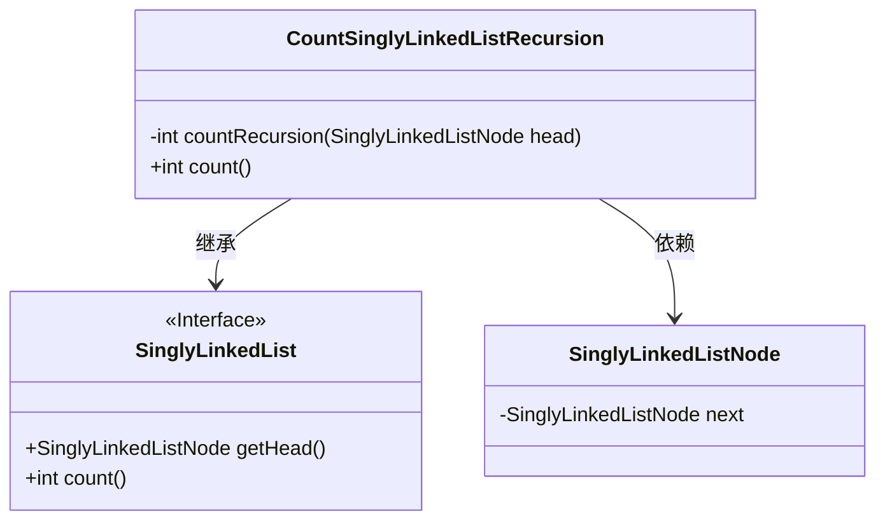
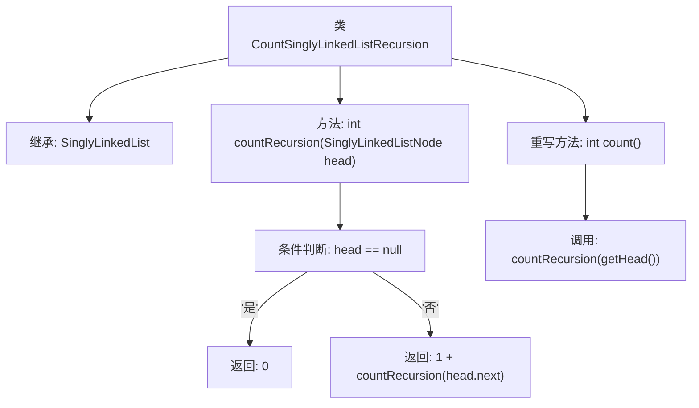

# 基础信息

|      |      |
|------|------|
| 名称 | CountSinglyLinkedListRecursion |
| 编码语言 | .java |
| 代码路径 | Java/src/main/java/com/thealgorithms/datastructures/lists/CountSinglyLinkedListRecursion.java |
| 包名 | com.thealgorithms.datastructures.lists |
| 依赖项 | [] |
| 概述说明 | 递归计算单链表节点总数。 |

# 说明

该内容描述了一个递归算法，用于计算单链表中节点的总数。递归方法通过不断调用自身，遍历链表中的每一个节点，直到到达链表末尾。每次递归调用都会处理当前节点，并移动到下一个节点，最终通过累加得到链表的节点总数。这种方法简洁但需要注意递归深度可能导致的栈溢出问题。

# 类列表 Class Summary

| 名称   | 类型  | 说明 |
|-------|------|-------------|
| CountSinglyLinkedListRecursion | class | 递归计算单链表节点总数。 |

## 类 CountSinglyLinkedListRecursion

|      |      |
|------|------|
| 访问范围 | public |
| 类型 | class |
| 名称 | CountSinglyLinkedListRecursion |
| 说明 | 递归计算单链表节点总数。 |

### UML类图

**描述：**  
`CountSinglyLinkedListRecursion`类继承自`SinglyLinkedList`接口，并实现了递归计算链表中节点数量的功能。该类包含一个私有方法`countRecursion`，用于递归遍历链表并返回节点数量。`count`方法通过调用`countRecursion`方法，从链表头节点开始计算总节点数。`SinglyLinkedListNode`类表示链表节点，包含指向下一个节点的引用。

### 内部方法调用关系图

这段代码定义了一个名为 `CountSinglyLinkedListRecursion` 的类，该类继承自 `SinglyLinkedList`。它包含一个递归方法 `countRecursion`，用于计算链表中从给定头节点开始的节点数量。该方法通过检查当前节点是否为 `null` 来终止递归，否则继续递归调用下一个节点。类中还重写了 `count` 方法，通过调用 `countRecursion(getHead())` 来返回整个链表的节点总数。流程图展示了类的继承关系、方法的调用逻辑以及递归的终止条件。

### 字段列表 Field List

| 名称  | 类型  | 说明 |
|-------|-------|------|

### 方法列表 Method List

| 名称  | 类型  | 说明 |
|-------|-------|------|
| countRecursion | int | 递归计算单链表节点数，空链表返回0。 |
| count | int | 重写count方法，通过递归调用countRecursion统计节点数量。 |

