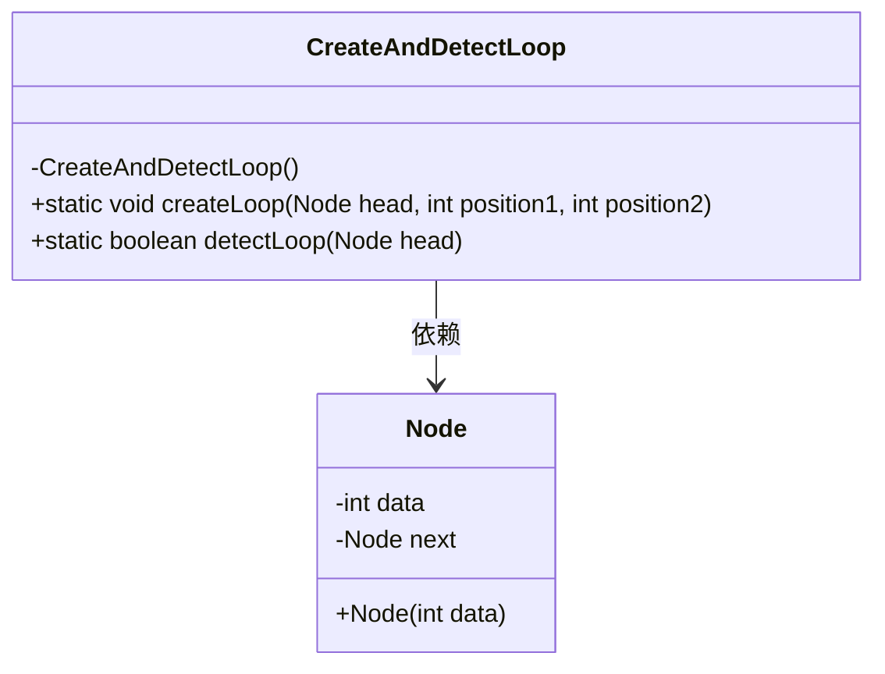
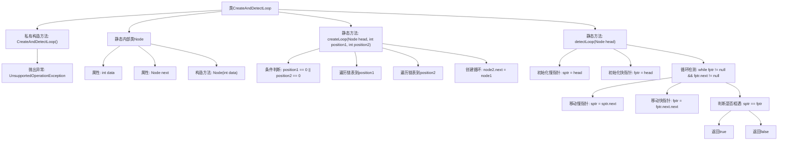

# 基础信息

|      |      |
|------|------|
| 名称 | CreateAndDetectLoop |
| 编码语言 | .java |
| 代码路径 | Java/src/main/java/com/thealgorithms/datastructures/lists/CreateAndDetectLoop.java |
| 包名 | com.thealgorithms.datastructures.lists |
| 依赖项 | [] |
| 概述说明 | CreateAndDetectLoop类用于创建和检测链表循环，包含节点类Node和Floyd算法。 |

# 说明

类CreateAndDetectLoop用于处理链表中的循环操作。它包含一个节点类Node，用于定义链表的基本结构。方法createLoop用于在链表的指定位置创建一个循环，使得链表在该位置形成闭环。方法detectLoop则使用Floyd算法来检测链表中是否存在循环。Floyd算法通过使用两个指针，一个快指针和一个慢指针，在链表中移动，如果两个指针相遇，则说明链表中存在循环。该类通过这两个方法实现了链表的循环创建与检测功能。

# 类列表 Class Summary

| 名称   | 类型  | 说明 |
|-------|------|-------------|
| CreateAndDetectLoop | class | 类CreateAndDetectLoop用于创建和检测链表中的循环。包含节点类Node，方法createLoop在指定位置创建循环，方法detectLoop使用Floyd算法检测循环。 |

## 类 CreateAndDetectLoop

|      |      |
|------|------|
| 访问范围 | public final |
| 类型 | class |
| 名称 | CreateAndDetectLoop |
| 说明 | 类CreateAndDetectLoop用于创建和检测链表中的循环。包含节点类Node，方法createLoop在指定位置创建循环，方法detectLoop使用Floyd算法检测循环。 |

### UML类图

**描述：**  
`CreateAndDetectLoop` 是一个工具类，提供了两个静态方法：`createLoop` 和 `detectLoop`。`createLoop` 方法用于在链表中创建循环，通过将指定位置的节点的 `next` 指针指向另一个指定位置的节点。`detectLoop` 方法使用 Floyd 的循环检测算法（龟兔赛跑算法）来检测链表中是否存在循环。`Node` 类表示链表中的节点，包含数据和指向下一个节点的引用。`CreateAndDetectLoop` 类依赖于 `Node` 类来操作链表。

### 内部方法调用关系图

**描述：**  
这段代码定义了一个名为 `CreateAndDetectLoop` 的工具类，包含一个私有构造方法以防止实例化，并抛出 `UnsupportedOperationException` 异常。类中包含一个静态内部类 `Node`，用于表示链表中的节点。`createLoop` 方法用于在链表中创建循环，通过指定两个位置将链表中的一个节点指向另一个节点。`detectLoop` 方法使用 Floyd 的循环检测算法（龟兔赛跑算法）来检测链表中是否存在循环。

### 字段列表 Field List

| 名称  | 类型  | 说明 |
|-------|-------|------|

### 方法列表 Method List

| 名称  | 类型  | 说明 |
|-------|-------|------|
| createLoop | void | 在链表指定位置创建循环。 |
| detectLoop | boolean | 使用快慢指针检测链表是否有环。 |

