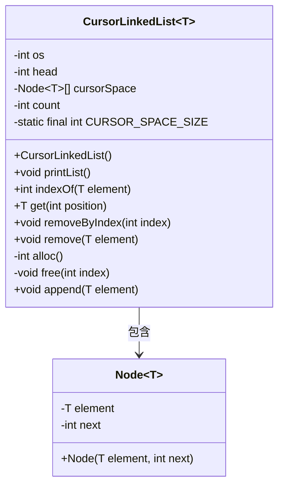
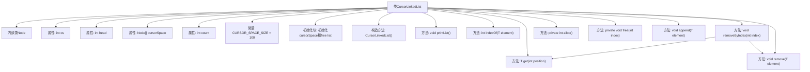

# 基础信息

|      |      |
|------|------|
| 名称 | CursorLinkedList |
| 编码语言 | .java |
| 代码路径 | Java/src/main/java/com/thealgorithms/datastructures/lists/CursorLinkedList.java |
| 包名 | com.thealgorithms.datastructures.lists |
| 依赖项 | ['java.util.Objects'] |
| 概述说明 | 基于游标的链表，支持增删查，固定数组管理节点。 |

# 说明

该描述涉及实现一个基于游标的链表，支持插入、删除和查找操作。链表节点使用固定大小的数组进行管理，通过游标来追踪节点的位置和关系。这种设计避免了动态内存分配的开销，提高了内存使用效率，同时保持了链表操作的灵活性。固定大小数组的使用简化了节点管理，但需要预先确定数组大小，可能限制链表的扩展性。整体实现注重性能和内存管理的平衡。

# 类列表 Class Summary

| 名称   | 类型  | 说明 |
|-------|------|-------------|
| CursorLinkedList | class | 实现基于游标的链表，支持增删查操作，使用固定大小数组管理节点。 |

## 类 CursorLinkedList

|      |      |
|------|------|
| 访问范围 | public |
| 类型 | class |
| 名称 | CursorLinkedList |
| 说明 | 实现基于游标的链表，支持增删查操作，使用固定大小数组管理节点。 |

### UML类图

**描述：**  
`CursorLinkedList` 是一个使用游标空间实现的链表类，支持泛型。它包含一个内部类 `Node`，用于表示链表中的节点，每个节点包含元素和指向下一个节点的索引。`CursorLinkedList` 提供了打印链表、查找元素、获取元素、删除元素、分配和释放节点等方法。链表通过游标空间管理节点，游标空间是一个固定大小的数组，用于存储节点和空闲节点的索引。

### 内部方法调用关系图

这段代码实现了一个基于游标的链表（CursorLinkedList），它使用数组来模拟链表结构。内部类Node表示链表中的节点，包含元素和指向下一个节点的索引。类中的方法包括打印链表、查找元素索引、获取指定位置的元素、删除元素、分配和释放节点空间以及追加元素到链表末尾。通过游标空间（cursorSpace）来管理节点的分配和释放，确保链表操作的高效性。

### 字段列表 Field List

| 名称  | 类型  | 说明 |
|-------|-------|------|
| cursorSpace | Node<T>[] | 私有不可变Node数组cursorSpace。 |
| count | int | 声明一个私有的整型变量count。 |
| head | int | 声明一个私有整型变量head。 |
| os | int | 定义了一个私有的整型变量os。 |
| CURSOR_SPACE_SIZE = 100 | int | 定义了一个私有的静态常量CURSOR_SPACE_SIZE，值为100。 |

### 方法列表 Method List

| 名称  | 类型  | 说明 |
|-------|-------|------|
| removeByIndex | void | 移除指定索引元素，若索引有效则执行移除操作。 |
| printList | void | 该方法遍历链表并打印每个元素的值。 |
| free | void | 释放指定索引节点，更新链表指针并清空元素。 |
| get | T | 获取链表中指定位置的元素，若位置有效则返回该元素，否则返回null。 |
| remove | void | 该方法移除指定元素，处理链表节点并释放空间，同时更新计数器。 |
| alloc | int | 私有方法`alloc`分配节点，若无可分配节点则抛出内存溢出异常。 |
| indexOf | int | 查找元素索引，若为空抛异常，遍历链表匹配返回位置，异常返回-1。 |
| append | void | 方法将元素添加到链表末尾，更新指针并增加计数。 |

