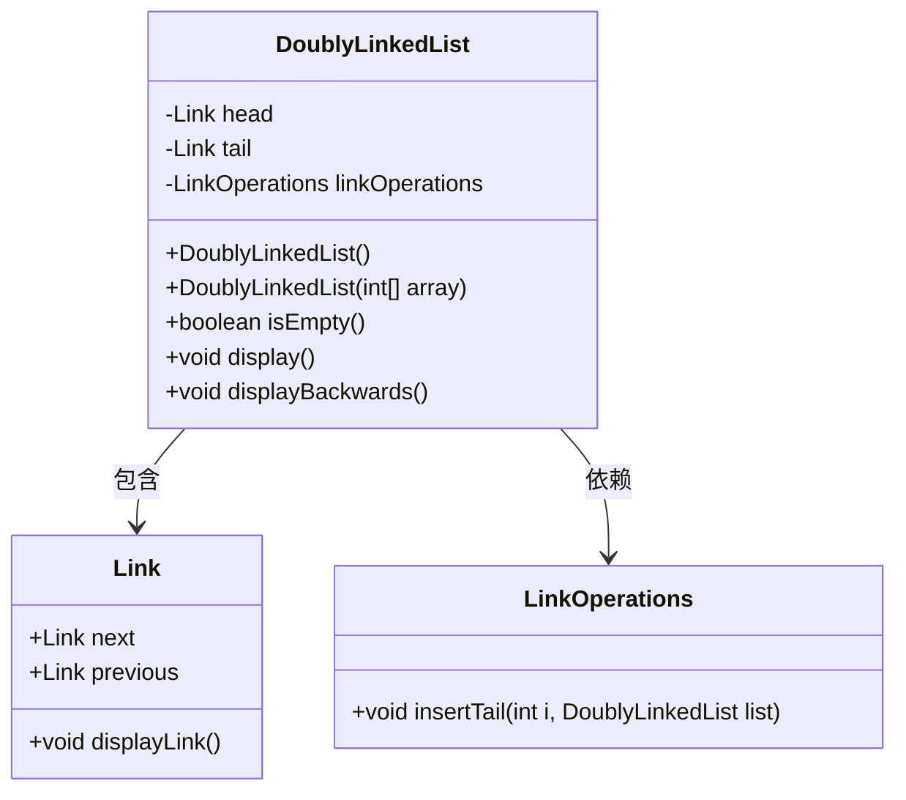
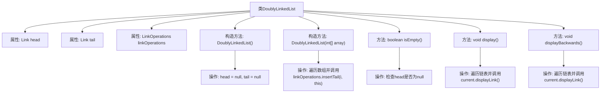
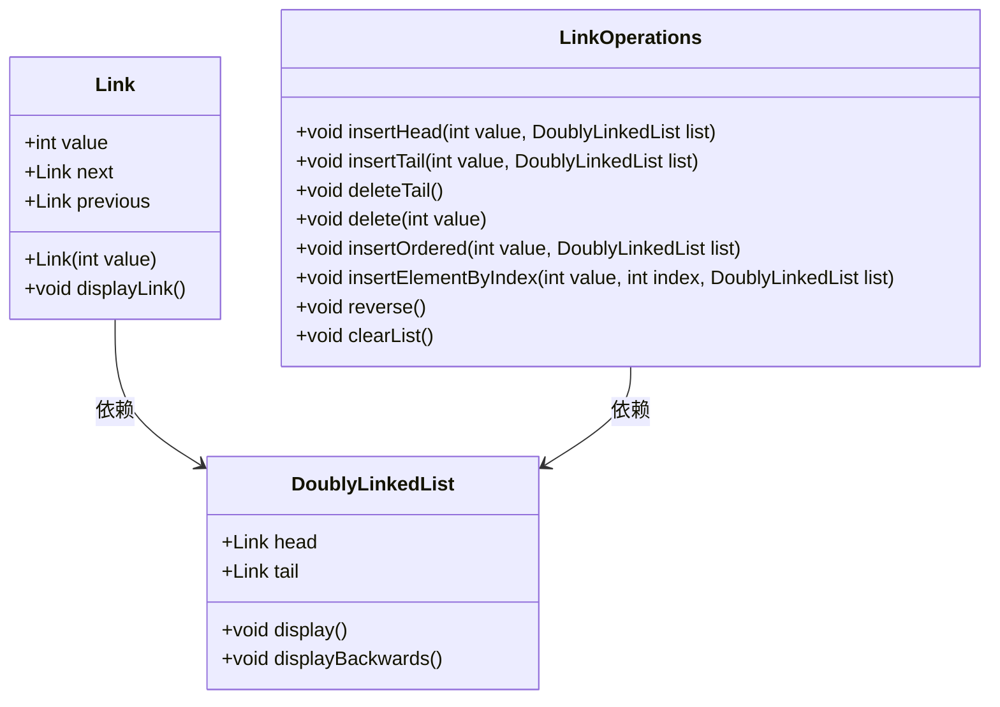
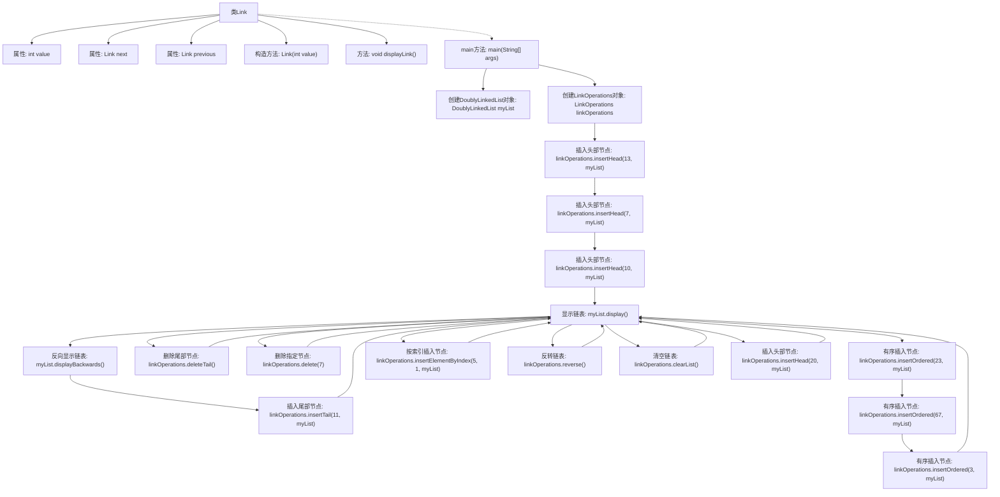
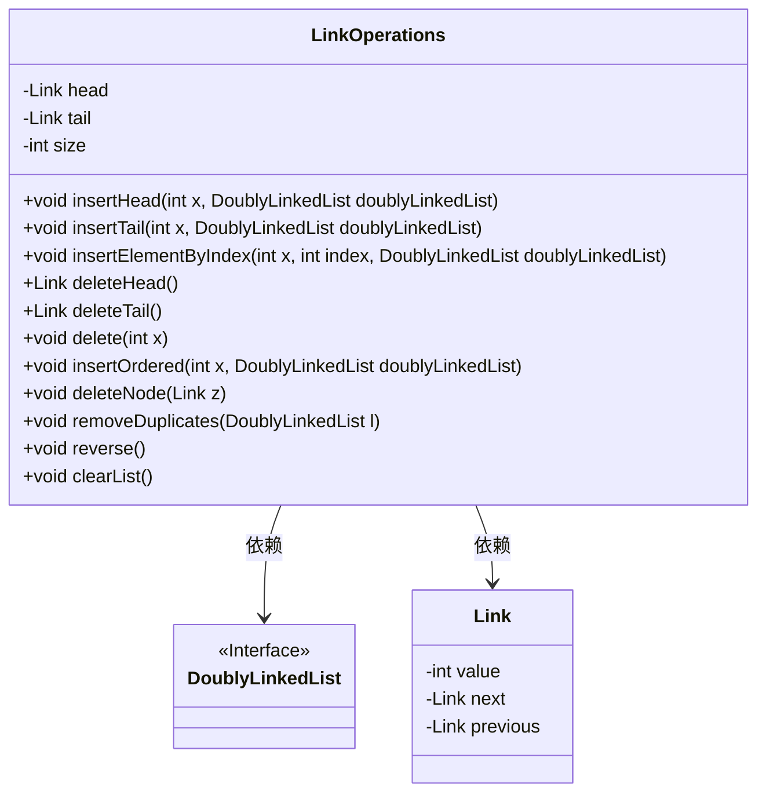

# 基础信息

|      |      |
|------|------|
| 名称 | DoublyLinkedList |
| 编码语言 | .java |
| 代码路径 | Java/src/main/java/com/thealgorithms/datastructures/lists/DoublyLinkedList.java |
| 包名 | com.thealgorithms.datastructures.lists |
| 依赖项 | [] |
| 概述说明 | 双向链表类实现头尾节点、链表操作、判空及正逆序打印功能。Link类支持插入、删除、排序、反转和清空操作。 |

# 说明

双向链表类包含头尾节点和多种链表操作，如插入、删除、排序、反转和清空，具备构造函数和判空功能，支持正序和逆序打印。Link类实现了双向链表，提供插入、删除、排序、反转和清空等操作。双向链表操作类则进一步扩展了功能，包括插入、删除、反转和去重等操作，确保链表的高效管理和数据处理。

# 类列表 Class Summary

| 名称   | 类型  | 说明 |
|-------|------|-------------|
| DoublyLinkedList | class | 双向链表类，包含头尾节点、链表操作、构造函数、判空、正序逆序打印功能。 |
| Link | class | Link类实现双向链表，包含插入、删除、排序、反转和清空操作。 |
| LinkOperations | class | 双向链表操作类，包含插入、删除、反转、去重等功能。 |

## 类 DoublyLinkedList

|      |      |
|------|------|
| 访问范围 | public final |
| 类型 | class |
| 名称 | DoublyLinkedList |
| 说明 | 双向链表类，包含头尾节点、链表操作、构造函数、判空、正序逆序打印功能。 |

### UML类图

### 描述
该代码定义了一个双向链表类 `DoublyLinkedList`，包含头节点 `head`、尾节点 `tail` 和操作类 `LinkOperations`。`Link` 类表示链表中的节点，包含前后节点的引用和显示节点内容的方法。`LinkOperations` 类提供了在链表尾部插入节点的操作。`DoublyLinkedList` 类提供了构造空链表、从数组构造链表、判断链表是否为空、以及正向和反向显示链表内容的功能。

### 内部方法调用关系图

这段代码定义了一个双向链表类 `DoublyLinkedList`，包含了链表的头节点 `head` 和尾节点 `tail`，以及一个用于节点操作的 `linkOperations` 对象。类中提供了默认构造函数和基于数组的构造函数，后者会遍历数组并将元素插入链表尾部。此外，类中还提供了判断链表是否为空的方法 `isEmpty()`，以及分别正向和反向打印链表内容的方法 `display()` 和 `displayBackwards()`。这些方法通过遍历链表并调用节点的 `displayLink()` 方法来输出链表内容。

### 字段列表 Field List

| 名称  | 类型  | 说明 |
|-------|-------|------|
| head | Link | 保护链表头节点。 |
| tail | Link | 定义私有链表尾节点。 |
| linkOperations | LinkOperations | 私有变量linkOperations用于链接操作。 |

### 方法列表 Method List

| 名称  | 类型  | 说明 |
|-------|-------|------|
| isEmpty | boolean | 检查链表是否为空，返回头节点是否为null。 |
| display | void | 该方法遍历链表并打印每个节点的内容。 |
| displayBackwards | void | 方法displayBackwards从尾部遍历链表并显示每个节点的内容。 |

## 类 Link

|      |      |
|------|------|
| 访问范围 | None |
| 类型 | class |
| 名称 | Link |
| 说明 | Link类实现双向链表，包含插入、删除、排序、反转和清空操作。 |

### UML类图

这段代码定义了一个双向链表的结构，包含 `Link` 类、`DoublyLinkedList` 类和 `LinkOperations` 类。`Link` 类表示链表中的节点，包含值、前驱和后继指针。`DoublyLinkedList` 类管理链表的头部和尾部，并提供显示链表内容的方法。`LinkOperations` 类提供了一系列操作链表的方法，如插入、删除、反转和清空链表。这些类共同实现了双向链表的基本功能，并提供了丰富的操作接口。

### 内部方法调用关系图

这段代码定义了一个双向链表的节点类 `Link`，并展示了如何使用 `LinkOperations` 类对链表进行各种操作，如插入、删除、反转和清空。代码通过 `main` 方法逐步演示了这些操作，并在每一步后显示链表的内容。流程图展示了类 `Link` 的结构以及 `main` 方法中各个操作的执行顺序。

### 字段列表 Field List

| 名称  | 类型  | 说明 |
|-------|-------|------|
| next | Link | `next` 是公共链接类型变量。 |
| previous | Link | 包含一个名为previous的公共链接。 |
| value | int | 定义一个公共整型变量value。 |

### 方法列表 Method List

| 名称  | 类型  | 说明 |
|-------|-------|------|
| displayLink | void | Java方法displayLink输出变量value的值并附加空格。 |
| main | void | 双向链表操作：插入、删除、排序、反转、清空及显示。 |

## 类 LinkOperations

|      |      |
|------|------|
| 访问范围 | None |
| 类型 | class |
| 名称 | LinkOperations |
| 说明 | 双向链表操作类，包含插入、删除、反转、去重等功能。 |

### UML类图

这段代码定义了一个 `LinkOperations` 类，用于操作双向链表。`LinkOperations` 类包含了对链表的各种操作，如插入、删除、反转等。`Link` 类表示链表中的节点，包含值、前驱和后继节点。`DoublyLinkedList` 是一个接口，表示双向链表的抽象。`LinkOperations` 类依赖于 `DoublyLinkedList` 和 `Link` 类来实现链表操作。代码通过多种方法管理链表的头部、尾部以及链表的大小，确保链表的正确性和完整性。

### 内部方法调用关系图

```mermaid
graph TD
    A["类LinkOperations"]
    B["属性: Link head"]
    C["属性: Link tail"]
    D["属性: int size"]
    E["方法: insertHead(int x, DoublyLinkedList doublyLinkedList)"]
    F["方法: insertTail(int x, DoublyLinkedList doublyLinkedList)"]
    G["方法: insertElementByIndex(int x, int index, DoublyLinkedList doublyLinkedList)"]
    H["方法: deleteHead()"]
    I["方法: deleteTail()"]
    J["方法: delete(int x)"]
    K["方法: insertOrdered(int x, DoublyLinkedList doublyLinkedList)"]
    L["方法: deleteNode(Link z)"]
    M["方法: removeDuplicates(DoublyLinkedList l)"]
    N["方法: reverse()"]
    O["方法: clearList()"]

    A --> B
    A --> C
    A --> D
    A --> E
    A --> F
    A --> G
    A --> H
    A --> I
    A --> J
    A --> K
    A --> L
    A --> M
    A --> N
    A --> O
```

这段代码定义了一个`LinkOperations`类，用于管理双向链表的操作。类中包含多个方法，用于在链表的头部、尾部或指定位置插入元素，删除头部、尾部或指定元素，按顺序插入元素，删除指定节点，移除重复元素，反转链表以及清空链表。每个方法都通过操作`head`和`tail`指针来维护链表的结构，并通过`size`属性跟踪链表的长度。

### 字段列表 Field List

| 名称  | 类型  | 说明 |
|-------|-------|------|
| head | Link | 私有链接头节点。 |
| size | int | 声明一个私有整型变量size。 |
| tail | Link | 私有链表尾部指针。 |

### 方法列表 Method List

| 名称  | 类型  | 说明 |
|-------|-------|------|
| deleteHead | Link | 删除链表头节点并返回被删除节点。 |
| removeDuplicates | void | 删除双向链表中的重复节点。 |
| deleteTail | Link | 删除链表尾部节点，更新指针并返回被删节点。 |
| reverse | void | 该方法反转链表，交换头尾节点并翻转每个节点的前后链接。 |
| insertTail | void | 在双向链表尾部插入新节点，更新头尾指针并增加链表大小。 |
| delete | void | 删除链表中指定值的节点，处理头尾节点，更新链表大小。 |
| insertHead | void | 在双向链表头部插入新节点，更新前后链接并增加链表大小。 |
| insertElementByIndex | void | 在双向链表中按索引插入元素，处理边界情况并更新链表大小。 |
| insertOrdered | void | 在双向链表中按顺序插入节点，更新前后链接并增加链表大小。 |
| deleteNode | void | 删除链表节点，处理头尾特殊情况，更新前后指针并减少链表大小。 |
| clearList | void | 清除链表，重置头尾指针和大小为0。 |

