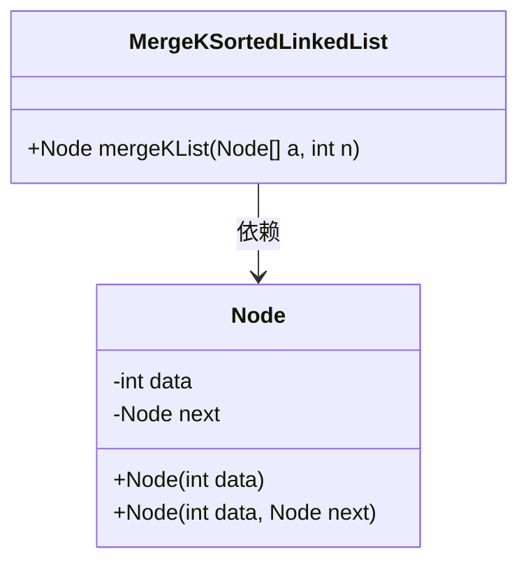
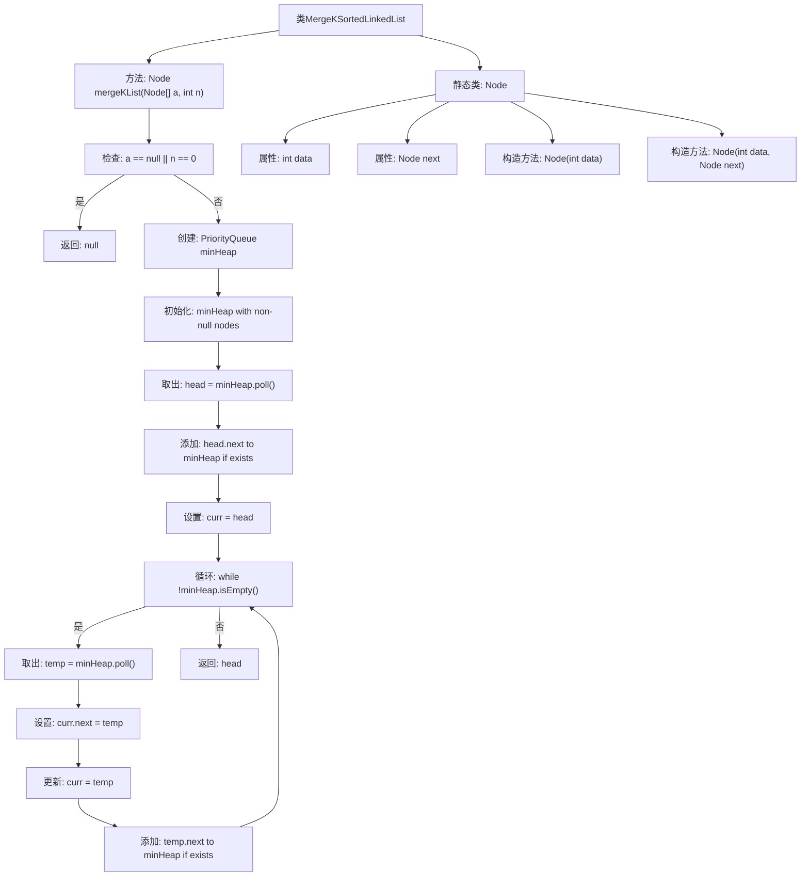

# 基础信息

|      |      |
|------|------|
| 名称 | MergeKSortedLinkedList |
| 编码语言 | .java |
| 代码路径 | Java/src/main/java/com/thealgorithms/datastructures/lists/MergeKSortedLinkedList.java |
| 包名 | com.thealgorithms.datastructures.lists |
| 依赖项 | ['java.util.Comparator', 'java.util.PriorityQueue'] |
| 概述说明 | 合并K个有序链表，利用最小堆提取最小节点，生成单一有序链表。 |

# 说明

合并K个有序链表时，采用最小堆数据结构来高效提取当前最小节点。通过将每个链表的头节点加入最小堆，每次从堆中取出最小节点，将其加入结果链表，并将该节点的下一个节点重新放入堆中。重复此过程直到堆为空，最终生成一个单一的有序链表。该方法确保了合并过程的时间复杂度优化，适用于处理大规模数据。

# 类列表 Class Summary

| 名称   | 类型  | 说明 |
|-------|------|-------------|
| MergeKSortedLinkedList | class | 合并K个有序链表，使用最小堆提取最小节点，生成单一有序链表。 |

## 类 MergeKSortedLinkedList

|      |      |
|------|------|
| 访问范围 | public |
| 类型 | class |
| 名称 | MergeKSortedLinkedList |
| 说明 | 合并K个有序链表，使用最小堆提取最小节点，生成单一有序链表。 |

### UML类图

这段代码定义了一个 `MergeKSortedLinkedList` 类，其中包含一个 `mergeKList` 方法，用于合并 K 个已排序的链表。`Node` 类表示链表中的节点，包含数据域和指向下一个节点的指针。`mergeKList` 方法使用优先队列（最小堆）来高效地获取当前最小的节点，并将其加入到合并后的链表中。整个过程持续到所有节点都被处理完毕，最终返回合并后的链表的头节点。

### 内部方法调用关系图

这段代码实现了一个合并K个有序链表的算法。通过使用最小堆（PriorityQueue），代码能够高效地从每个链表的头节点中选取最小的节点，并将其添加到合并后的链表中。每次从堆中取出一个节点后，如果该节点有下一个节点，则将其下一个节点重新加入堆中。这个过程持续进行，直到堆为空，最终返回合并后的链表的头节点。

### 字段列表 Field List

| 名称  | 类型  | 说明 |
|-------|-------|------|

### 方法列表 Method List

| 名称  | 类型  | 说明 |
|-------|-------|------|
| mergeKList | Node | 合并K个有序链表，使用最小堆实现高效排序。 |

