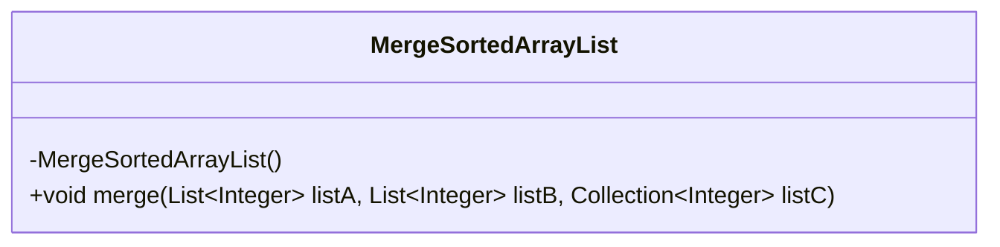
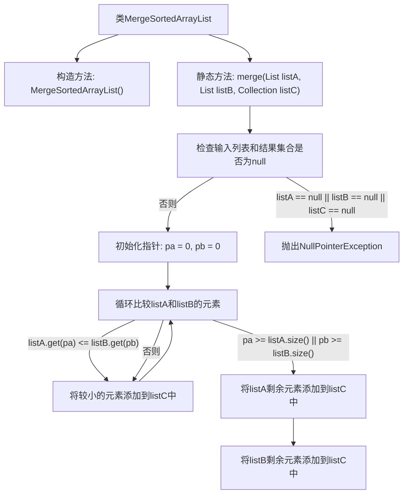

# 基础信息

|      |      |
|------|------|
| 名称 | MergeSortedArrayList |
| 编码语言 | .java |
| 代码路径 | Java/src/main/java/com/thealgorithms/datastructures/lists/MergeSortedArrayList.java |
| 包名 | com.thealgorithms.datastructures.lists |
| 依赖项 | ['java.util.Collection', 'java.util.List'] |
| 概述说明 | 合并两有序整数列表到新集合，保持升序且不修改原列表。 |

# 说明

该任务要求将两个已按升序排列的整数列表合并到第三个集合中，同时保持升序排列，且不修改原始列表。合并过程需要确保新集合中的元素按从小到大的顺序排列，且原列表的内容保持不变。这涉及到对两个列表的元素进行比较和排序，最终生成一个新的有序集合。

# 类列表 Class Summary

| 名称   | 类型  | 说明 |
|-------|------|-------------|
| MergeSortedArrayList | class | 合并两个有序整数列表到第三个集合，保持升序，不修改原列表。 |

## 类 MergeSortedArrayList

|      |      |
|------|------|
| 访问范围 | public final |
| 类型 | class |
| 名称 | MergeSortedArrayList |
| 说明 | 合并两个有序整数列表到第三个集合，保持升序，不修改原列表。 |

### UML类图

**描述：**  
`MergeSortedArrayList` 是一个工具类，提供了静态方法 `merge`，用于将两个已排序的整数列表 `listA` 和 `listB` 合并为一个新的有序集合 `listC`。该方法不会修改原始列表，而是将元素按升序插入到 `listC` 中。如果输入列表或结果集合为 `null`，方法会抛出 `NullPointerException`。该类通过私有构造函数防止实例化，确保仅作为工具类使用。

### 内部方法调用关系图

这段代码定义了一个名为 `MergeSortedArrayList` 的类，其中包含一个静态方法 `merge`，用于将两个已排序的整数列表合并到一个新的集合中，同时保持排序顺序。方法首先检查输入列表和结果集合是否为 `null`，如果是则抛出 `NullPointerException`。接着，通过两个指针遍历两个列表，比较元素大小并将较小的元素添加到结果集合中。最后，将剩余的元素添加到结果集合中。流程图展示了该方法的执行流程，包括输入检查、元素比较和结果集合的填充。

### 字段列表 Field List

| 名称  | 类型  | 说明 |
|-------|-------|------|

### 方法列表 Method List

| 名称  | 类型  | 说明 |
|-------|-------|------|
| merge | void | 合并两个有序列表到第三个集合中，确保输入非空。 |

