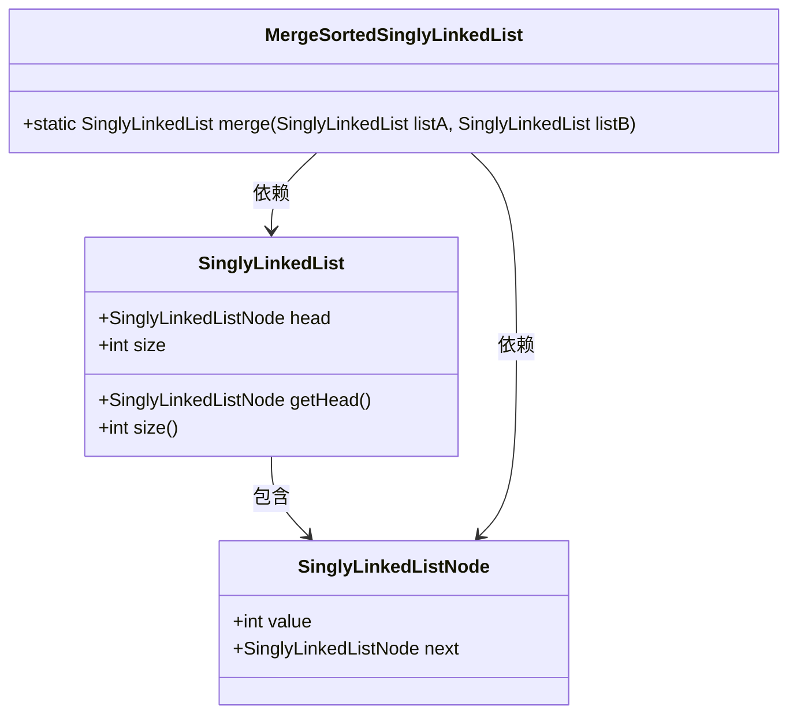
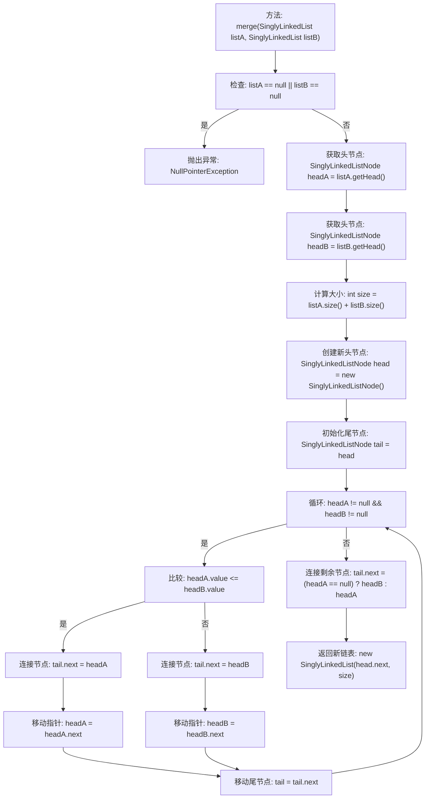

# 基础信息

|      |      |
|------|------|
| 名称 | MergeSortedSinglyLinkedList |
| 编码语言 | .java |
| 代码路径 | Java/src/main/java/com/thealgorithms/datastructures/lists/MergeSortedSinglyLinkedList.java |
| 包名 | com.thealgorithms.datastructures.lists |
| 依赖项 | [] |
| 概述说明 | 将两个有序单链表合并为一个新的有序单链表。 |

# 说明

合并两个有序单链表为一个新的有序单链表的过程涉及比较两个链表的节点值，并将较小的节点依次添加到新链表中。首先，初始化一个新链表的头节点和当前节点指针。然后，遍历两个输入链表，比较当前节点的值，将较小的节点连接到新链表，并移动相应链表的指针。重复此过程，直到其中一个链表遍历完毕。最后，将未遍历完的链表剩余部分直接连接到新链表的末尾。最终返回新链表的头节点。

# 类列表 Class Summary

| 名称   | 类型  | 说明 |
|-------|------|-------------|
| MergeSortedSinglyLinkedList | class | 合并两个有序单链表为一个新的有序单链表。 |

## 类 MergeSortedSinglyLinkedList

|      |      |
|------|------|
| 访问范围 | public |
| 类型 | class |
| 名称 | MergeSortedSinglyLinkedList |
| 说明 | 合并两个有序单链表为一个新的有序单链表。 |

### UML类图

**描述：**  
`MergeSortedSinglyLinkedList` 类扩展了 `SinglyLinkedList`，提供了一个静态方法 `merge`，用于合并两个已排序的单链表。该方法通过遍历两个链表的节点，按顺序将节点连接到一个新链表中，最终返回合并后的链表。`SinglyLinkedList` 类包含链表的基本结构和操作，而 `SinglyLinkedListNode` 类表示链表中的单个节点。`MergeSortedSinglyLinkedList` 类依赖于 `SinglyLinkedList` 和 `SinglyLinkedListNode` 来实现合并功能。

### 内部方法调用关系图

这段代码实现了一个静态方法 `merge`，用于将两个已排序的单链表合并为一个新的已排序单链表。该方法首先检查输入链表是否为空，若为空则抛出异常。然后获取两个链表的头节点，并计算合并后链表的大小。接着，通过循环比较两个链表的节点值，将较小的节点连接到新链表中，并移动相应的指针。最后，将剩余的节点连接到新链表的尾部，并返回新链表。

### 字段列表 Field List

| 名称  | 类型  | 说明 |
|-------|-------|------|

### 方法列表 Method List

| 名称  | 类型  | 说明 |
|-------|-------|------|
| merge | SinglyLinkedList | 合并两个有序单链表，返回新链表。 |

