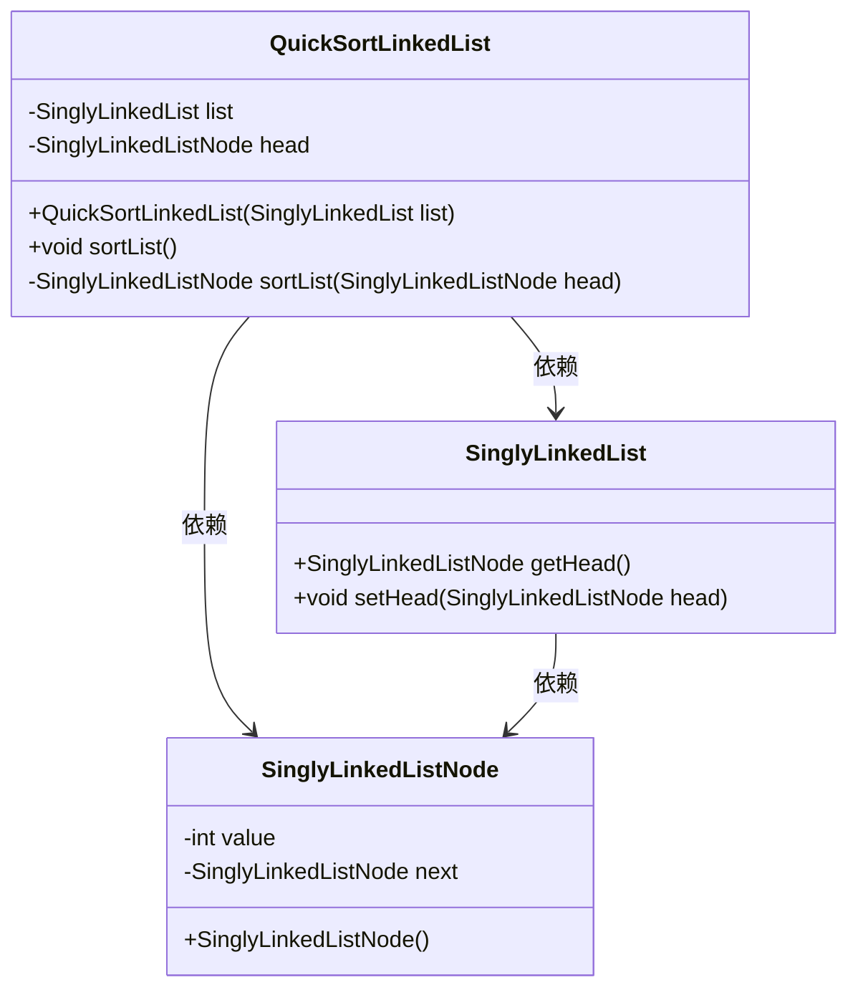
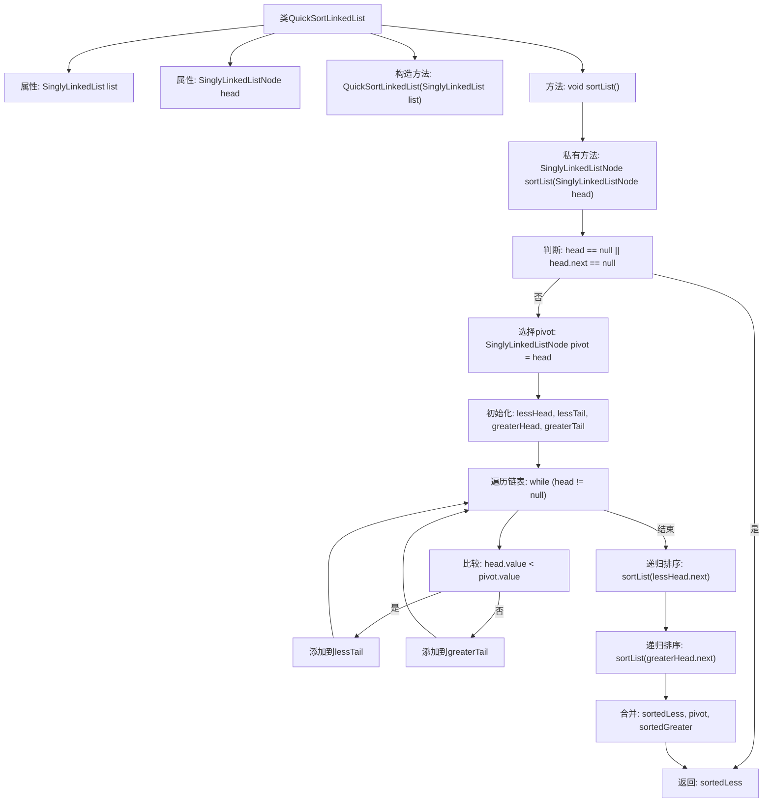

# 基础信息

|      |      |
|------|------|
| 名称 | QuickSortLinkedList |
| 编码语言 | .java |
| 代码路径 | Java/src/main/java/com/thealgorithms/datastructures/lists/QuickSortLinkedList.java |
| 包名 | com.thealgorithms.datastructures.lists |
| 依赖项 | [] |
| 概述说明 | 快速排序算法递归分区合并实现单链表排序。 |

# 说明

快速排序算法用于对单链表进行排序，其核心思想是通过递归的方式将链表分区并合并。具体步骤包括选择链表中的一个元素作为基准，将链表分为两部分，一部分包含小于基准的元素，另一部分包含大于基准的元素。然后递归地对这两部分进行同样的操作，最后将分区后的链表合并，完成排序。该方法通过递归分区和合并实现链表的快速排序。

# 类列表 Class Summary

| 名称   | 类型  | 说明 |
|-------|------|-------------|
| QuickSortLinkedList | class | 快速排序算法实现单链表排序，通过递归分区和合并完成。 |

## 类 QuickSortLinkedList

|      |      |
|------|------|
| 访问范围 | public |
| 类型 | class |
| 名称 | QuickSortLinkedList |
| 说明 | 快速排序算法实现单链表排序，通过递归分区和合并完成。 |

### UML类图

这段代码实现了一个用于对单向链表进行快速排序的类 `QuickSortLinkedList`。该类通过递归的方式将链表分为小于基准值（pivot）和大于等于基准值的两部分，然后分别对这两部分进行排序，最后将排序后的部分与基准值合并。`SinglyLinkedList` 类表示单向链表，`SinglyLinkedListNode` 类表示链表中的节点。`QuickSortLinkedList` 依赖于 `SinglyLinkedList` 和 `SinglyLinkedListNode` 来完成排序操作。

### 内部方法调用关系图

这段代码实现了一个基于链表的快速排序算法。`QuickSortLinkedList`类通过递归方法`sortList`对链表进行排序。首先，它选择链表的一个节点作为pivot，然后将链表分为两部分：小于pivot的部分和大于等于pivot的部分。接着，递归地对这两部分进行排序，最后将排序后的部分与pivot合并，返回排序后的链表头节点。整个过程通过递归和链表操作实现了快速排序的核心思想。

### 字段列表 Field List

| 名称  | 类型  | 说明 |
|-------|-------|------|
| list | SinglyLinkedList | 私有且不可变的单链表实例。 |
| head | SinglyLinkedListNode | 私有单链表节点head声明。 |

### 方法列表 Method List

| 名称  | 类型  | 说明 |
|-------|-------|------|
| sortList | void | 排序链表并更新头节点。 |
| sortList | SinglyLinkedListNode | 单链表快速排序，递归分割并合并。 |

