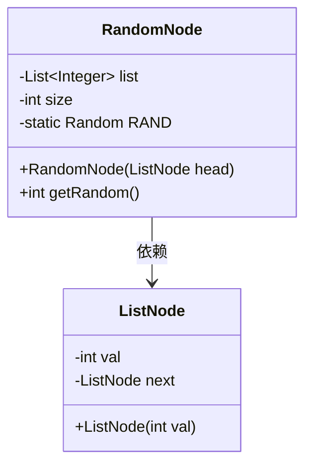
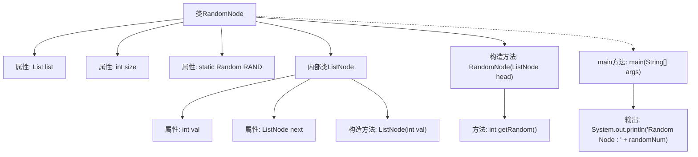

# 基础信息

|      |      |
|------|------|
| 名称 | RandomNode |
| 编码语言 | .java |
| 代码路径 | Java/src/main/java/com/thealgorithms/datastructures/lists/RandomNode.java |
| 包名 | com.thealgorithms.datastructures.lists |
| 依赖项 | ['java.util.ArrayList', 'java.util.List', 'java.util.Random'] |
| 概述说明 | RandomNode类从链表随机获取节点值，时间O(n)，空间O(1)。 |

# 说明

RandomNode类用于从链表中随机获取节点值。该算法的时间复杂度为O(n)，表示在最坏情况下需要遍历整个链表。空间复杂度为O(1)，意味着算法在运行过程中不需要额外的存储空间，仅使用常量级别的内存。这种方法在保证随机性的同时，实现了高效的内存使用和线性时间性能。

# 类列表 Class Summary

| 名称   | 类型  | 说明 |
|-------|------|-------------|
| RandomNode | class | RandomNode类从链表中随机获取节点值，时间复杂度O(n)，空间复杂度O(1)。 |

## 类 RandomNode

|      |      |
|------|------|
| 访问范围 | public |
| 类型 | class |
| 名称 | RandomNode |
| 说明 | RandomNode类从链表中随机获取节点值，时间复杂度O(n)，空间复杂度O(1)。 |

### UML类图

**描述：**  
`RandomNode` 类用于从链表中随机选择一个节点值。它包含一个 `ListNode` 内部类，用于表示链表节点。`RandomNode` 类通过构造函数将链表的值存储在一个列表中，并通过 `getRandom` 方法随机返回一个值。该类的核心功能是通过遍历链表存储节点值，并利用随机数生成器返回随机节点值。

### 内部方法调用关系图

这段代码定义了一个名为 `RandomNode` 的类，用于从一个链表中随机选择一个节点并返回其值。代码中包含一个内部类 `ListNode`，用于表示链表节点。`RandomNode` 类的构造函数将链表节点的值存储在一个 `List` 中，并通过 `getRandom` 方法随机选择一个值。`main` 方法用于测试 `RandomNode` 类的功能，输出随机选择的节点值。

### 字段列表 Field List

| 名称  | 类型  | 说明 |
|-------|-------|------|
| list | List<Integer> | 私有不可变整数列表变量。 |
| RAND = new Random() | Random | 声明并初始化一个私有的静态随机数生成器实例。 |
| size | int | 声明一个私有的整型变量size。 |

### 方法列表 Method List

| 名称  | 类型  | 说明 |
|-------|-------|------|
| main | void | Java代码生成链表并随机获取节点值。 |
| getRandom | int | 该方法从列表中随机获取一个元素并返回。 |

