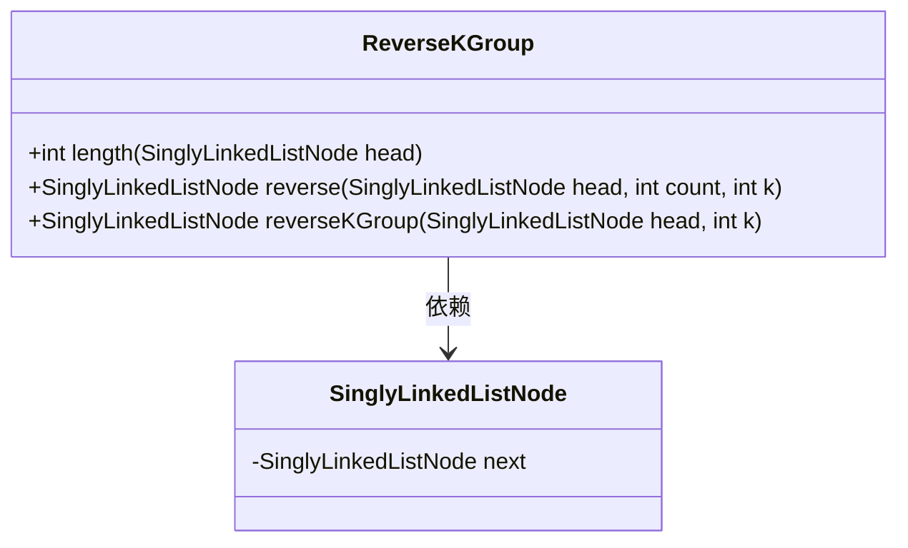

# 基础信息

|      |      |
|------|------|
| 名称 | ReverseKGroup |
| 编码语言 | .java |
| 代码路径 | Java/src/main/java/com/thealgorithms/datastructures/lists/ReverseKGroup.java |
| 包名 | com.thealgorithms.datastructures.lists |
| 依赖项 | [] |
| 概述说明 | 链表按k节点分组反转，计算长度后递归处理。 |

# 说明

链表按k节点分组反转的过程包括计算链表长度并递归反转。首先，遍历链表以确定其长度。然后，将链表分成每k个节点一组，对每一组进行反转操作。如果最后一组节点不足k个，则保持原顺序。递归方法用于处理每一组节点的反转，确保整个链表按k节点分组后顺序正确反转。整个过程确保链表结构不变，仅调整节点顺序。

# 类列表 Class Summary

| 名称   | 类型  | 说明 |
|-------|------|-------------|
| ReverseKGroup | class | 链表按k节点分组反转，计算长度并递归反转。 |

## 类 ReverseKGroup

|      |      |
|------|------|
| 访问范围 | public |
| 类型 | class |
| 名称 | ReverseKGroup |
| 说明 | 链表按k节点分组反转，计算长度并递归反转。 |

### UML类图

这段代码定义了一个 `ReverseKGroup` 类，用于将单向链表中的节点按每 `k` 个一组进行反转。`length` 方法用于计算链表的长度，`reverse` 方法用于反转指定数量的节点，`reverseKGroup` 方法则是整个反转操作的入口。`SinglyLinkedListNode` 类表示链表中的节点，包含一个指向下一个节点的引用。`ReverseKGroup` 类依赖于 `SinglyLinkedListNode` 类来执行链表操作。

### 内部方法调用关系图

```mermaid
graph TD
    A["类ReverseKGroup"]
    B["方法: int length(SinglyLinkedListNode head)"]
    C["方法: SinglyLinkedListNode reverse(SinglyLinkedListNode head, int count, int k)"]
    D["方法: SinglyLinkedListNode reverseKGroup(SinglyLinkedListNode head, int k)"]
    E["变量: SinglyLinkedListNode curr = head"]
    F["变量: int count = 0"]
    G["循环: while (curr != null)"]
    H["操作: curr = curr.next"]
    I["操作: count++"]
    J["返回: return count"]
    K["条件: if (count < k)"]
    L["返回: return head"]
    M["变量: SinglyLinkedListNode prev = null"]
    N["变量: int count1 = 0"]
    O["变量: SinglyLinkedListNode curr = head"]
    P["变量: SinglyLinkedListNode next = null"]
    Q["循环: while (curr != null && count1 < k)"]
    R["操作: next = curr.next"]
    S["操作: curr.next = prev"]
    T["操作: prev = curr"]
    U["操作: curr = next"]
    V["操作: count1++"]
    W["条件: if (next != null)"]
    X["操作: head.next = reverse(next, count - k, k)"]
    Y["返回: return prev"]
    Z["操作: int count = length(head)"]
    AA["返回: return reverse(head, count, k)"]

    A --> B
    A --> C
    A --> D
    B --> E
    B --> F
    B --> G
    G --> H
    G --> I
    B --> J
    C --> K
    K --> L
    C --> M
    C --> N
    C --> O
    C --> P
    C --> Q
    Q --> R
    Q --> S
    Q --> T
    Q --> U
    Q --> V
    C --> W
    W --> X
    C --> Y
    D --> Z
    D --> AA
```

这段代码实现了一个将单向链表以每k个节点为一组进行反转的功能。`length`方法用于计算链表的长度，`reverse`方法用于反转指定数量的节点，`reverseKGroup`方法则是整个功能的入口，它首先计算链表的长度，然后调用`reverse`方法进行反转。代码通过递归的方式处理剩余的节点，确保每k个节点都被正确反转。

### 字段列表 Field List

| 名称  | 类型  | 说明 |
|-------|-------|------|

### 方法列表 Method List

| 名称  | 类型  | 说明 |
|-------|-------|------|
| length | int | 计算单链表长度的Java方法。 |
| reverse | SinglyLinkedListNode | 反转单链表每k个节点，递归处理剩余部分。 |
| reverseKGroup | SinglyLinkedListNode | 反转链表每k个节点，返回新链表头节点。 |

