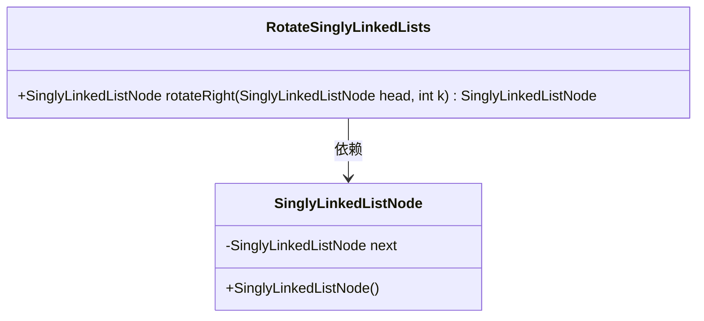
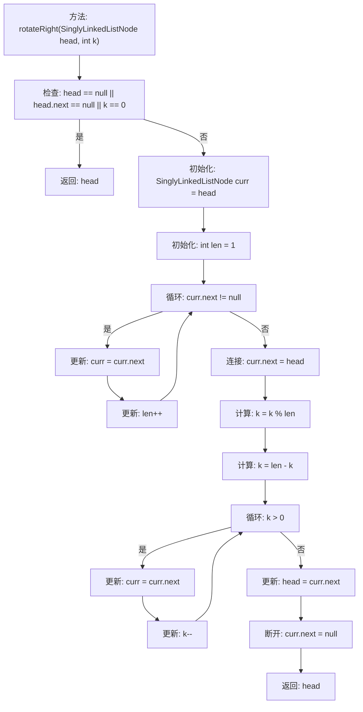

# 基础信息

|      |      |
|------|------|
| 名称 | RotateSinglyLinkedLists |
| 编码语言 | .java |
| 代码路径 | Java/src/main/java/com/thealgorithms/datastructures/lists/RotateSinglyLinkedLists.java |
| 包名 | com.thealgorithms.datastructures.lists |
| 依赖项 | [] |
| 概述说明 | 单向链表右旋k位，返回新头节点。 |

# 说明

单向链表右旋k个位置的操作涉及将链表的末尾k个节点移动到链表的前端，形成一个新的链表结构。该操作需要找到链表的尾节点，并将其与头节点连接，同时更新新的头节点。最终返回旋转后的链表头节点。此操作的关键在于确定旋转点，并确保链表连接的正确性，以保持链表的完整性和顺序。

# 类列表 Class Summary

| 名称   | 类型  | 说明 |
|-------|------|-------------|
| RotateSinglyLinkedLists | class | 单向链表右旋k个位置，返回新链表头节点。 |

## 类 RotateSinglyLinkedLists

|      |      |
|------|------|
| 访问范围 | public |
| 类型 | class |
| 名称 | RotateSinglyLinkedLists |
| 说明 | 单向链表右旋k个位置，返回新链表头节点。 |

### UML类图

这段代码定义了一个 `RotateSinglyLinkedLists` 类，其中包含一个 `rotateRight` 方法，用于将单向链表向右旋转 `k` 个位置。`SinglyLinkedListNode` 类表示链表中的节点，包含一个指向下一个节点的指针 `next`。`rotateRight` 方法首先计算链表的长度，然后将链表首尾相连，通过计算旋转后的新头节点位置，最终返回旋转后的链表头节点。

### 内部方法调用关系图

这段代码实现了一个方法 `rotateRight`，用于将单链表向右旋转 `k` 个位置。首先，代码检查链表是否为空或仅有一个节点，或者 `k` 是否为0，如果是则直接返回原链表。否则，计算链表的长度，并将链表首尾相连形成一个环。接着，通过计算 `k` 的有效值，找到新的头节点并断开环，最终返回旋转后的链表头节点。

### 字段列表 Field List

| 名称  | 类型  | 说明 |
|-------|-------|------|

### 方法列表 Method List

| 名称  | 类型  | 说明 |
|-------|-------|------|
| rotateRight | SinglyLinkedListNode | 单链表右旋k个节点，返回新链表头。 |

