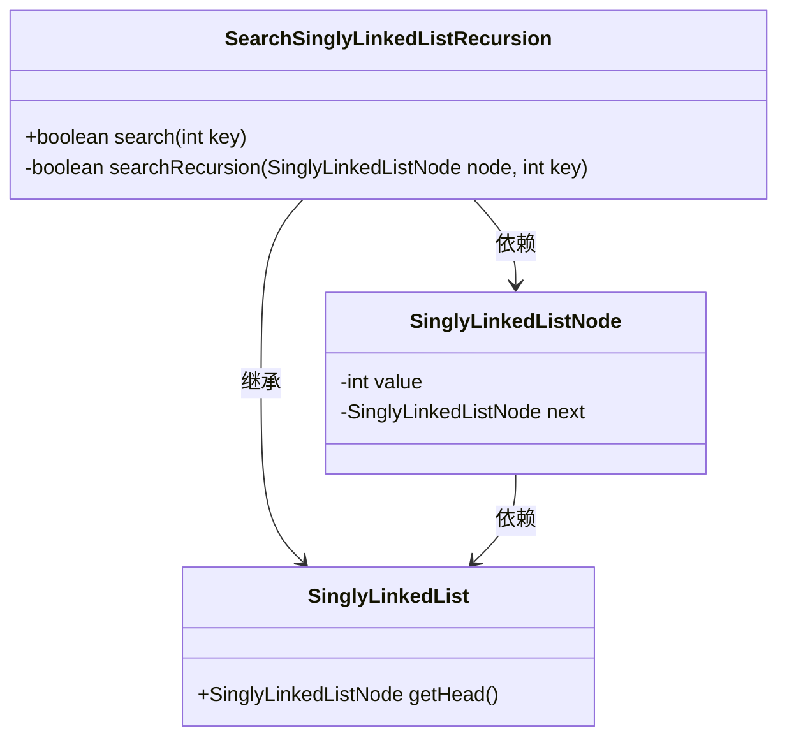
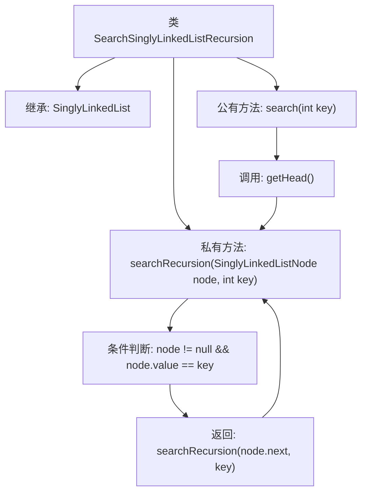

# 基础信息

|      |      |
|------|------|
| 名称 | SearchSinglyLinkedListRecursion |
| 编码语言 | .java |
| 代码路径 | Java/src/main/java/com/thealgorithms/datastructures/lists/SearchSinglyLinkedListRecursion.java |
| 包名 | com.thealgorithms.datastructures.lists |
| 依赖项 | [] |
| 概述说明 | 递归查找单链表是否包含特定值。 |

# 说明

递归搜索单链表中是否存在指定值的过程涉及以下关键步骤：首先检查链表是否为空，若为空则返回不存在。若链表不为空，则比较当前节点的值是否与目标值相等，若相等则返回存在。若不相等，则递归调用函数，将链表的下一个节点作为新的起始节点进行搜索。这一过程持续进行，直到找到目标值或链表遍历完毕。递归搜索通过不断缩小搜索范围，逐步逼近目标值，确保搜索的全面性和准确性。

# 类列表 Class Summary

| 名称   | 类型  | 说明 |
|-------|------|-------------|
| SearchSinglyLinkedListRecursion | class | 递归搜索单链表中是否存在指定值。 |

## 类 SearchSinglyLinkedListRecursion

|      |      |
|------|------|
| 访问范围 | public |
| 类型 | class |
| 名称 | SearchSinglyLinkedListRecursion |
| 说明 | 递归搜索单链表中是否存在指定值。 |

### UML类图

这段代码定义了一个名为 `SearchSinglyLinkedListRecursion` 的类，它继承自 `SinglyLinkedList`。该类提供了递归搜索单链表中是否存在某个值的方法。`searchRecursion` 方法通过递归遍历链表节点来查找指定的值，而 `search` 方法则是对外公开的接口，用于启动递归搜索。`SinglyLinkedListNode` 类表示链表中的节点，包含值和指向下一个节点的引用。

### 内部方法调用关系图

这段代码定义了一个继承自`SinglyLinkedList`的类`SearchSinglyLinkedListRecursion`，该类通过递归方法`searchRecursion`在单链表中搜索指定的值`key`。`search`方法是公有的入口，调用`getHead()`获取链表头节点，并传递给`searchRecursion`进行递归搜索。递归方法通过检查当前节点值是否等于`key`或继续搜索下一个节点来判断是否存在目标值。

### 字段列表 Field List

| 名称  | 类型  | 说明 |
|-------|-------|------|

### 方法列表 Method List

| 名称  | 类型  | 说明 |
|-------|-------|------|
| searchRecursion | boolean | 递归搜索链表节点，查找指定键值是否存在。 |
| search | boolean | 重写search方法，递归查找指定键值。 |

