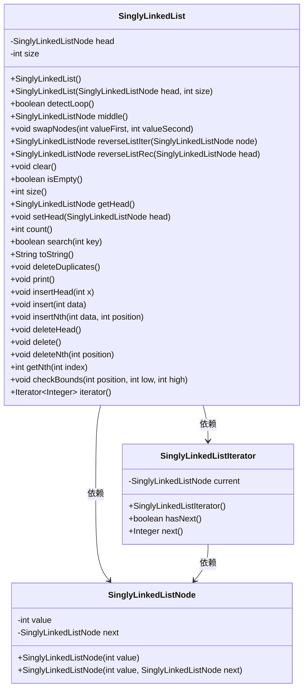

# 基础信息

|      |      |
|------|------|
| 名称 | SinglyLinkedList |
| 编码语言 | .java |
| 代码路径 | Java/src/main/java/com/thealgorithms/datastructures/lists/SinglyLinkedList.java |
| 包名 | com.thealgorithms.datastructures.lists |
| 依赖项 | ['java.util.Iterator', 'java.util.NoSuchElementException', 'java.util.StringJoiner'] |
| 概述说明 | 单链表支持插入、删除、查找、反转、去重操作。 |

# 说明

单链表实现支持多种操作，包括插入、删除、查找、反转和去重。插入操作允许在链表任意位置添加新节点。删除操作可以移除指定节点。查找功能用于定位特定值的节点。反转操作将链表节点顺序倒置。去重功能则删除链表中重复的节点，确保每个节点值唯一。这些操作共同构成了一个功能全面的单链表实现。

# 类列表 Class Summary

| 名称   | 类型  | 说明 |
|-------|------|-------------|
| SinglyLinkedList | class | 单链表实现，支持插入、删除、查找、反转、去重等操作。 |

## 类 SinglyLinkedList

|      |      |
|------|------|
| 访问范围 | public |
| 类型 | class |
| 名称 | SinglyLinkedList |
| 说明 | 单链表实现，支持插入、删除、查找、反转、去重等操作。 |

### UML类图

**描述**：  
`SinglyLinkedList` 是一个单链表的实现，包含了对链表的各种操作，如插入、删除、反转、检测循环等。`SinglyLinkedListNode` 是链表中的节点类，包含节点值和指向下一个节点的指针。`SinglyLinkedListIterator` 是一个迭代器类，用于遍历链表中的元素。这些类共同构成了一个完整的单链表数据结构，支持多种操作和遍历方式。

### 内部方法调用关系图

```mermaid
graph TD
    A["类SinglyLinkedList"]
    B["属性: SinglyLinkedListNode head"]
    C["属性: int size"]
    D["构造方法: SinglyLinkedList()"]
    E["构造方法: SinglyLinkedList(SinglyLinkedListNode head, int size)"]
    F["方法: boolean detectLoop()"]
    G["方法: SinglyLinkedListNode middle()"]
    H["方法: void swapNodes(int valueFirst, int valueSecond)"]
    I["方法: SinglyLinkedListNode reverseListIter(SinglyLinkedListNode node)"]
    J["方法: SinglyLinkedListNode reverseListRec(SinglyLinkedListNode head)"]
    K["方法: void clear()"]
    L["方法: boolean isEmpty()"]
    M["方法: int size()"]
    N["方法: SinglyLinkedListNode getHead()"]
    O["方法: void setHead(SinglyLinkedListNode head)"]
    P["方法: int count()"]
    Q["方法: boolean search(final int key)"]
    R["方法: String toString()"]
    S["方法: void deleteDuplicates()"]
    T["方法: void print()"]
    U["方法: void insertHead(int x)"]
    V["方法: void insert(int data)"]
    W["方法: void insertNth(int data, int position)"]
    X["方法: void deleteHead()"]
    Y["方法: void delete()"]
    Z["方法: void deleteNth(int position)"]
    AA["方法: int getNth(int index)"]
    AB["方法: void checkBounds(int position, int low, int high)"]
    AC["main方法: main(String[] arg)"]
    AD["内部类: SinglyLinkedListIterator"]
    AE["方法: Iterator<Integer> iterator()"]
    AF["方法: boolean hasNext()"]
    AG["方法: Integer next()"]

    A --> B
    A --> C
    A --> D
    A --> E
    A --> F
    A --> G
    A --> H
    A --> I
    A --> J
    A --> K
    A --> L
    A --> M
    A --> N
    A --> O
    A --> P
    A --> Q
    A --> R
    A --> S
    A --> T
    A --> U
    A --> V
    A --> W
    A --> X
    A --> Y
    A --> Z
    A --> AA
    A --> AB
    A -.-> AC
    A --> AD
    AD --> AF
    AD --> AG
    A --> AE
```

**描述**：  
该流程图展示了`SinglyLinkedList`类的结构及其内部方法之间的关系。`SinglyLinkedList`类包含两个主要属性`head`和`size`，以及多个方法用于操作链表，如插入、删除、反转、检测循环等。流程图清晰地展示了每个方法的调用路径及其与类属性的交互关系，帮助理解链表的操作逻辑和内部实现。

### 字段列表 Field List

| 名称  | 类型  | 说明 |
|-------|-------|------|
| head | SinglyLinkedListNode | 私有单链表节点头指针。 |
| size | int | 定义私有整型变量size。 |

### 方法列表 Method List

| 名称  | 类型  | 说明 |
|-------|-------|------|
| reverseListRec | SinglyLinkedListNode | 递归反转单链表，返回新头节点。 |
| detectLoop | boolean | 检测单链表是否存在环。 |
| reverseListIter | SinglyLinkedListNode | 迭代反转单链表，返回新链表头节点。 |
| size | int | 该方法返回当前对象的大小值。 |
| delete | void | 删除列表中最后一个元素的方法。 |
| getHead | SinglyLinkedListNode | 该方法返回单链表的头节点。 |
| setHead | void | 设置单链表头节点为指定节点。 |
| insert | void | 在指定位置插入数据的方法。 |
| deleteDuplicates | void | 删除链表中的重复元素，保留唯一节点。 |
| deleteHead | void | 删除链表头节点的方法。 |
| getNth | int | 获取链表中第n个节点的值。 |
| count | int | 该方法通过遍历元素计算并返回集合中的元素总数。 |
| swapNodes | void | 交换链表中两个指定值节点的位置。 |
| insertHead | void | 在链表头部插入元素x。 |
| iterator | Iterator<Integer> | 重写iterator方法，返回SinglyLinkedListIterator实例。 |
| checkBounds | void | 检查位置是否在高低范围内，超出则抛出异常。 |
| toString | String | 重写toString方法，用"->"连接元素并返回字符串。 |
| isEmpty | boolean | 检查集合大小是否为零。 |
| deleteNth | void | 删除链表中指定位置的节点，并调整链表大小。 |
| print | void | 该方法遍历单链表并打印节点值，以"->"分隔，最后换行。 |
| insertNth | void | 在链表中指定位置插入新节点，处理空链表和头部插入情况。 |
| main | void | 测试单链表功能，包括插入、搜索、获取、删除及去重操作。 |
| clear | void | 清除单链表，遍历节点并释放头指针，重置大小为0。 |
| middle | SinglyLinkedListNode | 查找单链表中间节点，使用双指针法。 |
| search | boolean | 该方法遍历集合，查找指定键值，存在返回true，否则返回false。 |

