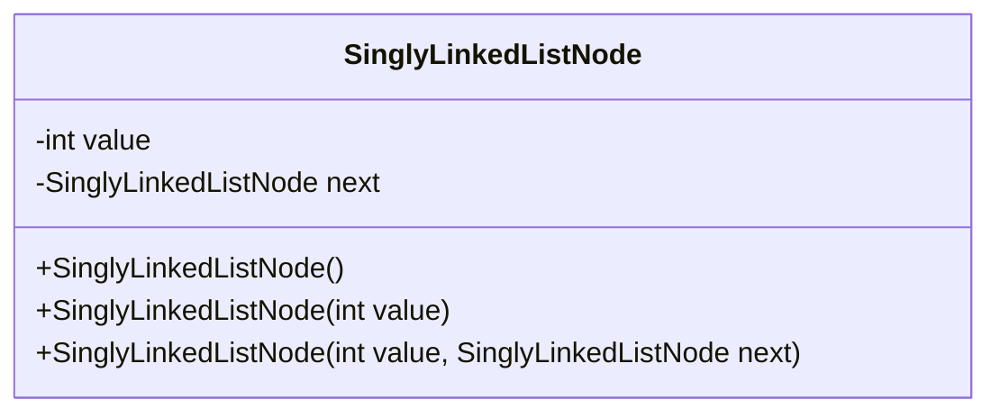
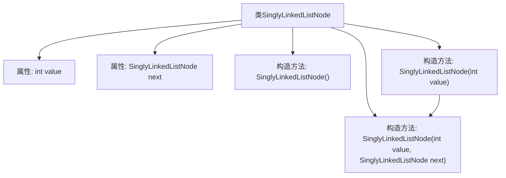

# 基础信息

|      |      |
|------|------|
| 名称 | SinglyLinkedListNode |
| 编码语言 | .java |
| 代码路径 | Java/src/main/java/com/thealgorithms/datastructures/lists/SinglyLinkedListNode.java |
| 包名 | com.thealgorithms.datastructures.lists |
| 依赖项 | [] |
| 概述说明 | 单链表节点类，包含值和下一节点引用。 |

# 说明

单链表节点类是一个用于表示链表节点的数据结构。该类包含两个主要属性：值和指向下一节点的引用。值属性用于存储节点中的数据，可以是任意类型的数据。指向下一节点的引用属性用于连接链表中的下一个节点，通常是一个指向另一个单链表节点类实例的指针或引用。通过这种结构，单链表节点类能够有效地组织和遍历链表中的各个节点，从而实现链表的常见操作，如插入、删除和查找。

# 类列表 Class Summary

| 名称   | 类型  | 说明 |
|-------|------|-------------|
| SinglyLinkedListNode | class | 单链表节点类，包含值和指向下一节点的引用。 |

## 类 SinglyLinkedListNode

|      |      |
|------|------|
| 访问范围 | None |
| 类型 | class |
| 名称 | SinglyLinkedListNode |
| 说明 | 单链表节点类，包含值和指向下一节点的引用。 |

### UML类图

这段代码定义了一个名为 `SinglyLinkedListNode` 的类，用于表示单向链表中的一个节点。该类包含两个私有成员变量：`value` 用于存储节点的值，`next` 用于指向下一个节点的引用。类中提供了三个构造函数：一个无参构造函数用于创建一个空节点；一个构造函数接受一个整数值作为参数，用于创建一个包含该值的节点；另一个构造函数接受一个整数值和一个 `SinglyLinkedListNode` 类型的引用作为参数，用于创建一个包含该值并指向下一个节点的节点。

### 内部方法调用关系图

这段代码定义了一个名为 `SinglyLinkedListNode` 的类，用于表示单向链表中的节点。该类包含两个属性：`value` 用于存储节点的值，`next` 用于指向下一个节点。代码中定义了三个构造方法：默认构造方法、带 `value` 参数的构造方法以及带 `value` 和 `next` 参数的构造方法。带 `value` 参数的构造方法会调用带 `value` 和 `next` 参数的构造方法，将 `next` 设置为 `null`。

### 字段列表 Field List

| 名称  | 类型  | 说明 |
|-------|-------|------|
| value | int | 声明一个整型变量value。 |
| next = null | SinglyLinkedListNode | 定义单链表节点，next初始化为null。 |

### 方法列表 Method List

| 名称  | 类型  | 说明 |
|-------|-------|------|

