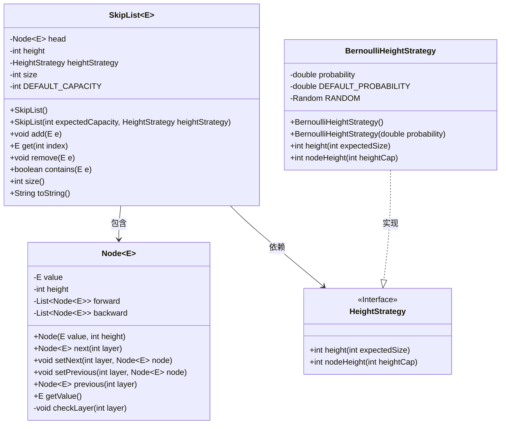

# 基础信息

|      |      |
|------|------|
| 名称 | SkipList |
| 编码语言 | .java |
| 代码路径 | Java/src/main/java/com/thealgorithms/datastructures/lists/SkipList.java |
| 包名 | com.thealgorithms.datastructures.lists |
| 依赖项 | ['java.util.ArrayList', 'java.util.Arrays', 'java.util.Collections', 'java.util.List', 'java.util.Objects', 'java.util.Random', 'java.util.stream.Collectors', 'java.util.stream.IntStream'] |
| 概述说明 | SkipList实现增删查操作，通过分层节点优化搜索性能。 |

# 说明

SkipList是一种数据结构，支持高效的插入、删除和查找操作。它通过使用分层节点来优化搜索性能，每层节点以概率方式决定是否提升到更高层，从而形成多层索引结构。这种设计使得SkipList在搜索时能够快速跳过大量节点，显著减少查找时间。SkipList的增删查操作均保持对数时间复杂度，适用于需要频繁更新和查询的场景。其实现简单且性能优越，常用于替代平衡树等复杂结构。

# 类列表 Class Summary

| 名称   | 类型  | 说明 |
|-------|------|-------------|
| SkipList | class | SkipList实现，支持增删查操作，使用分层节点优化搜索性能。 |

## 类 SkipList

|      |      |
|------|------|
| 访问范围 | public |
| 类型 | class |
| 名称 | SkipList |
| 说明 | SkipList实现，支持增删查操作，使用分层节点优化搜索性能。 |

### UML类图

### 描述
这段代码实现了一个跳表（SkipList）数据结构，跳表是一种概率性数据结构，允许快速查找、插入和删除操作。`SkipList`类包含一个内部类`Node`，用于表示跳表中的节点。`HeightStrategy`接口定义了跳表高度的计算策略，`BernoulliHeightStrategy`是其具体实现，使用伯努利分布来确定节点的高度。跳表通过多层链表结构来提高查询效率，`add`、`remove`、`contains`等方法实现了跳表的核心功能。

### 内部方法调用关系图

```mermaid
graph TD
    A["类SkipList<E extends Comparable<E>>"]
    B["属性: Node<E> head"]
    C["属性: int height"]
    D["属性: HeightStrategy heightStrategy"]
    E["属性: int size"]
    F["构造方法: SkipList()"]
    G["构造方法: SkipList(int expectedCapacity, HeightStrategy heightStrategy)"]
    H["方法: void add(E e)"]
    I["方法: E get(int index)"]
    J["方法: void remove(E e)"]
    K["方法: boolean contains(E e)"]
    L["方法: int size()"]
    M["方法: String toString()"]
    N["内部类: Node<E>"]
    O["属性: E value"]
    P["属性: int height"]
    Q["属性: List<Node<E>> forward"]
    R["属性: List<Node<E>> backward"]
    S["构造方法: Node(E value, int height)"]
    T["方法: Node<E> next(int layer)"]
    U["方法: void setNext(int layer, Node<E> node)"]
    V["方法: void setPrevious(int layer, Node<E> node)"]
    W["方法: Node<E> previous(int layer)"]
    X["方法: E getValue()"]
    Y["方法: void checkLayer(int layer)"]
    Z["接口: HeightStrategy"]
    AA["方法: int height(int expectedSize)"]
    AB["方法: int nodeHeight(int heightCap)"]
    AC["内部类: BernoulliHeightStrategy"]
    AD["属性: double probability"]
    AE["属性: Random RANDOM"]
    AF["构造方法: BernoulliHeightStrategy()"]
    AG["构造方法: BernoulliHeightStrategy(double probability)"]
    AH["方法: int height(int expectedSize)"]
    AI["方法: int nodeHeight(int heightCap)"]

    A --> B
    A --> C
    A --> D
    A --> E
    A --> F
    A --> G
    A --> H
    A --> I
    A --> J
    A --> K
    A --> L
    A --> M
    A --> N
    N --> O
    N --> P
    N --> Q
    N --> R
    N --> S
    N --> T
    N --> U
    N --> V
    N --> W
    N --> X
    N --> Y
    A --> Z
    Z --> AA
    Z --> AB
    A --> AC
    AC --> AD
    AC --> AE
    AC --> AF
    AC --> AG
    AC --> AH
    AC --> AI
```

该流程图展示了`SkipList`类的结构及其内部类`Node`和`BernoulliHeightStrategy`的关系。`SkipList`类包含多个属性和方法，用于管理跳表的数据结构。`Node`类用于存储跳表中的节点信息，而`BernoulliHeightStrategy`类实现了`HeightStrategy`接口，用于计算跳表的最大高度和节点高度。通过该流程图，可以清晰地看到类与类之间的调用关系和依赖关系。

### 字段列表 Field List

| 名称  | 类型  | 说明 |
|-------|-------|------|
| size | int | 声明一个私有整型变量size。 |
| head | Node<E> | 私有成员变量，类型为Node<E>，名称为head。 |
| height | int | 声明一个私有的不可变整型变量height。 |
| heightStrategy | HeightStrategy | 私有且不可变的高度策略对象。 |
| DEFAULT_CAPACITY = 100 | int | 定义私有静态常量DEFAULT_CAPACITY，默认值为100。 |

### 方法列表 Method List

| 名称  | 类型  | 说明 |
|-------|-------|------|
| size | int | 返回当前对象的size属性值。 |
| get | E | 获取链表中指定索引位置的元素值。 |
| add | void | 在跳表中插入元素，更新节点链接并增加大小。 |
| toString | String | 方法生成跳表字符串表示，包含层级和位置信息。 |
| contains | boolean | 该方法检查链表中是否包含指定元素，通过逐层遍历节点实现。 |
| remove | void | 该方法从多层链表中移除指定元素，并更新前后节点连接，最后减少链表大小。 |

