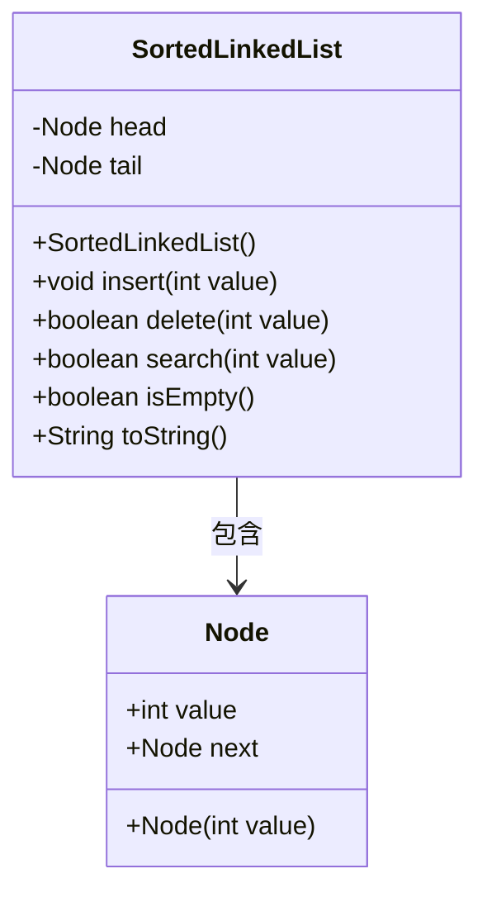
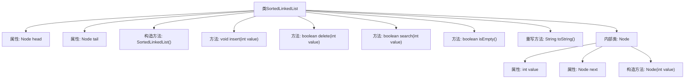

# 基础信息

|      |      |
|------|------|
| 名称 | SortedLinkedList |
| 编码语言 | .java |
| 代码路径 | Java/src/main/java/com/thealgorithms/datastructures/lists/SortedLinkedList.java |
| 包名 | com.thealgorithms.datastructures.lists |
| 依赖项 | ['java.util.ArrayList', 'java.util.List'] |
| 概述说明 | 实现有序链表，支持插入、删除、搜索及空列表检查。 |

# 说明

实现有序链表，支持插入、删除、搜索及空列表检查。插入操作确保链表中的元素按特定顺序排列，删除操作移除指定元素并保持链表有序，搜索操作用于查找特定元素是否存在，空列表检查用于判断链表是否为空。该实现旨在维护链表的有序性，确保各项操作的高效执行。

# 类列表 Class Summary

| 名称   | 类型  | 说明 |
|-------|------|-------------|
| SortedLinkedList | class | 实现有序链表，支持插入、删除、搜索及空列表检查。 |

## 类 SortedLinkedList

|      |      |
|------|------|
| 访问范围 | public |
| 类型 | class |
| 名称 | SortedLinkedList |
| 说明 | 实现有序链表，支持插入、删除、搜索及空列表检查。 |

### UML类图

类图描述：`SortedLinkedList` 类实现了一个有序链表，包含 `Node` 类作为链表的节点。`SortedLinkedList` 提供了插入、删除、搜索、判断链表是否为空以及获取链表字符串表示的方法。`Node` 类表示链表中的节点，包含节点值和指向下一个节点的指针。`SortedLinkedList` 类通过 `head` 和 `tail` 属性管理链表的头部和尾部节点。

### 内部方法调用关系图

**描述：** 该代码实现了一个有序链表类 `SortedLinkedList`，包含插入、删除、搜索、判断是否为空以及转换为字符串的功能。链表由 `Node` 类表示，每个节点包含一个整数值和指向下一个节点的指针。插入操作确保链表保持有序，删除操作移除第一个匹配的节点，搜索操作检查值是否存在，`toString` 方法返回链表的字符串表示。

### 字段列表 Field List

| 名称  | 类型  | 说明 |
|-------|-------|------|
| head | Node | 定义了一个私有的头节点变量。 |
| tail | Node | 链表尾节点引用。 |

### 方法列表 Method List

| 名称  | 类型  | 说明 |
|-------|-------|------|
| isEmpty | boolean | 该方法检查链表是否为空，返回头节点是否为null。 |
| search | boolean | 该方法在链表中查找指定值，存在返回true，否则返回false。 |
| delete | boolean | 删除链表中指定值的节点，处理头尾节点情况。 |
| toString | String | 重写toString方法，返回链表元素列表，空链表返回空列表。 |
| insert | void | 实现链表插入节点功能，支持头部、尾部和中间插入。 |

