# 基础信息

|      |      |
|------|------|
| 名称 | lists |
| 编码语言 | .java |
| 代码路径 | Java/src/main/java/com/thealgorithms/datastructures/lists |
| 包名 | Java.src.main.java.com.thealgorithms.datastructures.lists |
| 概述说明 | 随机链表节点、跳表、游标链表、循环链表、递归计数、递归搜索、右旋、快速排序、分组反转、循环检测、合并有序链表、有序链表、双向链表、合并单链表、单链表操作、合并有序数组、单链表节点。 |

# 说明

## 概述
该代码模块主要实现了多种链表数据结构及其相关操作，涵盖了单链表、双向链表、循环链表、游标链表、跳表等不同链表类型。模块提供了丰富的链表操作功能，包括插入、删除、查找、排序、反转、合并、去重等。此外，模块还包含了一些高级算法，如链表的快速排序、按组反转、循环检测、随机节点获取等。这些实现注重性能和内存管理的平衡，适用于需要频繁更新和查询的场景。

## 主要业务场景
1. **链表基本操作**：支持单链表、双向链表、循环链表等数据结构的基本操作，如插入、删除、查找、反转、去重等。这些操作适用于需要动态管理数据的场景，如任务队列、缓存管理等。
2. **链表排序与合并**：实现了链表的快速排序、有序链表的合并等操作，适用于需要对链表数据进行排序或合并的场景，如数据预处理、多路归并等。
3. **链表高级操作**：支持链表的按组反转、循环检测、随机节点获取等高级操作，适用于需要复杂链表操作的场景，如链表的重组、随机抽样、循环检测等。
4. **链表优化结构**：实现了跳表、游标链表等优化结构，适用于需要高效插入、删除和查找操作的场景，如数据库索引、内存管理等。
5. **递归算法**：提供了递归计算链表节点数、递归搜索链表值等递归算法，适用于需要简洁代码实现的场景，如链表遍历、递归搜索等。

### 包内部结构视图

```mermaid
graph TD
    lists --> RandomNode.java
    lists --> SkipList.java
    lists --> CursorLinkedList.java
    lists --> CircleLinkedList.java
    lists --> CountSinglyLinkedListRecursion.java
    lists --> SearchSinglyLinkedListRecursion.java
    lists --> RotateSinglyLinkedLists.java
    lists --> QuickSortLinkedList.java
    lists --> ReverseKGroup.java
    lists --> CreateAndDetectLoop.java
    lists --> MergeKSortedLinkedList.java
    lists --> SortedLinkedList.java
    lists --> DoublyLinkedList.java
    lists --> MergeSortedSinglyLinkedList.java
    lists --> SinglyLinkedList.java
    lists --> MergeSortedArrayList.java
    lists --> SinglyLinkedListNode.java
```

该流程图展示了`lists`文件夹下的所有文件及其层级关系。`lists`作为根节点，包含了多个与链表相关的Java文件，如`RandomNode.java`、`SkipList.java`等。这些文件均直接隶属于`lists`文件夹，展示了该目录下丰富的数据结构实现。

# 文件列表 File List

| 名称   | 类型  | 说明 |
|-------|------|-------------|
| [CircleLinkedList.java](CircleLinkedList.md) | file | 循环链表支持增删元素、获取大小和字符串表示。 |
| [SinglyLinkedListNode.java](SinglyLinkedListNode.md) | file | 单链表节点类，包含值和下一节点引用。 |
| [DoublyLinkedList.java](DoublyLinkedList.md) | file | 双向链表类实现头尾节点、链表操作、判空及正逆序打印功能。Link类支持插入、删除、排序、反转和清空操作。 |
| [ReverseKGroup.java](ReverseKGroup.md) | file | 链表按k节点分组反转，计算长度后递归处理。 |
| [MergeSortedArrayList.java](MergeSortedArrayList.md) | file | 合并两有序整数列表到新集合，保持升序且不修改原列表。 |
| [SinglyLinkedList.java](SinglyLinkedList.md) | file | 单链表支持插入、删除、查找、反转、去重操作。 |
| [MergeSortedSinglyLinkedList.java](MergeSortedSinglyLinkedList.md) | file | 将两个有序单链表合并为一个新的有序单链表。 |
| [SortedLinkedList.java](SortedLinkedList.md) | file | 实现有序链表，支持插入、删除、搜索及空列表检查。 |
| [MergeKSortedLinkedList.java](MergeKSortedLinkedList.md) | file | 合并K个有序链表，利用最小堆提取最小节点，生成单一有序链表。 |
| [CreateAndDetectLoop.java](CreateAndDetectLoop.md) | file | CreateAndDetectLoop类用于创建和检测链表循环，包含节点类Node和Floyd算法。 |
| [QuickSortLinkedList.java](QuickSortLinkedList.md) | file | 快速排序算法递归分区合并实现单链表排序。 |
| [RotateSinglyLinkedLists.java](RotateSinglyLinkedLists.md) | file | 单向链表右旋k位，返回新头节点。 |
| [SearchSinglyLinkedListRecursion.java](SearchSinglyLinkedListRecursion.md) | file | 递归查找单链表是否包含特定值。 |
| [CountSinglyLinkedListRecursion.java](CountSinglyLinkedListRecursion.md) | file | 递归计算单链表节点总数。 |
| [CursorLinkedList.java](CursorLinkedList.md) | file | 基于游标的链表，支持增删查，固定数组管理节点。 |
| [SkipList.java](SkipList.md) | file | SkipList实现增删查操作，通过分层节点优化搜索性能。 |
| [RandomNode.java](RandomNode.md) | file | RandomNode类从链表随机获取节点值，时间O(n)，空间O(1)。 |

