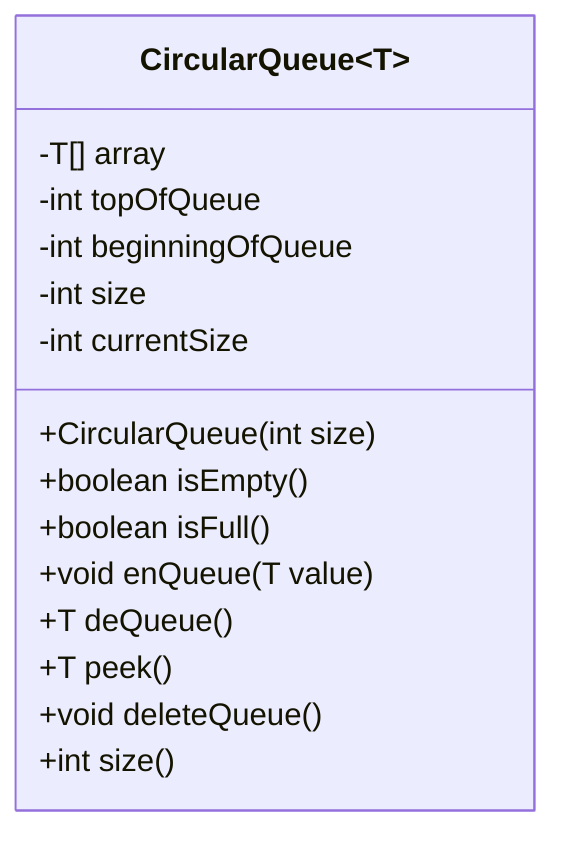
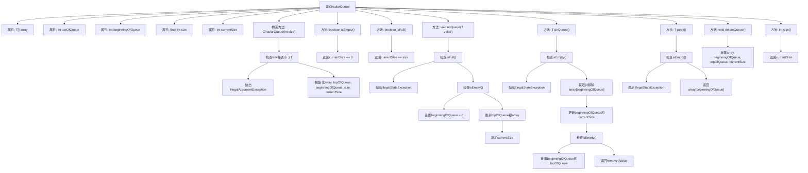

# 基础信息

|      |      |
|------|------|
| 名称 | CircularQueue |
| 编码语言 | .java |
| 代码路径 | Java/src/main/java/com/thealgorithms/datastructures/queues/CircularQueue.java |
| 包名 | com.thealgorithms.datastructures.queues |
| 依赖项 | [] |
| 概述说明 | 实现循环队列，支持入队、出队、查看队首、删除及判断空满操作。 |

# 说明

实现循环队列需支持多种操作，包括入队、出队、查看队首元素、删除整个队列以及判断队列是否为空或已满。循环队列通过利用固定大小的数组来模拟队列行为，避免空间浪费。入队操作将元素添加到队列尾部，若队列已满则无法添加。出队操作移除队首元素并返回其值。查看队首元素操作返回队列的第一个元素但不移除它。删除队列操作清空所有元素。判断空满操作分别用于检查队列是否为空或已满，确保操作的正确性和效率。

# 类列表 Class Summary

| 名称   | 类型  | 说明 |
|-------|------|-------------|
| CircularQueue | class | 实现循环队列，支持入队、出队、查看队首、删除队列及判断空满操作。 |

## 类 CircularQueue

|      |      |
|------|------|
| 访问范围 | public |
| 类型 | class |
| 名称 | CircularQueue |
| 说明 | 实现循环队列，支持入队、出队、查看队首、删除队列及判断空满操作。 |

### UML类图

这段代码定义了一个泛型类 `CircularQueue<T>`，用于实现一个循环队列。循环队列是一种数据结构，允许在队列的末尾添加元素，并在队列的开头移除元素，且当队列达到最大容量时，新元素会覆盖最旧的元素。类中包含了一些关键方法，如 `enQueue` 用于添加元素，`deQueue` 用于移除元素，`peek` 用于查看队列开头的元素，以及 `deleteQueue` 用于清空队列。此外，类还提供了 `isEmpty` 和 `isFull` 方法用于检查队列的状态。

### 内部方法调用关系图

这段代码实现了一个循环队列（CircularQueue）数据结构，支持基本的队列操作如入队（enQueue）、出队（deQueue）、查看队首元素（peek）、删除队列（deleteQueue）以及检查队列是否为空（isEmpty）或已满（isFull）。通过使用数组和指针（topOfQueue和beginningOfQueue）来管理队列元素，确保在队列满时不会覆盖已有元素，并在队列空时重置指针。

### 字段列表 Field List

| 名称  | 类型  | 说明 |
|-------|-------|------|
| array | T[] | 声明一个私有的泛型数组变量。 |
| currentSize | int | 定义私有整型变量currentSize。 |
| size | int | 私有整型变量size，不可修改。 |
| topOfQueue | int | 队列顶部指针的私有整型变量。 |
| beginningOfQueue | int | 私有整型变量，表示队列的起始位置。 |

### 方法列表 Method List

| 名称  | 类型  | 说明 |
|-------|-------|------|
| isFull | boolean | 检查当前大小是否等于最大容量。 |
| deleteQueue | void | 删除队列并重置相关变量。 |
| size | int | 返回当前大小的整数值。 |
| peek | T | peek方法检查队列是否为空，若为空则抛出异常，否则返回队首元素。 |
| deQueue | T | 队列出队操作：检查空队列异常，移除队首元素，更新队首指针和大小，返回移除值。 |
| enQueue | void | 队列入队操作，检查满队抛异常，空队初始化，更新队尾指针并存储值。 |
| isEmpty | boolean | 该方法检查当前大小是否为零，返回布尔值。 |

