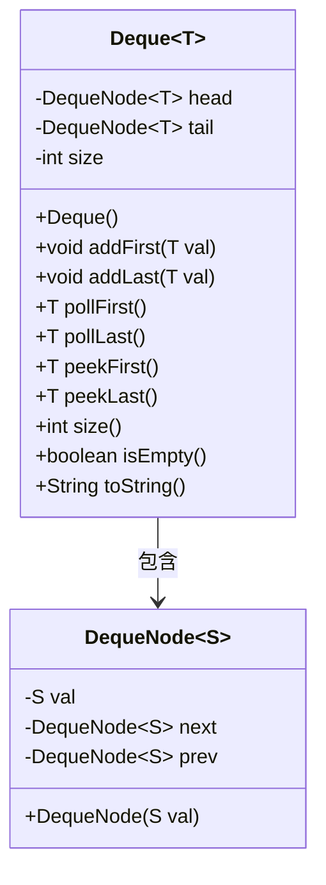

# 基础信息

|      |      |
|------|------|
| 名称 | Deque |
| 编码语言 | .java |
| 代码路径 | Java/src/main/java/com/thealgorithms/datastructures/queues/Deque.java |
| 包名 | com.thealgorithms.datastructures.queues |
| 依赖项 | ['java.util.NoSuchElementException'] |
| 概述说明 | 实现双向队列，支持头尾增删查操作。 |

# 说明

双向队列是一种支持在头部和尾部进行添加、删除及查看元素操作的数据结构。它允许用户从队列的两端高效地插入和移除元素，同时也能查看队列的头部和尾部元素。这种数据结构结合了栈和队列的特性，提供了更灵活的数据操作方式，适用于需要频繁在两端进行操作的场景。

# 类列表 Class Summary

| 名称   | 类型  | 说明 |
|-------|------|-------------|
| Deque | class | 实现双向队列数据结构，支持头尾添加删除及查看元素操作。 |

## 类 Deque

|      |      |
|------|------|
| 访问范围 | public |
| 类型 | class |
| 名称 | Deque |
| 说明 | 实现双向队列数据结构，支持头尾添加删除及查看元素操作。 |

### UML类图

该代码实现了一个双向队列（Deque），使用内部类 `DequeNode` 来表示队列中的节点。`Deque` 类提供了在队列头部和尾部添加、删除元素的操作，以及查看队列头部和尾部元素的功能。通过 `DequeNode` 的 `next` 和 `prev` 指针，实现了双向链表的逻辑。`Deque` 类还提供了队列大小和是否为空的方法，并重写了 `toString` 方法以格式化输出队列内容。

### 内部方法调用关系图

```mermaid
graph TD
    A["类Deque<T>"]
    B["内部类DequeNode<S>"]
    C["属性: S val"]
    D["属性: DequeNode<S> next"]
    E["属性: DequeNode<S> prev"]
    F["构造方法: DequeNode(S val)"]
    G["属性: DequeNode<T> head"]
    H["属性: DequeNode<T> tail"]
    I["属性: int size"]
    J["方法: void addFirst(T val)"]
    K["方法: void addLast(T val)"]
    L["方法: T pollFirst()"]
    M["方法: T pollLast()"]
    N["方法: T peekFirst()"]
    O["方法: T peekLast()"]
    P["方法: int size()"]
    Q["方法: boolean isEmpty()"]
    R["重写方法: String toString()"]
    S["main方法: main(String[] args)"]
    T["输出: System.out.println(myDeque)"]
    U["输出: System.out.println('Size: ' + myDeque.size())"]
    V["输出: System.out.println('Removing: ' + removing)"]

    A --> B
    B --> C
    B --> D
    B --> E
    B --> F
    A --> G
    A --> H
    A --> I
    A --> J
    A --> K
    A --> L
    A --> M
    A --> N
    A --> O
    A --> P
    A --> Q
    A --> R
    A -.-> S
    S --> T
    S --> U
    S --> V
```

这段代码实现了一个双向队列（Deque）数据结构，包含添加、删除、查看元素以及获取队列大小和判断是否为空的功能。内部类`DequeNode`用于表示队列中的节点，每个节点包含值、前驱和后继指针。`addFirst`和`addLast`分别在队列的头部和尾部添加元素，`pollFirst`和`pollLast`分别从头部和尾部移除元素，`peekFirst`和`peekLast`分别查看头部和尾部的元素而不移除。`toString`方法将队列转换为字符串形式。`main`方法展示了如何使用这些功能，包括添加、删除元素以及输出队列状态。

### 字段列表 Field List

| 名称  | 类型  | 说明 |
|-------|-------|------|
| head = null | DequeNode<T> | 私有变量head初始化为空，类型为DequeNode<T>。 |
| tail = null | DequeNode<T> | 双端队列尾节点初始化为空。 |
| size = 0 | int | 定义私有整型变量size并初始化为0。 |

### 方法列表 Method List

| 名称  | 类型  | 说明 |
|-------|-------|------|
| size | int | 返回当前对象的元素数量。 |
| peekLast | T | 该方法返回链表尾部元素值，若尾部为空则返回null。 |
| peekFirst | T | 获取链表第一个元素的值，若为空则返回null。 |
| isEmpty | boolean | 判断集合是否为空，返回布尔值。 |
| addLast | void | 方法addLast在双端队列尾部添加新节点，更新指针并增加队列大小。 |
| toString | String | 重写toString方法，生成双向链表的字符串表示。 |
| pollLast | T | 该方法从双端队列尾部移除并返回元素，若队列为空则抛出异常。 |
| main | void | Java代码演示双端队列操作，包括添加、删除和输出元素。 |
| pollFirst | T | 方法pollFirst移除并返回双端队列头部元素，若队列为空则抛出异常。 |
| addFirst | void | 在双端队列头部添加新节点，更新指针并增加大小。 |

