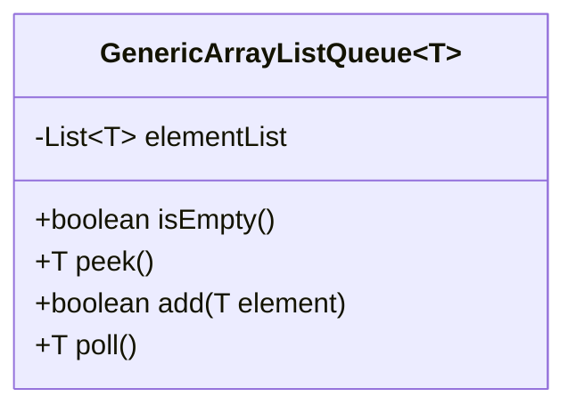
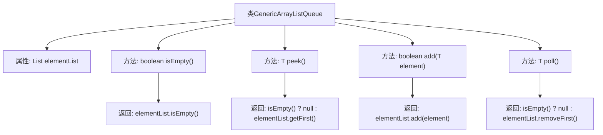

# 基础信息

|      |      |
|------|------|
| 名称 | GenericArrayListQueue |
| 编码语言 | .java |
| 代码路径 | Java/src/main/java/com/thealgorithms/datastructures/queues/GenericArrayListQueue.java |
| 包名 | com.thealgorithms.datastructures.queues |
| 依赖项 | ['java.util.ArrayList', 'java.util.List'] |
| 概述说明 | 泛型队列类，基于ArrayList实现，支持增删查及空检查。 |

# 说明

泛型队列类是基于ArrayList实现的，提供了添加元素、查看元素、删除元素以及检查队列是否为空的功能。该队列类支持泛型，能够处理各种类型的数据，确保操作的灵活性和通用性。通过ArrayList的底层实现，队列的元素管理高效且便捷，适用于需要先进先出（FIFO）操作的场景。

# 类列表 Class Summary

| 名称   | 类型  | 说明 |
|-------|------|-------------|
| GenericArrayListQueue | class | 泛型队列类，基于ArrayList实现，支持添加、查看、删除元素及检查是否为空。 |

## 类 GenericArrayListQueue

|      |      |
|------|------|
| 访问范围 | public |
| 类型 | class |
| 名称 | GenericArrayListQueue |
| 说明 | 泛型队列类，基于ArrayList实现，支持添加、查看、删除元素及检查是否为空。 |

### UML类图

这段代码定义了一个泛型类 `GenericArrayListQueue`，它使用 `ArrayList` 来实现队列的基本操作。类中包含四个方法：`isEmpty()` 用于检查队列是否为空，`peek()` 用于查看队列前端元素但不移除，`add()` 用于在队列尾部添加元素，`poll()` 用于移除并返回队列前端的元素。该类通过 `ArrayList` 来存储队列元素，并提供了队列的常见操作接口。

### 内部方法调用关系图

这段代码定义了一个泛型类 `GenericArrayListQueue<T>`，它使用 `ArrayList` 来实现队列的基本操作。类中包含四个方法：`isEmpty()` 用于检查队列是否为空，`peek()` 用于查看队列的第一个元素但不移除它，`add(T element)` 用于将元素添加到队列的末尾，`poll()` 用于移除并返回队列的第一个元素。这些方法通过操作 `elementList` 来实现队列的功能，确保队列的先进先出（FIFO）特性。

### 字段列表 Field List

| 名称  | 类型  | 说明 |
|-------|-------|------|
| elementList = new ArrayList<>() | List<T> | 定义一个私有且不可变的元素列表。 |

### 方法列表 Method List

| 名称  | 类型  | 说明 |
|-------|-------|------|
| peek | T | peek方法返回列表首个元素，若为空则返回null。 |
| isEmpty | boolean | isEmpty方法检查elementList是否为空并返回布尔值。 |
| add | boolean | 该方法将元素添加到列表中并返回操作结果。 |
| poll | T | 从列表中移除并返回第一个元素，若为空则返回null。 |

